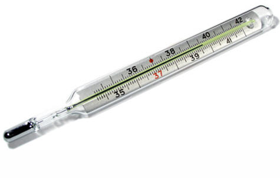
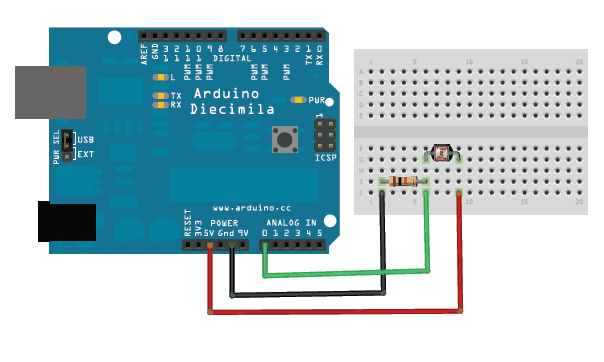

<!--

author:   Sebastian Zug & André Dietrich
email:    zug@ovgu.de   & andre.dietrich@ovgu.de
version:  0.0.1
language: de
narrator: Deutsch Female

link:     https://cdnjs.cloudflare.com/ajax/libs/animate.css/3.7.0/animate.min.css

import: https://raw.githubusercontent.com/LiaTemplates/Rextester/master/README.md
import: https://raw.githubusercontent.com/LiaTemplates/WebDev/master/README.md
import: https://raw.githubusercontent.com/LiaTemplates/NetSwarm-Simulator/master/README.md
-->


# Einführung

<h2>Week-for-Future "Wetterstation"</h2>

Prof. Dr. Sebastian Zug,
Technische Universität Bergakademie Freiberg

------------------------------

<!-- width="80%" -->

<h2>Herzlich Willkommen!</h2>

> Die interaktive Ansicht dieses Kurses ist unter folgendem [Link](https://liascript.github.io/course/?https://raw.githubusercontent.com/liaScript/ArduinoEinstieg/master/3day_workshop.md#1) verfügbar.

https://github.com/liaScript/ArduinoEinstieg/blob/master/3day_workshop.md

## 1. Motivation

> **Thema Wetterstation - Worum geht es eigentlich?**

|  <!-- width="100%" -->    | <!-- width="100%" -->    |
|  <!-- width="100%" -->    | <!-- width="100%" -->    |


vgl. [Link](https://www.wetterstation.net/wetterstation-wetterhaeuschen/)

> **Seit wann ist das Thema aktuell?**

<iframe name="ngram_chart" src="https://books.google.com/ngrams/interactive_chart?content=Wetterstation%2C+Wetter&year_start=1800&year_end=2000&corpus=8&smoothing=3&share=&direct_url=t1%3B%2CWetterstation%3B%2Cc0%3B.t1%3B%2CWetter%3B%2Cc0" width=100% height=350 marginwidth=0 marginheight=0 hspace=0 vspace=0 frameborder=0 scrolling=no></iframe>

<iframe name="ngram_chart" src="https://books.google.com/ngrams/interactive_chart?content=Wetterstation&year_start=1800&year_end=2000&corpus=8&smoothing=3&share=&direct_url=t1%3B%2CWetterstation%3B%2Cc0" width=100% height=350 marginwidth=0 marginheight=0 hspace=0 vspace=0 frameborder=0 scrolling=no></iframe>

> **Was wollen wir (Stöber/Zug) vermitteln?**

+ Technische Hintergründe
+ Methodische Vorgehensweise
+ Interaktion im Team

> **Was erwarten Sie von der Veranstaltung?**

+ ????

## 2. Grundidee

**Klima vs. Wetter**

| Wetter                                                                                                                                                                                                               | Klima                                                                                                                                        |
| -------------------------------------------------------------------------------------------------------------------------------------------------------------------------------------------------------------------- | -------------------------------------------------------------------------------------------------------------------------------------------- |
| ... bezeichnet man den spürbaren, kurzfristigen Zustand der Atmosphäre an einem bestimmten Ort der Erdoberfläche, der unter anderem als Sonnenschein, Bewölkung, Regen, Wind, Hitze oder Kälte in Erscheinung tritt. | ...versteht man dagegen das durchschnittliche Wetter einschließlich seiner Extremwerte über einen längeren Zeitraum an einem bestimmten Ort. |
|      Physikalisch lässt sich ein Wetter durch thermodynamische Zustandsgrößen wie etwa Druck, Temperatur, Dichte beschreiben und messtechnisch erfassen.                                                                                                  |    Klima" ist also nirgendwo direkt messbar, sondern eine Statistik aus vielen Messungen. Der Zeitraum muss groß genug für die Bildung eines statistischen Mittelwertes sein.                                                                                                                                           |

Falls die Klimavariablen, d.h. Temperatur, Niederschlag, Wind, Verdunstung usw., um einen langjährigen Mittelwert schwanken, bleibt das Klima stabil. Wenn sich der Mittelwert und die Variabilität der Extreme erkennbar verändern, liegt eine Klimaänderung vor.

Was heißt das für Doberlug-Kirchhain konkret:

<!-- width="80%" -->
Quelle: Deutscher Wetterdienst 23. August 2019
[Link](https://www.wetterdienst.de/Deutschlandwetter/Doberlug-Kirchhain/Klima/)

**Wo kommen die Daten denn her**

... Temperatur zum Beispiel mittels:

| Messmittel             | Gerät                                                         |
| ---------------------- | ------------------------------------------------------------- |
| Quecksilberthermometer | <!-- width="380" -->   |
| Heißleiter             |  <!-- width="380" -->       |
| IR-Thermometer         | <!-- width="380" --> |

> **Was heißt das überhaupt "Messen"?**


## 3. Müssen wir überhaupt selbst messen?

> **Seid wann gibt es Wetteraufzeichnungen, was ist die längste ununterbrochene Messreihe?**

Die professionelle und systematische Erfassung von Wetterdaten begann jedoch erst 1781 durch die Societas Meteorologica Palatina am Observatorium Hohenpeißenberg in Bayern, Deutschland. Die damals verwendeten „Mannheimer Stunden“, 7, 14, 21 Uhr mittlerer Ortszeit, entsprechen den bis heute noch üblichen Klimabeobachtungsterminen. Diese Datenreihe wird bis heute ununterbrochen weitergeführt und ist damit die älteste und längste Wetteraufzeichnung der Welt. Spricht man heute von „seit dem Beginn der Wetteraufzeichnung“ so ist damit maximal der Zeitraum ab 1781 gemeint. In manchen Regionen aber auch viel kürzere Zeiträume von lediglich einigen Jahrzehnten.

Die Wetterdaten werden heute über ein Netz von Messstationen (Messnetz) erfasst, die über die ganze Welt verteilt sind. Im Bundesgebiet registrieren

+ der staatlichen Deutschen Wetterdienst (DWD)
+ der Geoinfomationsdienst der Bundeswehr (GeoInfoDBw) und
+ private Wetterdienste

eigene Daten. Das Messnetz des DWD besteht aus 178 hauptamtlichen Stationen, der GeoInfoDBw unterhält eines mit 34 Stationen.

<!-- width="380" -->

*Beispiel einer automatischen Wetterstation (Quelle: Deutscher Wetterdienst unter [Link](https://www.dwd.de/SharedDocs/termine/DE/allgemein/wmo_icaws_2017.html))*

> **Was kann man damit anstellen?**

`Demo zur Analyse der Daten der Station Cottbus`

> **Warum also noch selbst messen?**

## 4. Wie wollen wir vorgehen?

**Sprint-Ziele - Gruppe I**

+ Dienstag Nachmittag: Auslesen des Helligkeitssensors und des Wettersensors mit Ausgabe auf dem Bildschirm

+ Mittwoch Vormittag: Löten und Integration des Displays, Verschönerung der Ausgabe

+ Mittwoch Nachmittag: Testen der Aufzeichnung, Vorverarbeitung der Daten mit Excel, Start der 24 Stunden Messung

+ Donnerstag: Vorbereitung eines Diagramms, dass die Abweichung der Daten illustriert

**Sprint-Ziele - Gruppe II**

+ Dienstag Nachmittag: Publikation der Helligkeitsdaten in einen Thinkspeak Kanal, Handy App mit Anweisungen zur Installation aktiv

+ Mittwoch Vormittag: Integration des DHT11 und des Bosch 680 Sensors in den Aufbau, Beginn der Lötarbeiten

+ Mittwoch Nachmittag: Fertigstellung der integrierten Lösung, 24-Stunden Messungen

+ Donnerstag: Auswertung der Daten, Visualisierung unter Python/ Matlab

<!-- width="100%" -->

# Gruppe I - Dienstag

**Was heißt das eigentlich "Eingebettetes System"?**

                              {{1-2}}
*******************************************************************************
> ... ein elektronischer Rechner ..., der in einen technischen Kontext
> eingebunden ist. Dabei übernimmt der (Kleinst-)Rechner entweder
> Überwachungs-, Steuerungs- oder Regelfunktionen ... weitestgehend unsichtbar
> für den Benutzer .. \[nach Wikipedia "Eingebettete Systeme"\].
*******************************************************************************

**Wie programmiere ich einen Mikrocontroller?**

                              {{2-3}}
*******************************************************************************
> Compiler wird eine Software genannt, die einen in einer Programmiersprache
> geschrieben Quellcode so übersetzt, dass sie von Maschinen verstanden
> werden können.
*******************************************************************************

**Was ist das Arduino Projekt?**

                                 {{3}}
*******************************************************************************
> Arduino ist eine aus Soft- und Hardware bestehende
> Physical-Computing-Plattform. Beide Komponenten sind im Sinne von Open
> Source quelloffen. Die Hardware besteht aus einem einfachen E/A-Board mit
> einem Mikrocontroller und analogen und digitalen Ein- und Ausgängen.

  https://www.arduino.cc/

  <!-- width="70%" -->
  [^3]

[^3] aus entsprechendem Artikel "Spiegel Online" http://www.spiegel.de/netzwelt/gadgets/arduino-erklaert-das-kann-der-microcontroller-a-1105328.html

*******************************************************************************

## 1. Arduino Programmierung

Womit haben wir es zu tuen?


*Quelle: Webseite des Herstellers*


### 1.1 Aufbau eines Arduino-Programmes

Arduino nutzt eine C/C++ Semantik für die Programmierung, die folgende
Grundelemente bedient

+ Alle Anweisungen enden mit einem `;`
+ Variabeln sind typbehaftet (`int`, `char`, `float`, etc.)
+ wichtige Schlüsselwörter sind `for`, `if`, `while`, etc.
+ Kommentare werden durch `//` eingeleitet

<!-- width="80%" -->

Unter 2.4 folgen einige Beispiele für den Gebrauch der Schleifen und Verzweigungen.

Jedes Arduinoprogramm umfasst 2 grundlegende Funktionen `setup()` und `loop()`.

```c
const int ledPin = 13;

// the setup function runs once when you press reset or power the board
void setup() {
  // initialize digital pin ledPin as an output.
  pinMode(ledPin, OUTPUT);
}

// the loop function runs over and over again forever
void loop() {
  digitalWrite(ledPin, HIGH);   // turn the LED on (HIGH is the voltage level)
  delay(1000);                  // wait for a second
  digitalWrite(ledPin, LOW);    // turn the LED off by making the voltage LOW
  delay(1000);                  // wait for a second
}
```

### 2.2 Arduino IDE

<!-- width="80%" -->

Wichtige Grundeinstellungen:

+ Richtigen Port für den Programmiervorgang auswählen (Tools -> Port)
+ Richtigen Controller auswählen (Tools -> Board)
+ Richtige Baudrate für die Serielle Schnittstellen

### 2.3 Hello World

*Und jetzt sind Sie dran!*

Laden Sie das Beispielprogramm "Blink" in Ihren Editor:

Datei -> Beispiele -> Basics -> Blink

Kompilieren und flashen Sie das Programm! Wichtige Tastaturbefehle sind dabei

| Tastenkombination | Bedeutung                |
| ----------------- | ------------------------ |
| Strg-R            | Kompilieren (Ve**R**ify) |
| Strg-U            | Flashend (**U**pload)    |
| Strg-T            | Code korrekt einrücken   |
| Strg-Shift-M      | Seriellen Monitor öffnen |
| Strg-L            | Cursor auf Zeile setzen  |

### 2.4 C++ Basiskonstrukte und die Serielle Schnittstelle

                              {{0-1}}
*******************************************************************************

Was fehlt? Ich möchte irgendwie in den Rechner schauen können :-)

Die Serielle Schnittstelle (häufig auch als UART) bezeichnet ermöglicht das
Versenden und den Empfang von Textnachrichten. Damit können Sie zum Beispiel
Messwerte ausgeben oder das Erreichen bestimmter Programmpositionen anzeigen.

Die folgenden Beispiele vermitteln grundlegende Programmierkonstrukte in C++.
Anhand des NetSwarm Simulator können diese ausgeführt werden.  Achtung, bis auf
die Serielle Schnittstelle können keine  weiteren Funktionalitäten genutzt
werden!

```c
void setup() {
  Serial.begin(9600);
  Serial.println("Hello World");
}

void loop() {
}
```
@NetSwarm.single_loop

Arduino kennt zwei Varianten der Ausgabe mit `print` - das einfache `print` und `println`. Welchen Unterschied vermuten Sie?
*******************************************************************************

                              {{1-2}}
*******************************************************************************

**Schleifen**

Was müssen wir tuen, um die Zahlen von 1 bis 10 auf dem Terminal anzuzeigen?

```c
void setup() {
  Serial.begin(9600);
  int counter = 0;
  for (int i = 0; i < 10; i++){
    Serial.println(counter);  
    counter = counter + 1;
  }
}

void loop() {
}
```
@NetSwarm.single_loop

Welche "Einsparmöglichkeiten" sehen Sie als erfahrener Programmierer in dem Beispiel? Wie kann der Code, mit der gleichen Ausgabe kürzer gestaltet werden?
*******************************************************************************

                              {{2-3}}
*******************************************************************************

**Verzweigungen**

Verzweigungen folgen dem Muster

```c
if (Bedingung) {
  // Anweisungen
}
else{               
  // Anweisungen       
}                      
```

wobei der `else` Abschnitt optional ist.

```c
void setup() {
  Serial.begin(9600);
  float value = 5.234;
  Serial.print(value);
  if (value > 10){
    Serial.println(" - Der Wert ist größer als 10!");
  }else{
    Serial.println(" - Der Wert ist kleiner als 10!");
  }
}

void loop() {
}
```
@NetSwarm.single_loop

*******************************************************************************


                              {{3-4}}
*******************************************************************************

Bedingungen werden dabei wie folgt formuliert:

```c
void setup() {
  Serial.begin(9600);
  int a = 2;
  if (a == 2) {Serial.println("a ist gleich zwei!");}
  if (a <= 5) {Serial.println("a ist kleiner oder gleich fünf!");}
  if (a != 3) {Serial.println("a ist ungleich drei!");}
  char b = 'g';
  if (b == 'z') {Serial.println("In b ist ein z gespeichert!");}
  else {Serial.println("In b ist kein z gespeichert!");}
}

void loop() {
}
```
@NetSwarm.single_loop

Für die Ausgabe von komplexeren, vorformatierten Ausdrücken können Sie auf einen
Befehl aus der C++ Standard-Bibliothek zurückgreifen `sprintf`

Eine anschauliche Dokumentation findet sich unter: [link](https://arduinobasics.blogspot.com/2019/05/sprintf-function.html)

*******************************************************************************

## 3. Einstiegsübung

> **Aufgabe:** Schreiben Sie einen Code, der das *SOS* Morsesignal über die
> Led ausgibt!

Welche Anpassungen sind dafür notwendig?

```c
const int ledPin = 13;

// the setup function runs once when you press reset or power the board
void setup() {
  // initialize digital pin ledPin as an output.
  pinMode(ledPin, OUTPUT);
}

// the loop function runs over and over again forever
void loop() {
  digitalWrite(ledPin, HIGH);   // turn the LED on (HIGH is the voltage level)
  delay(1000);                  // wait for a second
  digitalWrite(ledPin, LOW);    // turn the LED off by making the voltage LOW
  delay(1000);                  // wait for a second
}
```

## 4. Aufgabenkomplexe

<!-- width="80%" -->

* Webseiten des Wiki des Herstellers
   [https://www.elegoo.com/](https://www.elegoo.com/)

* Referenzübersicht Arduino

    + deutsch (unvollständig) https://www.arduino.cc/reference/de/

    + englisch https://www.arduino.cc/reference/en/


### 3a. Serielle Schnittstelle

{{0-3}}
<!--
style="height: 80px; display: block; margin-right: auto;"
-->
````
-> Demo: Hello World Programm
         (Serielle Schnittstelle und LED anschalten)
````

{{1-3}}
> **Aufgabe:** Schreiben Sie einen Code, der die Zahlen von 0 bis 9 über die
> serielle Schnittstelle ausgibt.

{{2-3}}
```c      PrintNumbers.ino
// Loesung
void setup() {
  Serial.begin(57600);
  for (int counter=0; counter < 10; counter++) {
    Serial.print(counter);
  }
}

void loop() {
}
```

{{3-6}}
<!--
style="height: 60px; display: block; margin-right: auto;"
-->
````
-> Demo:  Vorführung Erfassen von Zeichen
````

{{4-6}}
> **Aufgabe:** Erweitern Sie den Code, so dass wir die LED über 'A' an- und
> 'B' ausschalten können.

{{5-6}}
```c      ControlLed.ino
// Loesung
void loop() {
  if (Serial.available() > 0) {
        incomingByte = Serial.read();
        Serial.write(incomingByte);
        if (incomingByte == 'A'){
          Serial.println("An");
          digitalWrite(13, HIGH);
        }
        if (incomingByte == 'B'){
          digitalWrite(13, LOW);
          Serial.println("Aus");
        }
  }
}
```

### 3b. Taster als Erweiterung

*Langweilig ... ! Das ist doch kein echtes eingebettetes System!*

> **Aufgabe:** Der Taster schaltet die LED ein und nach 3 Sekunden geht sie von
> selbst wieder aus.

Es wird ernst! Wir müssen den Taster elektrisch mit dem Board verbinden. Anweisungen unter ...

<!-- width="80%" -->

*Quelle: [https://www.arduino.cc/en/tutorial/button](https://www.arduino.cc/en/tutorial/button)*

Eine anschauliche deutsche Erklärung findet sich unter [https://arduino2016blog.wordpress.com/tutorials/taster/](https://arduino2016blog.wordpress.com/tutorials/taster/)

Verwenden Sie einen 1KOhm Wiederstand bei dieser Aufgabe. Beachten Sie, dass Sie die blaue Leitung auf alle digitalen und analogen Eingänge des Controlers führen können.

                                       {{1}}
********************************************************************************
```c               ActivateLed.ino
// constants won't change. They're used here to set pin numbers:
const int buttonPin = 2;     // the number of the pushbutton pin
const int ledPin =  13;      // the number of the LED pin

// variables will change:
int buttonState = 0;         // variable for reading the pushbutton status

void setup() {
  // initialize the LED pin as an output:
  pinMode(ledPin, OUTPUT);
  // initialize the pushbutton pin as an input:
  pinMode(buttonPin, INPUT);
}

void loop() {
  // read the state of the pushbutton value:
  buttonState = digitalRead(buttonPin);

  // check if the pushbutton is pressed. If it is, the buttonState is HIGH:
  if (buttonState == HIGH) {
    // turn LED on:
    digitalWrite(ledPin, HIGH);
  } else {
    // turn LED off:
    digitalWrite(ledPin, LOW);
  }
}
```

> **Aufgabe:** Geben Sie den Zustand der Led (an oder aus) auf der seriellen Schnittstelle aus.

********************************************************************************

### 3c. Lichtsensor als Input

*Langweilig ... ! Wir wollen einen echten Sensor!*

> **Aufgabe:** Integrieren Sie eine Fotozelle in Ihren Schaltkreis!

<!-- width="80%" -->

*Quelle: Adafruit-Webseite [Link](https://learn.adafruit.com/photocells/arduino-code)*

Recherchieren Sie dazu, wie sie aus analoge Werte am Arduino einlesen können.
Verwenden Sie einen 1KOhm Wiederstand bei dieser Aufgabe.

Eine gute Einführung bietet das Tutorial von Adi Dax auf youtube:

!?[](https://www.youtube.com/watch?v=OIWk-vZWloc)

> **Aufgabe:** Geben Sie den Helligkeitswert auf seriellen Schnittstelle aus.

### 3d. Temperatur und Luftfeuchte

*Immer noch langweilig ... ! Wir wollen mehr Sensoren!*

> **Aufgabe:** Lesen Sie in *Lektion 12* nach, wie sie den Temperatur- und
> Luftfeuchtigkeitssensor DHT11 in Betrieb nehmen können. Geben Sie die Werte
> auf der Seriellen Schnittestelle aus.

# Gruppe II - Dienstag

Sie werden nicht mit dem 8-bit Controller auf dem Uno-Board arbeiten sondern mit einem MKR1000.

> **Aufgabe 1:** Recherchieren Sie, welche Features dieses Board gegenüber dem
> einfachen Controller bietet. Nehmen Sie das System mit dem üblichen
> Arduion Blink-Beispiel in Betrieb.

Damit wir den MKR1000 mit der Arduino-IDE programmieren können, muss zunächst
das Board hinzufügt werden. Unter Werkzeuge -> Board -> Boardverwalter nach „Arduino SAMD Boards (32-bits ARM Cortex-M0+) by Arduino suchen und die aktuelle Version installieren.

Hinzu kommen noch weitere Bibliotheken

| Name         | Bedeutung                                 |
| ------------ | ----------------------------------------- |
| `WiFi101`    | Netzwerkstack für den Mikrocontroller     |
| `SimpleDHT`  | Treiberbiblothek für den Temperatursensor |
| `Thinkspeak` | Zugriff auf die API von Thinkspeak.com    |

Gehen Sie dazu auf Sketch -> Bibliothek einbinden -> Bibliotheken verwalten und installiere jeweils die neueste Version der beiden Libraries.

Wenn Sie später die Fehlermeldung

```
WiFi101.h: No such file or directory
```

sehen, wurde dieser Schritt nicht korrekt umgesetzt.

**Achtung**: Der Controller benötigt einige Zeit um die Serielle Schnittstelle zu initalisieren! Dafür ist ein Warten nach der Konfiguration notwendig!


```c
void setup() {
  Serial.begin(9600);
  while (!Serial) {
    ; // wait for serial port to connect. Needed for native USB port only
  }
  Serial.println("Week for Future - Data logger");
}

void loop() {

}
```

> **Aufgabe 2:** Integrieren Sie eine Fotozelle zur Erfassung der Helligkeit in Ihr System. Geben Sie die Daten über die Serielle Schnittstelle aus.

<!-- width="80%" -->

*Quelle: Adafruit-Webseite [Link](https://learn.adafruit.com/photocells/arduino-code)*

Recherchieren Sie dazu, wie sie aus analoge Werte am Arduino einlesen können.
Verwenden Sie einen 1KOhm Wiederstand bei dieser Aufgabe.

Eine gute Einführung bietet das Tutorial von Adi Dax auf youtube:

!?[](https://www.youtube.com/watch?v=OIWk-vZWloc)

> **Aufgabe 3:** Legen Sie sich einen Thinkspeak-Account an, der unterschiedliche Kanäle (Team I, Team II) umfasst. Schreiben Sie die Zugangsdaten (Accountname, Kanal-IDs an die Tafel). Testen Sie den Account mit einem Python-Programm ähnlich dem folgenden:

https://thingspeak.com

```python
# Beispielskript für das Senden eines Eintrages an Thinkspeak. Über weitere Angaben in der URL können auch zusätzliche Felder geschrieben werdne.
import sys
import urllib2

value = 100
baseURL = "http://api.thingspeak.com/update?api_key=YOUR_API_KEY&field1="
f = urllib2.urlopen(baseURL +str(100))
f.read()
f.close()

print "Program has ended"
```

> **Aufgabe 4:** Aktivieren Sie den WLAN Kanal des Arduino Zero!

**Achtung:** Bauen Sie die Verbindung immer erst auf, wenn Sie Daten senden wollen. Eine permanente Verbindung mit dem Netz kostet Strom! Zudem geht der WLAN Controller irgendwann in einen Stand-By Mode! Ein Beispielprogramm finden Sie unter:

Link fehlt!


# Gruppe II - Mittwoch

> **Aufgabe 2:** Informieren Sie sich über den Temperatur- und
> Luftfeuchtigkeitssensor DHT11. Bauen Sie eine Schaltung mit diesem Sensor auf,
> geben Sie die Werte auf der seriellen Schnittestelle aus.

<!-- width="80%" -->

*Quelle: Arduino Tutorials [Link](https://create.arduino.cc/projecthub/makers-ns/arduino-mkr1000-dht-artik-cloud-78cf18)*

Verwenden Sie einen 10kOhm Wiederstand, warum ist dieser notwendig?

Ein Beispielcode für das Einlesen und die Ausgabe der Werte finden Sie unter folgendem [Link](https://github.com/winlinvip/SimpleDHT/blob/master/examples/DHT11Default/DHT11Default.ino)
