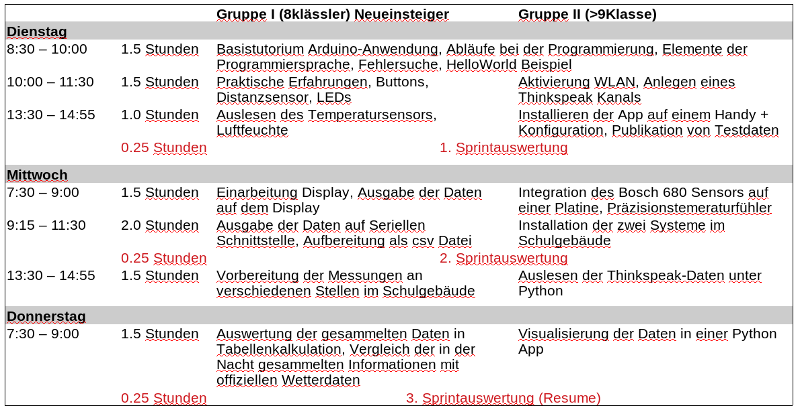
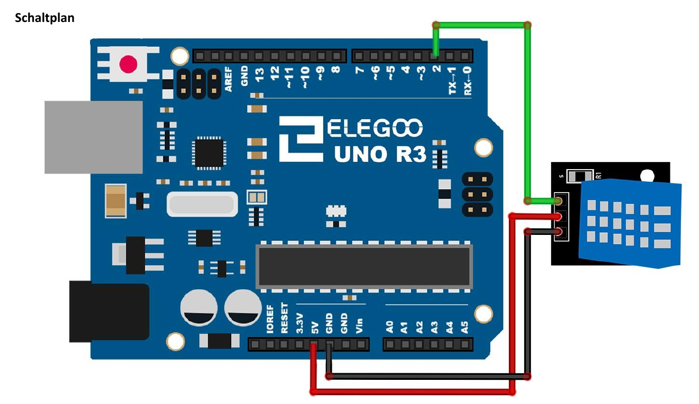

<!--

author:   Sebastian Zug & André Dietrich
email:    zug@ovgu.de   & andre.dietrich@ovgu.de
version:  0.0.1
language: de
narrator: Deutsch Female

link:     https://cdnjs.cloudflare.com/ajax/libs/animate.css/3.7.0/animate.min.css

import: https://raw.githubusercontent.com/LiaTemplates/Rextester/master/README.md
import: https://raw.githubusercontent.com/LiaTemplates/WebDev/master/README.md
import: https://raw.githubusercontent.com/LiaTemplates/NetSwarm-Simulator/master/README.md
-->


# Einführung

<h2>Week-for-Future "Wetterstation"</h2>

Prof. Dr. Sebastian Zug,
Technische Universität Bergakademie Freiberg

------------------------------

<!-- width="80%" -->

<h2>Herzlich Willkommen!</h2>

> Die interaktive Ansicht dieses Kurses ist unter folgendem [Link](https://liascript.github.io/course/?https://raw.githubusercontent.com/liaScript/ArduinoEinstieg/master/3day_workshop.md#1) verfügbar.

https://github.com/liaScript/ArduinoEinstieg/blob/master/3day_workshop_day2.md

# Wie weit sind wir gekommen?

**Gruppe I - Der Mikrocontroller gibt die Daten verschiedener Umweltsensoren auf der serielle Schnittstelle aus, wir kopieren diese in eine Tabellenkalkulation und werten sie aus.**


**Sprint-Ziele - Gruppe I**

+ Dienstag Nachmittag: Auslesen des Helligkeitssensors und des Wettersensors mit Ausgabe auf dem Bildschirm

+ Mittwoch Vormittag: Löten und Integration des Displays, Verschönerung der Ausgabe

+ Mittwoch Nachmittag: Testen der Aufzeichnung, Vorverarbeitung der Daten mit Excel, Start der 24 Stunden Messung

+ Donnerstag: Vorbereitung eines Diagramms, dass die Abweichung der Daten illustriert


**Gruppe II - Wir realisieren mit redundanten Sensoren einen Cloud-basierten Wetterdienst mit einer zugehörigen App**

**Sprint-Ziele - Gruppe II**

+ Dienstag Nachmittag: Publikation der Helligkeitsdaten in einen Thinkspeak Kanal, Handy App mit Anweisungen zur Installation aktiv

+ Mittwoch Vormittag: Integration des DHT11 und des Bosch 680 Sensors in den Aufbau, Beginn der Lötarbeiten

+ Mittwoch Nachmittag: Fertigstellung der integrierten Lösung, 24-Stunden Messungen

+ Donnerstag: Auswertung der Daten, Visualisierung unter Python/ Matlab


<!-- width="100%" -->

## Wiederholung

+ Was passiert eigentlich in unserem Controller?

+ Wie gehen wir bei der Fehlersuche vor?

Ok, Ausgaben klappen, wie sieht es mit Eingaben aus?

<!-- width="80%" -->


```c     ReadButton.c
// constants won't change. They're used here to set pin numbers:
const int buttonPin = 2;     // the number of the pushbutton pin
const int ledPin =  13;      // the number of the LED pin

// variables will change:
int buttonState = 0;         // variable for reading the pushbutton status

int setup() {
  pinMode(ledPin, INPUT);
  pinMode(buttonPin, INPUT);
}

void loop() {
  buttonState = digitalRead(buttonPin);

  // check if the pushbutton is pressed. If it is, the buttonState is HIGH:
  if (buttonState == HIGH) {
    digitalWrite(ledPIN, HIGH)
  } else {
    digitalWrite(buttonPin, LOW);
  }
}
```

Und wie gehen wir bei der Fehlersuche vor?

1. Ruhe bewahren!
2. Ruhe bewahren!
3. Situation prüfen

    + Syntaktischer Fehler (Dein Kompiler meckert!)

    + Logischer Fehler (Du hast einen Denkfehler!)

    + Hardwarefehler (Ups, draufgetreten!)

4. Fehlermeldung aufmerksam lesen
5. ggf. Hypothesen aufstellen und prüfen

> **Aufgabe:** Debuggen Sie den obrigen Quellcode!.

# Gruppe I - Mittwoch

### 3d. Temperatur und Luftfeuchte

*Immer noch langweilig ... ! Wir wollen mehr Sensoren!*

> **Aufgabe:** Lesen Sie in *Lektion 12* nach, wie sie den Temperatur- und
> Luftfeuchtigkeitssensor DHT11 in Betrieb nehmen können. Geben Sie die Werte
> auf der Seriellen Schnittestelle aus.

**Achtung: Es kursieren unterschiedliche Versionen des DHT Sensors (hellblaue Schutzkappe)**

A. Orginal Elegoo Sensor mit weißem Quadrat auf der Rückseite

<!-- width="70%" -->

B. Sensor anderer Hersteller mit Beschriftung +- auf der Vorderseite

<!-- width="70%" -->

Integrieren Sie die Sensoren und integrieren Sie die Seriellen Ausgaben, so dass
folgende Reihenfolge auf Ihrem Monitor erscheint:

```
25, 76, 243
24, 74, 231
...
```

Diese Daten brauchen wir morgen für die Auswertung und Visualisierung.


### 3e. Joystick statt Button

> **Aufgabe:** Recherchiere die Möglichkeiten des Joysticks, schreibe ein
> Programm, dass dessen Ausgaben auf die serielle Schnittstelle ausgibt.

<!-- width="70%" -->

```c
// Arduino pin numbers
const int SW_pin = 2; // digital pin connected to switch output
const int X_pin = 0; // analog pin connected to X output
const int Y_pin = 1; // analog pin connected to Y output

void setup() {
  pinMode(SW_pin, INPUT);
  digitalWrite(SW_pin, HIGH);
  Serial.begin(9600);
}

void loop() {
  Serial.print("Switch:  ");
  Serial.print(digitalRead(SW_pin));
  Serial.print("\n");
  Serial.print("X-axis: ");
  Serial.print(analogRead(X_pin));
  Serial.print("\n");
  Serial.print("Y-axis: ");
  Serial.println(analogRead(Y_pin));
  Serial.print("\n\n");
  delay(500);
}
```

> **Aufgabe:** Wandeln Sie das Programm so ab, dass beim bewegen des Joysticks
> eine Zahl verändert wird - zum Beispiel Inkrementieren beim Drücken nach
> vorn Dekrementieren beim Ziehen nach hinten.

```c                        LoesungJoystick.ino
int xPin = A1;
int yPin = A0;
int buttonPin = 2;

int xPosition = 0;
int yPosition = 0;
int buttonState = 0;

int count = 0;

void setup() {
  Serial.begin(9600);
  pinMode(xPin, INPUT);
  pinMode(yPin, INPUT);
  pinMode(buttonPin, INPUT_PULLUP);
}

void loop() {
  xPosition = analogRead(xPin);
  yPosition = analogRead(yPin);
  buttonState = digitalRead(buttonPin);

  if (buttonState == LOW) count = 0;
  if (xPosition > 700) count++;
  if (xPosition < 300) count--;
  Serial.println(count);
  delay(100);
}
```

### 3f. Display Einführung

*Langweilig ... ! Ich möchte was sehen!*

> **Aufgabe:** Verbinden Sie das Display mit dem Board entsprechend dem
> Beschaltungsplan.

[https://www.mangolabs.de/portfolio-item/lcd-i2c-display-2x16/#getting-started](https://www.mangolabs.de/portfolio-item/lcd-i2c-display-2x16/#getting-started)

Achtung für diese Aufgabe müssen Sie die zusätzliche Bibliothek _LiquidCrystal_PCF8574_
installieren. Informieren Sie sich, wie dies umzusetzen ist "How to install a library for Arduino?".

```c                   Display.ino
#include <Wire.h>
#include <LiquidCrystal_PCF8574.h>

int lcdi2c = 0x27;  // <- Hart eingecodete Adresse, die nur für unser
                    // Beispiel funktioniert, vgl. Datenblatt

void setup()
{
  LiquidCrystal_PCF8574 lcd(lcdi2c);
  lcd.begin(16, 2);
  lcd.setBacklight(255);
  lcd.clear();
  lcd.setCursor(0, 0);
  lcd.print("Gymnasium Doki");
  lcd.setCursor(0, 1);
  lcd.print("2. Coding Night");
}

void loop()
{}
```
<!--
style="width: 100%; max-width: 460px; display: block; margin-left: auto; margin-right: auto;"
-->
````
    0                             15
    0 1 2 3 4 5 6 7 8 9 A B C D E F
   ╔═╤═╤═╤═╤═╤═╤═╤═╤═╤═╤═╤═╤═╤═╤═╤═╗
 0 ║G│y│m│n│a│s│i│u│m│ │D│o│k│i│ │ ║
   ╟─┼─┼─┼─┼─┼─┼─┼─┼─┼─┼─┼─┼─┼─┼─┼─╢
 1 ║2│.│C│o│d│i│n│g│ │N│i│g│h│t│ │ ║
   ╚═╧═╧═╧═╧═╧═╧═╧═╧═╧═╧═╧═╧═╧═╧═╧═╝
````


Welche Methoden stehen denn für das Display bereit?

** 1. Cursor Konfiguration**

| Name               | Bedeutung                       |
|:-------------------|:--------------------------------|
|  void noBlink();   |                                 |
|  void blink();     |  Blinkender Cursor              |
|  void noCursor();  |  Cursor unsichtbar              |
|  void cursor();    | Aktiviert den Cursor            |
|  void setCursor();    | Bewege den Cursor an eine Position           |


** 2. Bewegung des Cursors **

{{1}}
| Name               | Bedeutung                       |
|:-------------------|:--------------------------------|
|  void scrollDisplayLeft(); | Verschiebt den Inhalt um ein Feld nach links |
|  void scrollDisplayRight(); | ... nach rechts   |
|  void leftToRight();  | Textrichtung (Bewegung des Cursors nach dem Schreiben) |
|  void rightToLeft();  | ... nach links |
|  void autoscroll();   | Die Darstellung verschiebt sich automatisch mit dem erzeugen eines neuen Zeichens `lcd.print('A')` |
|  void noAutoscroll(); | ... aux |


** 3. Bewegung des Cursors**

| Name               | Bedeutung                       |
|:-------------------|:--------------------------------|
|  void print(); | Schreibt Text auf das Display, startet an der Stelle des Cursors |
|  void write(); | Schreibt ein Zeichen auf das Display |
|  void clear(); | Löschen des gesamten Displays |

**Welche Ausgaben generieren folgende Codefragmente?**

```c
lcd.setCursor(5, 1);
lcd.print("Gymnasium Doki");
```

<!--
style="width: 100%; max-width: 460px; display: block; margin-left: auto; margin-right: auto;"
-->
````
    0                             15
    0 1 2 3 4 5 6 7 8 9 A B C D E F
   ╔═╤═╤═╤═╤═╤═╤═╤═╤═╤═╤═╤═╤═╤═╤═╤═╗
 0 ║ │ │ │ │ │ │ │ │ │ │ │ │ │ │ │ ║
   ╟─┼─┼─┼─┼─┼─┼─┼─┼─┼─┼─┼─┼─┼─┼─┼─╢
 1 ║ │ │ │ │ │G│y│m│n│a│s│i│u│m│ │D║
   ╚═╧═╧═╧═╧═╧═╧═╧═╧═╧═╧═╧═╧═╧═╧═╧═╝
````


```c
lcd.setCursor(2, 1);
String s = "Das ist ein Test";
int number = s.length();
for (int i = 0; i< number; i++)
  lcd.write(s[i]);
```

<!--
style="width: 100%; max-width: 460px; display: block; margin-left: auto; margin-right: auto;"
-->
````
    0                             15
    0 1 2 3 4 5 6 7 8 9 A B C D E F
   ╔═╤═╤═╤═╤═╤═╤═╤═╤═╤═╤═╤═╤═╤═╤═╤═╗
 0 ║ │ │ │ │ │ │ │ │ │ │ │ │ │ │ │ ║
   ╟─┼─┼─┼─┼─┼─┼─┼─┼─┼─┼─┼─┼─┼─┼─┼─╢
 1 ║ │ │D│a│s│ │i│s│t│ │e│i│n│ │T│e║
   ╚═╧═╧═╧═╧═╧═╧═╧═╧═╧═╧═╧═╧═╧═╧═╧═╝
````

```c
lcd.setCursor(15, 1);
lcd.rightToLeft();
String s = "Das ist ein superlanger Text der gar nicht aufhört";
int number = s.length();
for (int i = 0; i< number; i++)
  lcd.write(s[i]);
```

<!--
style="width: 100%; max-width: 460px; display: block; margin-left: auto; margin-right: auto;"
-->
````
    0                             15
    0 1 2 3 4 5 6 7 8 9 A B C D E F
   ╔═╤═╤═╤═╤═╤═╤═╤═╤═╤═╤═╤═╤═╤═╤═╤═╗
 0 ║ │ │ │ │ │ │ │ │ │ │ │ │ │ │ │ ║
   ╟─┼─┼─┼─┼─┼─┼─┼─┼─┼─┼─┼─┼─┼─┼─┼─╢
 1 ║t│s│e│T│ │n│i│e│ │t│s│i│ │s│a│D║
   ╚═╧═╧═╧═╧═╧═╧═╧═╧═╧═╧═╧═╧═╧═╧═╧═╝
````

```c
lcd.setCursor(15, 1);
lcd.autoscroll();
String s = "Das ist ein superlanger Text der gar nicht aufhört";
int number = s.length();
for (int i = 0; i< number; i++){
  lcd.write(s[i]);
  delay(1000);
}
```

<!--
style="width: 100%; max-width: 460px; display: block; margin-left: auto; margin-right: auto;"
-->
````
    0                             15
    0 1 2 3 4 5 6 7 8 9 A B C D E F
   ╔═╤═╤═╤═╤═╤═╤═╤═╤═╤═╤═╤═╤═╤═╤═╤═╗
 0 ║ │ │ │ │ │ │ │ │ │ │ │ │ │ │ │ ║
   ╟─┼─┼─┼─┼─┼─┼─┼─┼─┼─┼─┼─┼─┼─┼─┼─╢
 1 ║ │ │ │ │ │ │ │ │ │ │ │ │D│a│s│ ║
   ╚═╧═╧═╧═╧═╧═╧═╧═╧═╧═╧═╧═╧═╧═╧═╧═╝
````

### 3g. Und jetzt alles zusammmen


> **Aufgabe:** Geben Sie auf dem Display die aktuelle Cursor-Position des
> Joysticks aus.

{{1}}
```c                   ShowPosition.ino
#include <Wire.h>
#include <LiquidCrystal_PCF8574.h>

int lcdi2c = 0x27;
LiquidCrystal_PCF8574 lcd(lcdi2c);

int xPin = A1;
int yPin = A0;
int buttonPin = 2;

int xPosition = 0;
int yPosition = 0;
int buttonState = 0;

int count = 0;

void setup() {
  pinMode(xPin, INPUT);
  pinMode(yPin, INPUT);
  pinMode(buttonPin, INPUT_PULLUP);
  lcd.begin(16, 2);
  lcd.setBacklight(255);
  lcd.clear();
}

void loop() {
  xPosition = analogRead(xPin);
  yPosition = analogRead(yPin);
  buttonState = digitalRead(buttonPin);

  lcd.clear();
  lcd.setCursor(12, 0);
  lcd.print(xPosition);
  lcd.setCursor(12, 1);
  lcd.print(yPosition);
  delay(100);
}
```


# Gruppe II - Mittwoch

> **Aufgabe 1:** Integrieren Sie den Sens Bosch 680 in ihr System. Dieser wird über den I2C Bus an das MKR 1000 Board angeschlossen (PIN 11 und 12).

Installieren Sie die `Zanshin_BME680` Bibliothek, so dass sie darauf zugreifen können. Unter Beispiele steht eine entsprechende Implementierung zur Verfügung.

> **Aufgabe 2:** Integrieren Sie nun alle verfügbaren Sensoren auf die Aufsteckplatine, um einen kompakten Aufbau zu gewährleisten.

Entwerfen Sie dazu
zunächst einen Schaltplan des Boards und stimmen Sie diesen mit den Betreuern ab.

> **Aufgabe 3:** Bereiten Sie die Messung im Schulgebäude vor.
