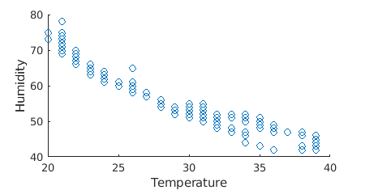
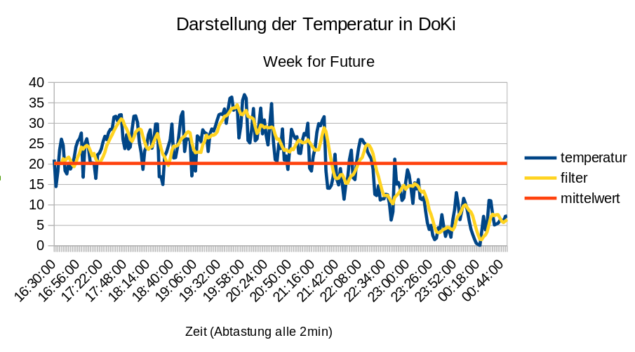

<!--

author:   Sebastian Zug & André Dietrich
email:    zug@ovgu.de   & andre.dietrich@ovgu.de
version:  0.0.1
language: de
narrator: Deutsch Female

link:     https://cdnjs.cloudflare.com/ajax/libs/animate.css/3.7.0/animate.min.css

import: https://raw.githubusercontent.com/LiaTemplates/Rextester/master/README.md
import: https://raw.githubusercontent.com/LiaTemplates/WebDev/master/README.md
import: https://raw.githubusercontent.com/LiaTemplates/NetSwarm-Simulator/master/README.md
-->


# Einführung

<h2>Week-for-Future "Wetterstation"</h2>

Prof. Dr. Sebastian Zug,
Technische Universität Bergakademie Freiberg

------------------------------

<!-- width="80%" -->

<h2>Herzlich Willkommen!</h2>

> Die interaktive Ansicht dieses Kurses ist unter folgendem [Link](https://liascript.github.io/course/?https://raw.githubusercontent.com/liaScript/ArduinoEinstieg/master/3day_workshop_day3.md#1) verfügbar.

https://github.com/liaScript/ArduinoEinstieg/blob/master/3day_workshop_day3.md

# Wie weit sind wir gekommen?

**Gruppe I - Der Mikrocontroller gibt die Daten verschiedener Umweltsensoren auf der serielle Schnittstelle aus, wir kopieren diese in eine Tabellenkalkulation und werten sie aus.**


**Sprint-Ziele - Gruppe I**

+ Dienstag Nachmittag: Auslesen des Helligkeitssensors und des Wettersensors mit Ausgabe auf dem Bildschirm

+ Mittwoch Vormittag: Löten und Integration des Displays, Verschönerung der Ausgabe

+ Mittwoch Nachmittag: Testen der Aufzeichnung, Vorverarbeitung der Daten mit Excel, Start der 24 Stunden Messung

+ Donnerstag: Vorbereitung eines Diagramms, dass die Abweichung der Daten illustriert


**Gruppe II - Wir realisieren mit redundanten Sensoren einen Cloud-basierten Wetterdienst mit einer zugehörigen App**

**Sprint-Ziele - Gruppe II**

+ Dienstag Nachmittag: Publikation der Helligkeitsdaten in einen Thinkspeak Kanal, Handy App mit Anweisungen zur Installation aktiv

+ Mittwoch Vormittag: Integration des DHT11 und des Bosch 680 Sensors in den Aufbau, Beginn der Lötarbeiten

+ Mittwoch Nachmittag: Fertigstellung der integrierten Lösung, 24-Stunden Messungen

+ Donnerstag: Auswertung der Daten, Visualisierung unter Python/ Matlab


<!-- width="100%" -->

## Datenauswertung (Gruppe II)

Beschäftigen Sie sich mit der Datenauswertung unter Thinkspeak. Evaluiert
insbesondere, wie ihr die `Status` Nachrichten in einem Diagamm ausgeben könnt.

```Matlab
% Read humidity over
% Channel ID to read data from
readChannelID = 847602;
% Humidity Field ID
TemperatureFieldID = 1;
% Humidity Field ID
HumidityFieldID = 2;

% Channel Read API Key
% If your channel is private, then enter the read API Key between the '' below:
readAPIKey = 'NRZIC3F6NST0FC4R';

% Get humidity data for the last 60 minutes from the MathWorks weather
% station channel. Learn more about the THINGSPEAKREAD function by going to
% the Documentation tab on the right side pane of this page.

data = thingSpeakRead(readChannelID, 'Fields',[TemperatureFieldID HumidityFieldID], 'NumPoints', 1000,'ReadKey',readAPIKey);
temperatureData = data(:,1);

% Read Humidity Data
humidityData = data(:,2);

% Visualize the data
scatter(temperatureData,humidityData);
xlabel('Temperature');
ylabel('Humidity');
```

<!-- width="80%" -->

## Datenauswertung (Gruppe I)

Wir wollen nun unsere Messdaten vom gestrigen Tag filtern und visualisieren.
Welche Aspekte der Temperatur, Feuchtigkeit und Helligkeitsinformationen
könnten für uns interessant sein?

Was wollen wir erreichen?

<!-- width="80%" -->

Welche Möglichkeiten hätten wir dafür?
