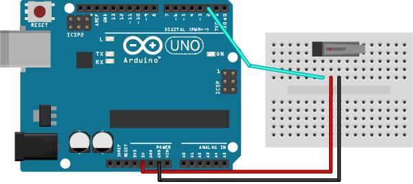
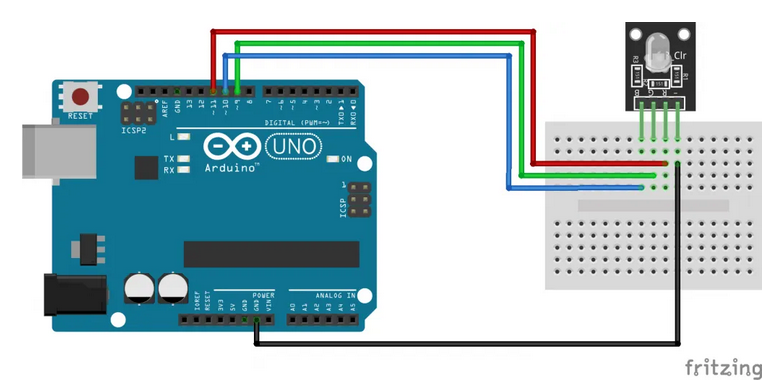

<!--

author:   Sebastian Zug & André Dietrich
email:    zug@ovgu.de   & andre.dietrich@ovgu.de
version:  0.0.3
language: de
narrator: Deutsch Female

link:     https://cdnjs.cloudflare.com/ajax/libs/animate.css/3.7.0/animate.min.css

import: https://raw.githubusercontent.com/LiaTemplates/Rextester/master/README.md
        https://raw.githubusercontent.com/LiaTemplates/WebDev/master/README.md
        https://github.com/LiaTemplates/AVR8js/main/README.md#10
        https://raw.githubusercontent.com/LiaTemplates/NetSwarm-Simulator/master/README.md
-->

[](https://liascript.github.io/course/?https://raw.githubusercontent.com/liaScript/ArduinoEinstieg/master/3days_Introduction_day1.md#1)


# Mikrocontroller Einführung - Tag 1

Prof. Dr. Sebastian Zug,
Technische Universität Bergakademie Freiberg

------------------------------

<!-- width="80%" -->

<h2>Herzlich Willkommen!</h2>

> Die interaktive Ansicht dieses Kurses ist unter folgendem [Link](https://liascript.github.io/course/?https://raw.githubusercontent.com/liaScript/ArduinoEinstieg/master/Course_00.md#1) verfügbar.

Der Quellcode der Materialien ist unter https://github.com/liaScript/ArduinoEinstieg/blob/master/3days_Introduction_day1.md zu finden.

## Vorstellungsrunde

                                     {{0-1}}
********************************************************************************

Forschung
----------------------

!?[Schwimmroboter](https://www.youtube.com/watch?v=qbDoeSv3BPs)

Lehre
----------------------

")<!-- width="80%" -->

********************************************************************************

{{1-2}}
> Und Ihr?
>
> + Was für Programmiererfahrung habt Ihr bereits?
> + Welche Programmiersprachen mögt Ihr und warum?
> + Wie viele Zeilen hatte das umfangreichste Programm, dass Ihr schon geschrieben habt?


## Planungen für diese Woche

| Wochentag                      | Zeit          | Inhalt                                           |
| ------------------------------ | ------------- | ------------------------------------------------ |
| **Montag (Mikrocontroller)**   | 09:00 - 10:00 | Grundlage C, Hello World, Serielle Schnittstelle |
|                                | 10:10 - 11:30 | Taster, Distanzsensor, Mehrfarben-Leds           |
|                                | 11:40 - 12:30 | Display                                          |
|                                | 12:30         | _Sprint Meeting_                                 |
| **Dienstag (App Entwicklung)** | 09:00 - 10:30 | Einführung MIT-App Inventor                      |
|                                | 10:40 - 11:55 | Beispielanwendungen                              |
|                                | 11:55         | _Sprint Meeting _                                |
|                                | 12:00 - 13:00 | Freie Anwendungsentwicklung                      |
| **Mittwoch (Integration)**     | 09:00 - 10:30 | Bluetooth Kommunikation im App Inventor          |
|                                | 10:40 - 11:55 | Fernsteuern des Mikrocontrollers über die App    |
|                                | 11:55         | _Sprint Meeting _                                |
|                                | 12:00 - 13:00 | Freie Anwendungsentwicklung                      |

## Einführung

<!-- width="70%" -->

**Was heißt das eigentlich "Eingebettetes System"?**

                              {{1-2}}
*******************************************************************************
> _... ein elektronischer Rechner ..., der in einen technischen Kontext_
> _eingebunden ist. Dabei übernimmt der (Kleinst-)Rechner entweder_
> _Überwachungs-, Steuerungs- oder Regelfunktionen ... weitestgehend unsichtbar_
> _für den Benutzer .. \[nach Wikipedia "Eingebettete Systeme"\]._
*******************************************************************************

**Wie programmiere ich einen Mikrocontroller?**

                              {{2-3}}
*******************************************************************************
> _Compiler wird eine Software genannt, die einen in einer Programmiersprache_
> _geschrieben Quellcode so übersetzt, dass sie von Maschinen verstanden_
> _werden können._
*******************************************************************************

**Was ist das Arduino Projekt?**

                                 {{3}}
*******************************************************************************
> _Arduino ist eine aus Soft- und Hardware bestehende_
> _Physical-Computing-Plattform. Beide Komponenten sind im Sinne von Open_
> _Source quelloffen. Die Hardware besteht aus einem einfachen E/A-Board mit_
> _einem Mikrocontroller und analogen und digitalen Ein- und Ausgängen._

  https://www.arduino.cc/


*******************************************************************************

[^3]: aus entsprechendem Artikel "Spiegel Online" http://www.spiegel.de/netzwelt/gadgets/arduino-erklaert-das-kann-der-microcontroller-a-1105328.html

## Arduino Programmierung

Arduino nutzt eine C/C++ Semantik für die Programmierung, die folgende
Grundelemente bedient

+ Alle Anweisungen enden mit einem `;`
+ Variabeln sind typbehaftet (`int`, `char`, `float`, etc.)
+ wichtige Schlüsselwörter sind `for`, `if`, `while`, etc.
+ Kommentare werden durch `//` eingeleitet


### Aufbau eines Arduino-Programmes

Jedes Arduinoprogramm umfasst 2 grundlegende Funktionen `setup()` und `loop()`.

<div>
  <wokwi-led color="red" pin="13" port="B" label="13"></wokwi-led>
  <span id="simulation-time"></span>
</div>
```cpp       arduino.cpp
const int ledPin = 13;

void setup() {
  pinMode(ledPin, OUTPUT);
}

void loop() {
  digitalWrite(ledPin, HIGH);  
  delay(1000);                
  digitalWrite(ledPin, LOW);
  delay(1000);  
}
```
@AVR8js.sketch

### Arduino IDE


Wichtige Grundeinstellungen:

+ Richtigen Port für den Programmiervorgang auswählen (Tools -> Port)
+ Richtigen Controller auswählen (Tools -> Board)
+ Richtige Baudrate für die Serielle Schnittstellen

### Hello World

*Und jetzt sind Sie dran!*

Laden Sie das Beispielprogramm "Blink" in Ihren Editor:

Datei -> Beispiele -> Basics -> Blink

Kompilieren und flashen Sie das Programm! Wichtige Tastaturbefehle sind dabei

| Tastenkombination | Bedeutung                |
| ----------------- | ------------------------ |
| Strg-R            | Kompilieren (Ve**R**ify) |
| Strg-U            | Flashend (**U**pload)    |
| Strg-T            | Code korrekt einrücken   |
| Strg-Shift-M      | Seriellen Monitor öffnen |
| Strg-L            | Cursor auf Zeile setzen  |

### C++ Basiskonstrukte und die Serielle Schnittstelle


                              {{0-1}}
*******************************************************************************

Was fehlt? Ich möchte irgendwie in den Rechner schauen können :-)

Die Serielle Schnittstelle (häufig auch als UART) bezeichnet ermöglicht das
Versenden und den Empfang von Textnachrichten. Damit können Sie zum Beispiel
Messwerte ausgeben oder das Erreichen bestimmter Programmpositionen anzeigen.

Die folgenden Beispiele vermitteln grundlegende Programmierkonstrukte in C++.
Diese können in der Simulation ausgeführt werden.  

<div>
  <span id="simulation-time"></span>
</div>
```cpp       arduino.cpp
void setup() {
  Serial.begin(9600);
  Serial.println("Hello World");
}

void loop() {
}
```
@AVR8js.sketch


Arduino kennt zwei Varianten der Ausgabe mit `print` - das einfache `print` und `println`. Welchen Unterschied vermuten Sie?

*******************************************************************************

                              {{1-2}}
*******************************************************************************

**Schleifen**

Was müssen wir tuen, um die Zahlen von 1 bis 10 auf dem Terminal anzuzeigen?

<div>
  <span id="simulation-time"></span>
</div>
```cpp       arduino.cpp
void setup() {
  Serial.begin(9600);
  int counter = 0;
  for (int i = 0; i < 10; i++){
    Serial.println(counter);  
    counter = counter + 1;
  }
}

void loop() {
}
```
@AVR8js.sketch

Welche "Einsparmöglichkeiten" sehen Sie als erfahrener Programmierer in dem Beispiel? Wie kann der Code, mit der gleichen Ausgabe kürzer gestaltet werden?

*******************************************************************************

                              {{2-3}}
*******************************************************************************

**Verzweigungen**

Verzweigungen folgen dem Muster

```c
if (Bedingung) {
  // Anweisungen
}
else{               
  // Anweisungen       
}                      
```

wobei der `else` Abschnitt optional ist.

<div>
  <span id="simulation-time"></span>
</div>
```cpp       arduino.cpp
void setup() {
  Serial.begin(9600);
  float value = 5.234;
  Serial.print(value);
  if (value > 10){
    Serial.println(" - Der Wert ist größer als 10!");
  }else{
    Serial.println(" - Der Wert ist kleiner als 10!");
  }
}

void loop() {
}
```
@AVR8js.sketch


*******************************************************************************


                              {{3-4}}
*******************************************************************************

Bedingungen werden dabei wie folgt formuliert:

<div>
  <span id="simulation-time"></span>
</div>
```c      ardunino.cpp
void setup() {
  Serial.begin(9600);
  int a = 2;
  if (a == 2) {Serial.println("a ist gleich zwei!");}
  if (a <= 5) {Serial.println("a ist kleiner oder gleich fünf!");}
  if (a != 3) {Serial.println("a ist ungleich drei!");}
  char b = 'g';
  if (b == 'z') {Serial.println("In b ist ein z gespeichert!");}
  else {Serial.println("In b ist kein z gespeichert!");}
}

void loop() {
}
```
@AVR8js.sketch

Für die Ausgabe von komplexeren, vorformatierten Ausdrücken können Sie auf einen
Befehl aus der C++ Standard-Bibliothek zurückgreifen `sprintf`

Eine anschauliche Dokumentation findet sich unter: [link](https://arduinobasics.blogspot.com/2019/05/sprintf-function.html)

*******************************************************************************

## Einstiegsübung

> **Aufgabe 1:** Schreiben Sie einen Code, der das *SOS* Morsesignal über die
> Led ausgibt!

Welche Anpassungen sind dafür an unserem Beispiel vornehmen?

```c
const int ledPin = 13;

// the setup function runs once when you press reset or power the board
void setup() {
  // initialize digital pin ledPin as an output.
  pinMode(ledPin, OUTPUT);
}

// the loop function runs over and over again forever
void loop() {
  digitalWrite(ledPin, HIGH);   // turn the LED on (HIGH is the voltage level)
  delay(1000);                  // wait for a second
  digitalWrite(ledPin, LOW);    // turn the LED off by making the voltage LOW
  delay(1000);                  // wait for a second
}
```


## Systematische Fehlersuche

Ok, Ausgaben klappen, wie sieht es mit Eingaben aus?

<!-- width="80%" -->


```c     ReadButton.c
// constants won't change. They're used here to set pin numbers:
const int buttonPin = 2;     // the number of the pushbutton pin
const int ledPin =  13;      // the number of the LED pin

// variables will change:
int buttonState = 0;         // variable for reading the pushbutton status

int setup() {
  pinMode(ledPin, INPUT);
  pinMode(buttonPin, INPUT);
}

void loop() {
  buttonState = digitalRead(buttonPin);

  // check if the pushbutton is pressed. If it is, the buttonState is HIGH:
  if (buttonState == HIGH) {
    digitalWrite(ledPin, HIGH)
  } else {
    digitalWrite(buttonPin, LOW);
  }
}
```

Und wie gehen wir bei der Fehlersuche vor?

1. Ruhe bewahren!
2. Ruhe bewahren!
3. Situation prüfen

    + Syntaktischer Fehler (Dein Kompiler meckert!)

    + Logischer Fehler (Du hast einen Denkfehler!)

    + Hardwarefehler (Ups, draufgetreten!)

4. Fehlermeldung aufmerksam lesen
5. ggf. Hypothesen aufstellen und prüfen

> **Aufgabe:** Debuggen Sie den obigen Quellcode!.


## Aufgabenkomplexe


<!-- width="80%" -->

* Referenzübersicht Arduino

  + deutsch (unvollständig) https://www.arduino.cc/reference/de/
  + englisch https://www.arduino.cc/reference/en/


### Serielle Schnittstelle als Eingabe


Die Arbeit mit der seriellen Schnittstelle vom Arduino zum PC kennen Sie bereits. Aber das Ganze funktioniert auch umgekehrt.

<div>
  <span id="simulation-time"></span>
</div>
```c      ardunino.cpp
char incomingByte;

void setup() {
  Serial.begin(9600);
}

void loop() {
  if (Serial.available() > 0) {
        incomingByte = Serial.read();
        Serial.write(incomingByte);
        if (incomingByte == 'A'){
          Serial.println("A gelesen");
        }
    }
}
```
@AVR8js.sketch

> **Aufgabe:** Erweitern Sie den Code, so dass wir die LED über 'A' an- und
> 'B' ausschalten können. Dazu "mischen" Sie den Code aus dieser und der vorangegangen Aufgabe.

### Taster als Erweiterung

*Langweilig ... ! Das ist doch kein echtes eingebettetes System!*

<!-- width="60%" -->

```c               ActivateLed.ino
const int buttonPin = 2;     // Pin des Buttons
const int ledPin =  13;      // Pin der LED

// variables will change:
int buttonState = 0;         // Variable für die Speicherung

void setup() {
  pinMode(ledPin, OUTPUT);
  pinMode(buttonPin, INPUT);
}

void loop() {
  buttonState = digitalRead(buttonPin);
  if (buttonState == HIGH) {
    // turn LED on:
    digitalWrite(ledPin, HIGH);
  } else {
    // turn LED off:
    digitalWrite(ledPin, LOW);
  }
}
```

> **Aufgabe:** Der Taster schaltet die LED ein und nach 3 Sekunden geht sie von
> selbst wieder aus.

> **Aufgabe:** Aktiviere ein 3-maliges Blinken nach dem drücken des Tasters.

### Distanzsensor als Input

*Langweilig ... ! Wir wollen einen echten Sensor!*

> **Aufgabe:** Schalten Sie die LED mittels Ultraschallsensor an und aus
> (distanzabhäniger Lichtschalter)

Verbinden Sie den Ultraschallsensor mit Ihrem Board entsprechend dieser Belegung:

<!-- data-type="none" -->
| Sensor IO | Pin am Board |
| --------- | ------------ |
| VCC       | 5V           |
| GND       | GND          |
| Echo      | 11           |
| Trigger   | 12           |


ACHTUNG: Sie müssen für die Integration des Sensors noch die Bibliothek
`NewPing` installieren. Finden Sie dafür allein einen Weg? Recherchieren sie in
den Arduino Foren zur Frage "How to install a library for Arduino?"

[Link](https://downloads.arduino.cc/libraries/bitbucket.org/teckel12/NewPing-1.9.4.zip)

```c               Sonar.ino
// Loesung
#include <NewPing.h>

const int triggerPin = 12;   
const int echoPin = 11;     
const int maxDistance = 400;
const int ledPin =  13;

NewPing sonar(triggerPin, echoPin, maxDistance);

void setup() {
  Serial.begin(9600);
  pinMode(ledPin, OUTPUT);
}

void loop() {
  delay(50);
  Serial.println(sonar.ping_cm());
}
```

Erweitern Sie das Programm so, dass eine Aktivierung der LED erfolgt, wenn ein Hindernis näher als 10cm kommt.

### Es wird bunt

Integration einer Mehrfarben LED als Erweiterung der Ausgabe

<!-- width="60%" -->   

<!-- width="60%" -->


```c     LedDifferentColors.ino
// Methoden aus dem Lösungsvorschlag der MangoLabs
const int redPin = 11;
const int greenPin = 10;
const int bluePin = 9;

void setColourRgb(unsigned int red, unsigned int green, unsigned int blue) {
  analogWrite(redPin, red);
  analogWrite(greenPin, green);
  analogWrite(bluePin, blue);
}

void setup() {
  // Start off with the LED off.
  setColourRgb(0,0,0);
}

void loop() {
  setColourRgb(255, 0, 0);
  delay(1000);
}
```

> **Aufgabe:** Wechseln Sie die Farben der LED in Abhängigkeit von der Entfernung

[^1] https://www.informatikzentrale.de/rgb-farbmodell.html
[^2]: https://arduinomodules.info/ky-016-rgb-full-color-led-module/


### Display Einführung

*Langweilig ... ! Ich möchte was sehen!*

> **Aufgabe:** Verbinden Sie das Display mit dem Board entsprechend dem
> Beschaltungsplan.


Achtung für diese Aufgabe müssen Sie die zusätzliche Bibliothek [Link `LiquidCrystal_PCF8574`](https://github.com/mathertel/LiquidCrystal_PCF8574/archive/refs/tags/2.0.0.zip)
installieren. Informieren Sie sich, wie dies umzusetzen ist "How to install a library for Arduino?".

```c                   Display.ino
#include <Wire.h>
#include <LiquidCrystal_PCF8574.h>

int lcdi2c = 0x27; // <- Hart eingecodete Adresse, die nur für unser
                   // Beispiel funktioniert, vgl. Datenblatt

void setup()
{
  LiquidCrystal_PCF8574 lcd(lcdi2c);
  lcd.begin(16, 2);
  lcd.setBacklight(255);
  lcd.clear();
  lcd.setCursor(0, 0);
  lcd.print("Gymnasium DD");
  lcd.setCursor(0, 1);
  lcd.print("Projektwoche");
}

void loop()
{}
```
<!--
style="width: 100%; max-width: 400px; display: block; margin-left: auto; margin-right: auto;"
-->
````
    0                             15
    0 1 2 3 4 5 6 7 8 9 A B C D E F
   ╔═╤═╤═╤═╤═╤═╤═╤═╤═╤═╤═╤═╤═╤═╤═╤═╗
 0 ║G│y│m│n│a│s│i│u│m│ │D│D│ │ │ │ ║
   ╟─┼─┼─┼─┼─┼─┼─┼─┼─┼─┼─┼─┼─┼─┼─┼─╢
 1 ║P│r│o│j│e│k│t│w│o│c│h│e│ │ │ │ ║
   ╚═╧═╧═╧═╧═╧═╧═╧═╧═╧═╧═╧═╧═╧═╧═╧═╝
````


{{1}}
Welche Methoden stehen denn für das Display bereit?

{{1}}
** 1. Cursor Konfiguration**

{{1}}
| Name                | Bedeutung                          |
|:------------------- |:---------------------------------- |
| `void noBlink();`   |                                    |
| `void blink();`     | Blinkender Cursor                  |
| `void noCursor();`  | Cursor unsichtbar                  |
| `void cursor();`    | Aktiviert den Cursor               |
| `void setCursor();` | Bewege den Cursor an eine Position |


{{1}}
** 2. Bewegung des Cursors **

{{1}}
| Name                         | Bedeutung                                                                                          |
|:---------------------------- |:-------------------------------------------------------------------------------------------------- |
| `void scrollDisplayLeft();`  | Verschiebt den Inhalt um ein Feld nach links                                                       |
| `void scrollDisplayRight();` | ... nach rechts                                                                                    |
| `void leftToRight();`        | Textrichtung (Bewegung des Cursors nach dem Schreiben)                                             |
| `void rightToLeft();`        | ... nach links                                                                                     |
| `void autoscroll();`         | Die Darstellung verschiebt sich automatisch mit dem erzeugen eines neuen Zeichens `lcd.print('A')` |
| `void noAutoscroll();`       | ... aux                                                                                            |


{{1}}
** 3. Bewegung des Cursors**

{{1}}
| Name            | Bedeutung                                                        |
|:--------------- |:---------------------------------------------------------------- |
| `void print();` | Schreibt Text auf das Display, startet an der Stelle des Cursors |
| `void write();` | Schreibt ein Zeichen auf das Display                             |
| `void clear();` | Löschen des gesamten Displays                                    |

{{2}}
**Welche Ausgaben generieren folgende Codefragmente?**

{{2}}
```c
lcd.setCursor(5, 1);
lcd.print("Gymnasium DD");
```

{{3}}
<!--
style="width: 100%; max-width: 400px; display: block; margin-left: auto; margin-right: auto;"
-->
```ascii
    0                             15
    0 1 2 3 4 5 6 7 8 9 A B C D E F
   ╔═╤═╤═╤═╤═╤═╤═╤═╤═╤═╤═╤═╤═╤═╤═╤═╗
 0 ║ │ │ │ │ │ │ │ │ │ │ │ │ │ │ │ ║
   ╟─┼─┼─┼─┼─┼─┼─┼─┼─┼─┼─┼─┼─┼─┼─┼─╢
 1 ║ │ │ │ │ │G│y│m│n│a│s│i│u│m│ │D║
   ╚═╧═╧═╧═╧═╧═╧═╧═╧═╧═╧═╧═╧═╧═╧═╧═╝
```


{{2}}
```c
lcd.setCursor(2, 1);
String s = "Das ist ein Test";
int number = s.length();
for (int i = 0; i< number; i++)
  lcd.write(s[i]);
```

{{3}}
<!--
style="width: 100%; max-width: 400px; display: block; margin-left: auto; margin-right: auto;"
-->
```ascii
    0                             15
    0 1 2 3 4 5 6 7 8 9 A B C D E F
   ╔═╤═╤═╤═╤═╤═╤═╤═╤═╤═╤═╤═╤═╤═╤═╤═╗
 0 ║ │ │ │ │ │ │ │ │ │ │ │ │ │ │ │ ║
   ╟─┼─┼─┼─┼─┼─┼─┼─┼─┼─┼─┼─┼─┼─┼─┼─╢
 1 ║ │ │D│a│s│ │i│s│t│ │e│i│n│ │T│e║
   ╚═╧═╧═╧═╧═╧═╧═╧═╧═╧═╧═╧═╧═╧═╧═╧═╝
```

{{2}}
```c
lcd.setCursor(15, 1);
lcd.rightToLeft();
String s = "Das ist ein superlanger Text der gar nicht aufhört";
int number = s.length();
for (int i = 0; i< number; i++)
  lcd.write(s[i]);
```

{{3}}
<!--
style="width: 100%; max-width: 400px; display: block; margin-left: auto; margin-right: auto;"
-->
```ascii
    0                             15
    0 1 2 3 4 5 6 7 8 9 A B C D E F
   ╔═╤═╤═╤═╤═╤═╤═╤═╤═╤═╤═╤═╤═╤═╤═╤═╗
 0 ║ │ │ │ │ │ │ │ │ │ │ │ │ │ │ │ ║
   ╟─┼─┼─┼─┼─┼─┼─┼─┼─┼─┼─┼─┼─┼─┼─┼─╢
 1 ║t│s│e│T│ │n│i│e│ │t│s│i│ │s│a│D║
   ╚═╧═╧═╧═╧═╧═╧═╧═╧═╧═╧═╧═╧═╧═╧═╧═╝
```


{{2}}
```c
lcd.setCursor(15, 1);
lcd.autoscroll();
String s = "Das ist ein superlanger Text der gar nicht aufhört";
int number = s.length();
for (int i = 0; i< number; i++){
  lcd.write(s[i]);
  delay(1000);
}
```

{{3}}
<!--
style="width: 100%; max-width: 400px; display: block; margin-left: auto; margin-right: auto;"
-->
```ascii
    0                             15
    0 1 2 3 4 5 6 7 8 9 A B C D E F
   ╔═╤═╤═╤═╤═╤═╤═╤═╤═╤═╤═╤═╤═╤═╤═╤═╗
 0 ║ │ │ │ │ │ │ │ │ │ │ │ │ │ │ │ ║
   ╟─┼─┼─┼─┼─┼─┼─┼─┼─┼─┼─┼─┼─┼─┼─┼─╢
 1 ║ │ │ │ │ │ │ │ │ │ │ │ │D│a│s│ ║
   ╚═╧═╧═╧═╧═╧═╧═╧═╧═╧═╧═╧═╧═╧═╧═╧═╝
```

{{4}}
> **Aufgabe:** Geben Sie die Messwerte des Ultraschallsensors auf dem Display aus!.
