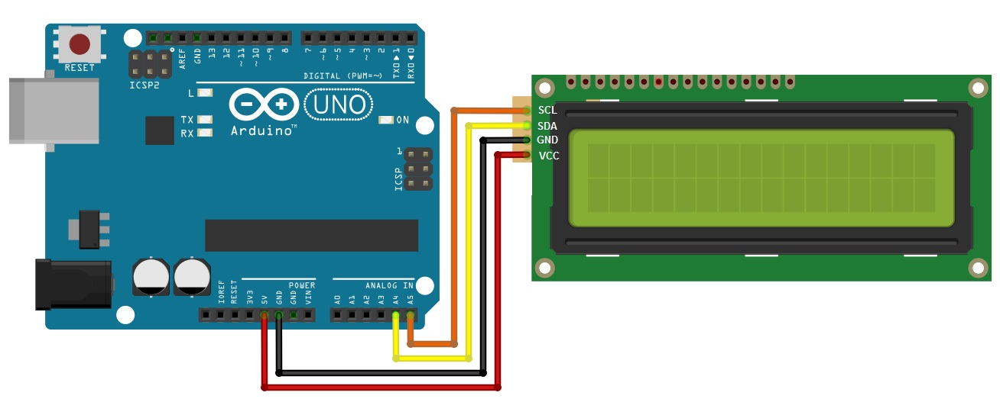
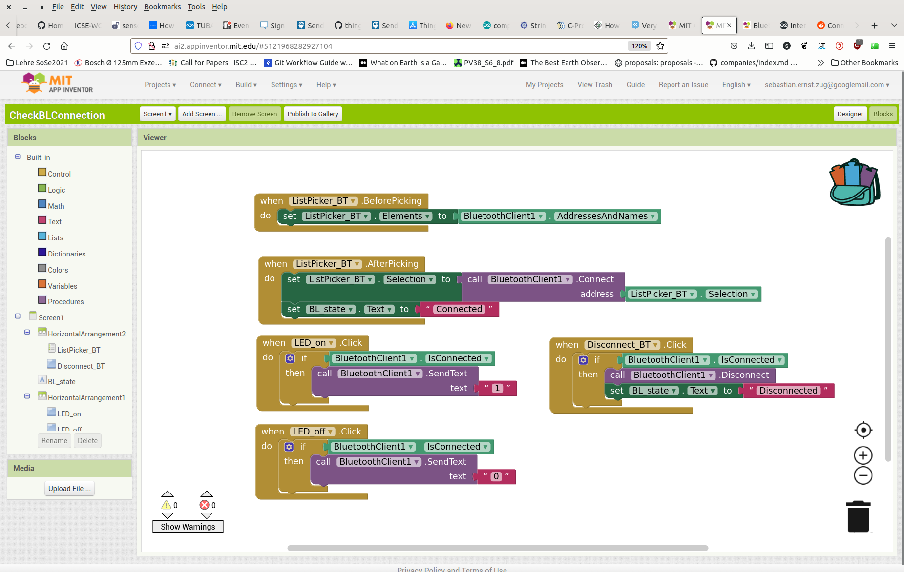

<!--

author:   Sebastian Zug & André Dietrich
email:    zug@ovgu.de   & andre.dietrich@ovgu.de
version:  0.0.3
language: de
narrator: Deutsch Female

link:     https://cdnjs.cloudflare.com/ajax/libs/animate.css/3.7.0/animate.min.css

import: https://raw.githubusercontent.com/LiaTemplates/Rextester/master/README.md
        https://raw.githubusercontent.com/LiaTemplates/WebDev/master/README.md
        https://github.com/LiaTemplates/AVR8js/main/README.md#10
        https://raw.githubusercontent.com/LiaTemplates/NetSwarm-Simulator/master/README.md
-->

[](https://liascript.github.io/course/?https://raw.githubusercontent.com/liaScript/ArduinoEinstieg/master/3days_Introduction_day2.md#1)


# Mikrocontroller & App-Entwicklung - Tag 2

Prof. Dr. Sebastian Zug,
Technische Universität Bergakademie Freiberg

------------------------------

<!-- width="80%" -->

<h2>Herzlich Willkommen!</h2>

> Die interaktive Ansicht dieses Kurses ist unter folgendem [Link](https://liascript.github.io/course/?https://raw.githubusercontent.com/liaScript/ArduinoEinstieg/master/Course_00.md#1) verfügbar.

Der Quellcode der Materialien ist unter https://github.com/liaScript/ArduinoEinstieg/blob/master/3days_Introduction_day2.md zu finden.

## Planungen für diese Woche

Ich habe den Zeitplan etwas angepasst ...

| Wochentag                      | Zeit          | Inhalt                                           |
| ------------------------------ | ------------- | ------------------------------------------------ |
| **Montag (Mikrocontroller)**   | 09:00 - 10:00 | Grundlage C, Hello World, Serielle Schnittstelle |
|                                | 10:10 - 11:30 | Taster, Distanzsensor, Mehrfarben-Leds           |
|                                | 11:40 - 12:30 | Display                                          |
| **Dienstag (Mikrocontroller)** | 09:00 - 10:40 | String Klasse und Displays                       |
|                                | 10:50 - 11:55 | Beispielanwendungen mit dem Display                               |
|                                | 12:00 - 13:00 | Inbetriebnahme App-Inventor                      |
| **Mittwoch (App Entwicklung)** | 09:00 - 10:30 | Bluetooth Kommunikation im App Inventor          |
|                                | 10:40 - 11:55 | Fernsteuern des Mikrocontrollers über die App    |
|                                | 12:00 - 13:00 | Freie Anwendungsentwicklung                      |


<!--
style="width: 100%; max-width: 860px; display: block; margin-left: auto; margin-right: auto;"
-->
```ascii
                                 US Sensor
                USB/Serielle         |         Serielle                     Bluetooth
                Schnittstelle        v         Schnittstelle                            
╔══════════════╗              +-------------+              +-------------+             ╔══════════════╗
║ Arduino IDE  ║ LED-Cmds     | Arduino     | ---------->  | HC-06       |             ║ Handy-App    ║      
║              ║ -----------> |             |  Messungen   | Bluetooth   |             ║              ║
║              ║              |             |              | to          |  )))   (((  ║              ║
║              ║ Display Cmds |             | <----------  | Serial      |             ║              ║   
║              ║ -----------> |             |  Commands    |             |             ║              ║   
╚══════════════╝              +-------------+              +-------------+             ╚══════════════╝      
                                 |       |                                     
                                 v       v                              
                              Display   LED                    
```

## Systematische Fehlersuche

Und wie gehen wir bei der Fehlersuche vor?

1. Ruhe bewahren!
2. Ruhe bewahren!
3. Situation prüfen

    + Syntaktischer Fehler (_Dein Kompiler meckert!_)

    + Logischer Fehler (_Du hast einen Denkfehler!_)

    + Hardwarefehler (_Ups, draufgetreten!_)

4. Fehlermeldung aufmerksam lesen
5. ggf. Hypothesen aufstellen und prüfen

> **Aufgabe:** Debuggen Sie den Quellcode!.

```c     ReadButton.c
const int buttonPin = 2;   
const int ledPin =  13;    

int buttonState = 0;

int setup() {
  pinMode(ledPin, INPUT);
  pinMode(buttonPin, INPUT);
}

void loop() {
  buttonState = digitalRead(buttonPin);

  if (buttonState == HIGH) {
    digitalWrite(ledPin, HIGH)
  } else {
    digitalWrite(buttonPin, LOW);
  }
}
```

## Aufgabenkomplex Mikrocontroller

<!-- width="80%" -->

* Referenzübersicht Arduino

  + deutsch (unvollständig) https://www.arduino.cc/reference/de/
  + englisch https://www.arduino.cc/reference/en/

### String Grundlagen

Die zugehörigen Methoden der String-Klasse finden sich in der Dokumentation unter [String](https://www.arduino.cc/reference/de/language/variables/data-types/stringobject/)


<div>
  <span id="simulation-time"></span>
</div>
```cpp       String.cpp
void setup() {
  Serial.begin(9600);
  String HelloWorld = "Hello World";     // Das ist ein String
  String Greetings = "   Nice to meet you!                ";
  Serial.println(HelloWorld + " - " + Greetings);
}

void loop() {
}
```
@AVR8js.sketch

> Aufgabe: Suchen Sie in der Dokumentation nach Methoden, die im obigen Beispiel
> die Lehrzeichen in `Greetings` entfernt und `HelloWorld` die großen Buchstaben
> in kleine umwandelt.

> Frage: Warum sind die beiden Operationen für unsere Anwendung wichtig?

                              {{1-2}}
********************************************************************************

<div>
  <span id="simulation-time"></span>
</div>
```c      ardunino.cpp
//char incomingByte;
String receivedString;

void setup() {
  Serial.begin(9600);
  Serial.println("Geben Sie Ihren Namen ein!");
}

void loop() {
  if (Serial.available() > 0) {
        //incomingByte = Serial.read();    // Lesen eines Zeichens
        receivedString = Serial.readString();
        Serial.print(receivedString);
        if (receivedString.equals("Robin"))
        {
           Serial.println(" Hood");
        }
    }
}
```
@AVR8js.sketch

> Aufgabe: Führen Sie den Code auf dem Mikrocontroller aus und testen Sie, ob Ihr Name eingeben wurde.

********************************************************************************

### Zerlegung von Befehlsworten

> __Aufgabe:__ Lesen Sie folgenden Code und erklären Sie diesen!

<div>
  <span id="simulation-time"></span>
</div>
```cpp       StringAuswertung.cpp
const int ledPin = 13;

void setup() {
  Serial.begin(9600);
  Serial.println("Zerlege das Befehlswort:");
  pinMode(ledPin, OUTPUT);

  String LEDCommand = "7, 12, 4";
  Serial.println(LEDCommand);
  int firstCommaPosition = LEDCommand.indexOf(",");
  String redString = LEDCommand.substring(0, firstCommaPosition);
  int redNumber = redString.toInt();
  Serial.println(redNumber);
}

void loop() {
}
```
@AVR8js.sketch

> Aufgabe: Wie können wir ALLE Farbwerte auslesen?

                       {{1-2}}
********************************************************************************

<div>
  <span id="simulation-time"></span>
</div>
```cpp       StringAuswertung.cpp
void setup() {
  Serial.begin(9600);
  Serial.print("Zerlege das Befehlswort: ");
  pinMode(ledPin, OUTPUT);

  String LEDCommand = "7, 12, 4";
  Serial.println(LEDCommand);

  int  LEDValues [] = {0,0,0};
  int startPosition = 0;
  for (int i=0; i<3; i++){
    int CommaPosition = LEDCommand.indexOf(",");
    String colorString = LEDCommand.substring(startPosition, CommaPosition);
    int colorStringLength = colorString.length();
    LEDValues[i] = colorString.toInt();

    LEDCommand.remove(startPosition, colorStringLength + 1);
    LEDCommand.trim();
  }
  Serial.println(LEDValues[0]);
  Serial.println(LEDValues[1]);
  Serial.println(LEDValues[2]);
}

void loop() {
}
```
@AVR8js.sketch

********************************************************************************

### Ansteuern der 3 Farben LED

> Aufgabe: Jetzt wird es ernst - erweitern Sie unseren Code der Mehrfarben LED, um diese mit den Kommandos der Seriellen Eingabe zu steuern.

```c     LedDifferentColors.ino
const int redPin = 11;
const int greenPin = 10;
const int bluePin = 9;

void setColourRgb(unsigned int red, unsigned int green, unsigned int blue) {
  analogWrite(redPin, red);
  analogWrite(greenPin, green);
  analogWrite(bluePin, blue);
}

void setup() {
  setColourRgb(0,0,0);
}

void loop() {
  setColourRgb(255, 0, 0);
  delay(1000);
}
```

### Display Einführung

*Langweilig ... ! Ich möchte was sehen!*

> **Aufgabe:** Verbinden Sie das Display mit dem Board entsprechend dem
> Beschaltungsplan.



Achtung für diese Aufgabe müssen Sie die zusätzliche Bibliothek [Link `LiquidCrystal_PCF8574`](https://github.com/mathertel/LiquidCrystal_PCF8574/archive/refs/tags/2.0.0.zip)
installieren. Informieren Sie sich, wie dies umzusetzen ist "How to install a library for Arduino?".

```c                   Display.ino
#include <Wire.h>
#include <LiquidCrystal_PCF8574.h>

int lcdi2c = 0x27; // <- Hart eingecodete Adresse, die nur für unser
                   // Beispiel funktioniert, vgl. Datenblatt

void setup()
{
  LiquidCrystal_PCF8574 lcd(lcdi2c);
  lcd.begin(16, 2);
  lcd.setBacklight(255);
  lcd.clear();
  lcd.setCursor(0, 0);
  lcd.print("Gymnasium DD");
  lcd.setCursor(0, 1);
  lcd.print("Projektwoche");
}

void loop()
{}
```
<!--
style="width: 100%; max-width: 400px; display: block; margin-left: auto; margin-right: auto;"
-->
````
    0                             15
    0 1 2 3 4 5 6 7 8 9 A B C D E F
   ╔═╤═╤═╤═╤═╤═╤═╤═╤═╤═╤═╤═╤═╤═╤═╤═╗
 0 ║G│y│m│n│a│s│i│u│m│ │D│D│ │ │ │ ║
   ╟─┼─┼─┼─┼─┼─┼─┼─┼─┼─┼─┼─┼─┼─┼─┼─╢
 1 ║P│r│o│j│e│k│t│w│o│c│h│e│ │ │ │ ║
   ╚═╧═╧═╧═╧═╧═╧═╧═╧═╧═╧═╧═╧═╧═╧═╧═╝
````

### Display Befehle

Welche Methoden stehen denn für das Display bereit?

** 1. Cursor Konfiguration**

                               {{0-1}}
********************************************************************************

| Name                | Bedeutung                          |
|:------------------- |:---------------------------------- |
| `void noBlink();`   |                                    |
| `void blink();`     | Blinkender Cursor                  |
| `void noCursor();`  | Cursor unsichtbar                  |
| `void cursor();`    | Aktiviert den Cursor               |
| `void setCursor();` | Bewege den Cursor an eine Position |

********************************************************************************


** 2. Bewegung des Cursors **

                              {{1-2}}
********************************************************************************

| Name                         | Bedeutung                                                                                          |
|:---------------------------- |:-------------------------------------------------------------------------------------------------- |
| `void scrollDisplayLeft();`  | Verschiebt den Inhalt um ein Feld nach links                                                       |
| `void scrollDisplayRight();` | ... nach rechts                                                                                    |
| `void leftToRight();`        | Textrichtung (Bewegung des Cursors nach dem Schreiben)                                             |
| `void rightToLeft();`        | ... nach links                                                                                     |
| `void autoscroll();`         | Die Darstellung verschiebt sich automatisch mit dem erzeugen eines neuen Zeichens `lcd.print('A')` |
| `void noAutoscroll();`       | ... aux                                                                                            |

********************************************************************************

** 3. Bewegung des Cursors**

                               {{2-3}}
********************************************************************************

| Name            | Bedeutung                                                        |
|:--------------- |:---------------------------------------------------------------- |
| `void print();` | Schreibt Text auf das Display, startet an der Stelle des Cursors |
| `void write();` | Schreibt ein Zeichen auf das Display                             |
| `void clear();` | Löschen des gesamten Displays                                    |

********************************************************************************

### Display Beispiele

                              {{0-1}}
********************************************************************************

```c
lcd.setCursor(5, 1);
lcd.print("Gymnasium DD");
```

<!--
style="width: 100%; max-width: 400px; display: block; margin-left: auto; margin-right: auto;"
-->
```ascii
    0                             15
    0 1 2 3 4 5 6 7 8 9 A B C D E F
   ╔═╤═╤═╤═╤═╤═╤═╤═╤═╤═╤═╤═╤═╤═╤═╤═╗
 0 ║ │ │ │ │ │ │ │ │ │ │ │ │ │ │ │ ║
   ╟─┼─┼─┼─┼─┼─┼─┼─┼─┼─┼─┼─┼─┼─┼─┼─╢
 1 ║ │ │ │ │ │G│y│m│n│a│s│i│u│m│ │D║
   ╚═╧═╧═╧═╧═╧═╧═╧═╧═╧═╧═╧═╧═╧═╧═╧═╝
```

********************************************************************************

{{1}}
```c
lcd.setCursor(2, 1);
String s = "Das ist ein Test";
int number = s.length();
for (int i = 0; i< number; i++)
  lcd.write(s[i]);
```

{{2}}
<!--
style="width: 100%; max-width: 400px; display: block; margin-left: auto; margin-right: auto;"
-->
```ascii
    0                             15
    0 1 2 3 4 5 6 7 8 9 A B C D E F
   ╔═╤═╤═╤═╤═╤═╤═╤═╤═╤═╤═╤═╤═╤═╤═╤═╗
 0 ║ │ │ │ │ │ │ │ │ │ │ │ │ │ │ │ ║
   ╟─┼─┼─┼─┼─┼─┼─┼─┼─┼─┼─┼─┼─┼─┼─┼─╢
 1 ║ │ │D│a│s│ │i│s│t│ │e│i│n│ │T│e║
   ╚═╧═╧═╧═╧═╧═╧═╧═╧═╧═╧═╧═╧═╧═╧═╧═╝
```

{{3}}
```c
lcd.setCursor(15, 1);
lcd.rightToLeft();
String s = "Das ist ein superlanger Text der gar nicht aufhört";
int number = s.length();
for (int i = 0; i< number; i++)
  lcd.write(s[i]);
```

{{4}}
<!--
style="width: 100%; max-width: 400px; display: block; margin-left: auto; margin-right: auto;"
-->
```ascii
    0                             15
    0 1 2 3 4 5 6 7 8 9 A B C D E F
   ╔═╤═╤═╤═╤═╤═╤═╤═╤═╤═╤═╤═╤═╤═╤═╤═╗
 0 ║ │ │ │ │ │ │ │ │ │ │ │ │ │ │ │ ║
   ╟─┼─┼─┼─┼─┼─┼─┼─┼─┼─┼─┼─┼─┼─┼─┼─╢
 1 ║t│s│e│T│ │n│i│e│ │t│s│i│ │s│a│D║
   ╚═╧═╧═╧═╧═╧═╧═╧═╧═╧═╧═╧═╧═╧═╧═╧═╝
```


{{6}}
```c
lcd.setCursor(15, 1);
lcd.autoscroll();
String s = "Das ist ein superlanger Text der gar nicht aufhört";
int number = s.length();
for (int i = 0; i< number; i++){
  lcd.write(s[i]);
  delay(1000);
}
```

{{7}}
<!--
style="width: 100%; max-width: 400px; display: block; margin-left: auto; margin-right: auto;"
-->
```ascii
    0                             15
    0 1 2 3 4 5 6 7 8 9 A B C D E F
   ╔═╤═╤═╤═╤═╤═╤═╤═╤═╤═╤═╤═╤═╤═╤═╤═╗
 0 ║ │ │ │ │ │ │ │ │ │ │ │ │ │ │ │ ║
   ╟─┼─┼─┼─┼─┼─┼─┼─┼─┼─┼─┼─┼─┼─┼─┼─╢
 1 ║ │ │ │ │ │ │ │ │ │ │ │ │D│a│s│ ║
   ╚═╧═╧═╧═╧═╧═╧═╧═╧═╧═╧═╧═╧═╧═╧═╧═╝
```

### Display Aufgaben

> **Aufgabe:** Geben Sie die Messwerte des Ultraschallsensors auf dem Display aus!.

> **Aufgabe:** Geben Sie einen Text von der Seriellen Schnittstelle auf dem Display aus!.

## App Inventor

App Inventor ist eine ursprünglich vom US-amerikanischen Unternehmen Google Inc. entwickelte Integrierte Entwicklungsumgebung, um Anwendungen für Android zu programmieren. Die verwendete grafische Schnittstelle ermöglicht es Anwendern, per Drag and Drop grafische Blöcke (grafische Programmiersprache) zu einer Anwendung für Mobiltelefone mit dem Android-System zu erstellen.

https://appinventor.mit.edu/

> Aufgabe: Melden Sie sich bitte unter dem angegebenen Link an.

### Einsteiger

// Mitmachdemo

### Experten

Erweitern Sie Ihre Schaltung um einen HC-06 Bluetooth Dongle und steuern Sie den Status einer LED über die Eingaben der Pins. Die Beschaltung entnehmen Sie dem obigen Schaubild.


```c
#include <SoftwareSerial.h>

char Incoming_value = 0;

const byte rxPin = 2;
const byte txPin = 3;

// Set up a new SoftwareSerial object
SoftwareSerial mySerial (rxPin, txPin);

void setup()
{
  mySerial.begin(9600);     
  mySerial.println("Los geht's");    
  pinMode(13, OUTPUT);       
}

void loop()
{
  if(mySerial.available() > 0)  
  {
    Incoming_value = mySerial.read();      
    mySerial.print(Incoming_value);        
    mySerial.print("\n");        
    if(Incoming_value == '1')             
      digitalWrite(13, HIGH);  
    else if(Incoming_value == '0')       
      digitalWrite(13, LOW);   
  }                            
}
```

> Frage: Warum brauchen wir die Software-Serial [Link](https://docs.arduino.cc/learn/built-in-libraries/software-serial) Implementierung?




Die aai Datei finden Sie unter [Github-link](https://github.com/LiaScript/ArduinoEinstieg/raw/master/CodeExamples/ProjektwocheGymnasium/check_bluetooth/CheckBLConnection.aia)
