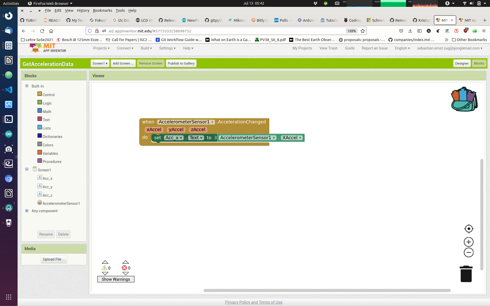
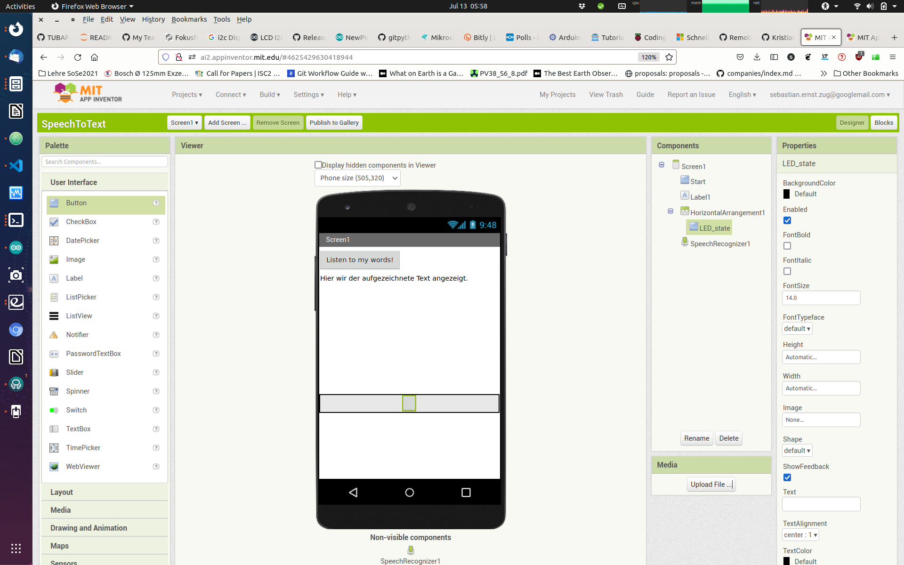
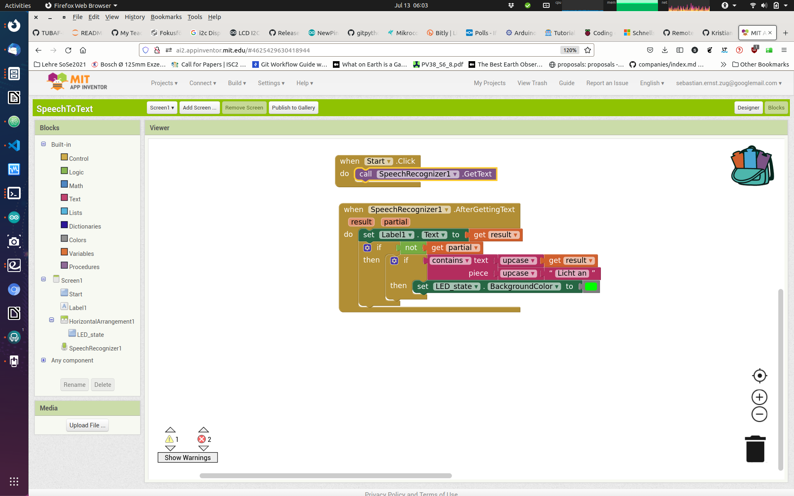
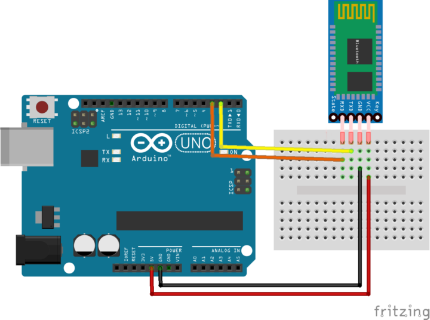
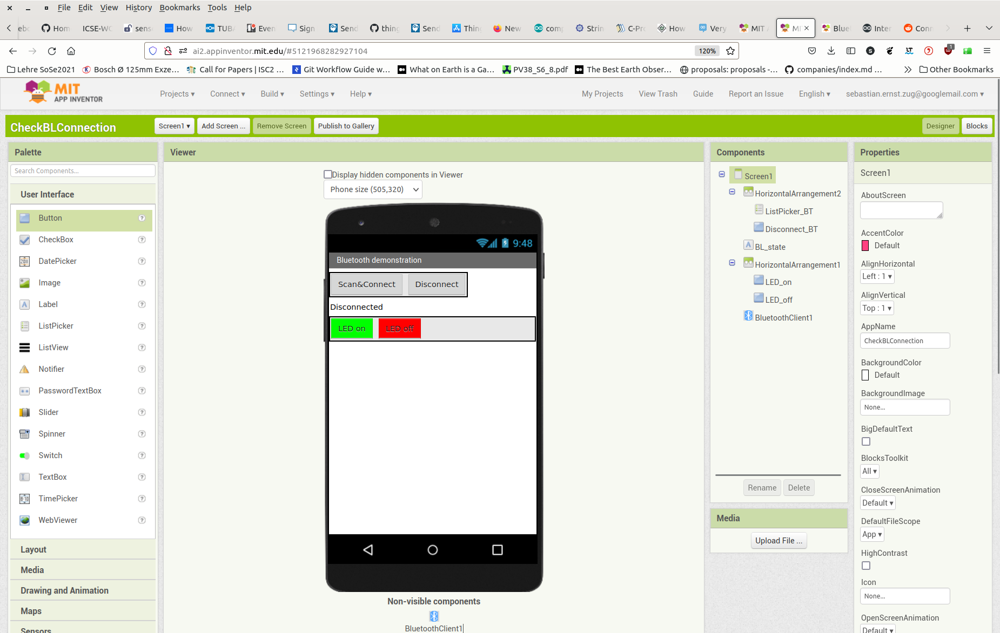
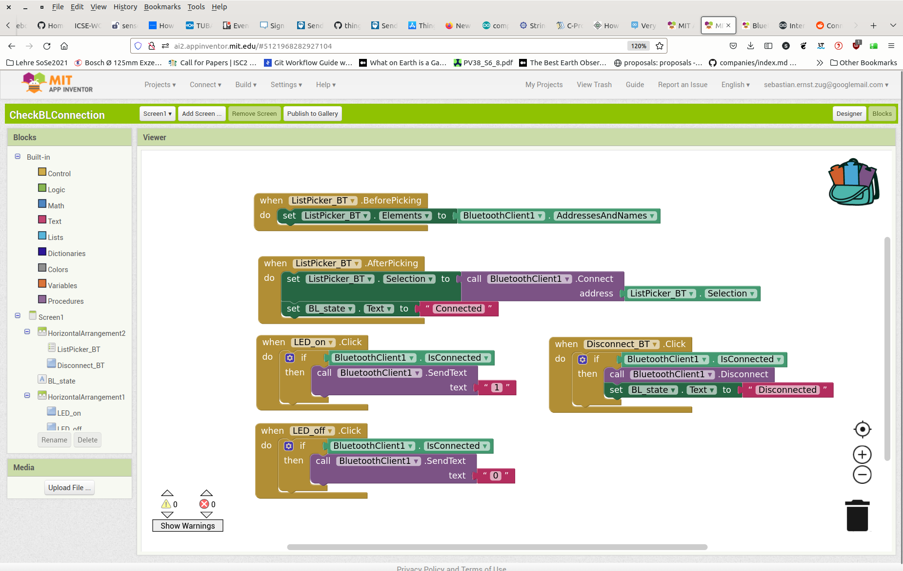

<!--

author:   Sebastian Zug & André Dietrich
email:    zug@ovgu.de   & andre.dietrich@ovgu.de
version:  0.0.3
language: de
narrator: Deutsch Female

link:     https://cdnjs.cloudflare.com/ajax/libs/animate.css/3.7.0/animate.min.css

import: https://raw.githubusercontent.com/LiaTemplates/Rextester/master/README.md
        https://raw.githubusercontent.com/LiaTemplates/WebDev/master/README.md
        https://github.com/LiaTemplates/AVR8js/main/README.md#10
        https://raw.githubusercontent.com/LiaTemplates/NetSwarm-Simulator/master/README.md
-->

[](https://liascript.github.io/course/?https://raw.githubusercontent.com/liaScript/ArduinoEinstieg/master/3days_Introduction_day3.md#1)


# Mikrocontroller & App-Entwicklung - Tag 3

Prof. Dr. Sebastian Zug,
Technische Universität Bergakademie Freiberg

------------------------------

<!-- width="80%" -->

<h2>Herzlich Willkommen!</h2>

> Die interaktive Ansicht dieses Kurses ist unter folgendem [Link](https://liascript.github.io/course/?https://raw.githubusercontent.com/liaScript/ArduinoEinstieg/master/Course_00.md#1) verfügbar.

Der Quellcode der Materialien ist unter https://github.com/liaScript/ArduinoEinstieg/blob/master/3days_Introduction_day2.md zu finden.

## Planungen für diese Woche

Ich habe den Zeitplan etwas angepasst ...

| Wochentag                      | Zeit          | Inhalt                                                               |
| ------------------------------ | ------------- | -------------------------------------------------------------------- |
| **Montag (Mikrocontroller)**   | 09:00 - 10:00 | Grundlage C, Hello World, Serielle Schnittstelle                     |
|                                | 10:10 - 11:30 | Taster, Distanzsensor                                                |
|                                | 11:40 - 12:30 | Mehrfarben-Leds                                                      |
| **Dienstag (Mikrocontroller)** | 09:00 - 10:40 | String Klasse und Displays                                           |
|                                | 10:50 - 11:55 | Beispielanwendungen mit dem Display                                  |
|                                | 12:00 - 12:30 | Inbetriebnahme App-Inventor                                          |
| **Mittwoch (App Entwicklung)** | 09:00 - 10:30 | Textausgabe auf dem Display, Bluetooth Kommunikation im App Inventor |
|                                | 10:55 - 11:55 | Freie Anwendungsentwicklung                                          |
|                                | 12:00 - 12:30 | Vorbereitung Präsentation                                            |
| **Donnerstag **                |               |                                                                      |


<!--
style="width: 100%; max-width: 860px; display: block; margin-left: auto; margin-right: auto;"
-->
```ascii
                                 US Sensor
                USB/Serielle         |         Serielle                     Bluetooth
                Schnittstelle        v         Schnittstelle                            
╔══════════════╗              +-------------+              +-------------+             ╔══════════════╗
║ Arduino IDE  ║ LED-Cmds     | Arduino     | ---------->  | HC-06       |             ║ Handy-App    ║      
║              ║ -----------> |             |  Messungen   | Bluetooth   |             ║              ║
║              ║              |             |              | to          |  )))   (((  ║              ║
║              ║ Display Cmds |             | <----------  | Serial      |             ║              ║   
║              ║ -----------> |             |  Commands    |             |             ║              ║   
╚══════════════╝              +-------------+              +-------------+             ╚══════════════╝      
                                 |       |                                     
                                 v       v                              
                              Display   LED             
```

## Vorbereitende Aufgabe

> Aufgabe: Zeigen Sie auf dem Display einen Text an, den Sie über die Serielle Schnittstelle eingegeben haben.

1. Integrieren Sie das Display in Ihre Schaltung
2. Testen Sie dessen Funktion mit einem einfachen Beispiel!
3. Integrieren Sie das Einlesen des Strings von der Seriellen Schnittstelle.
4. Leiten Sie den Text an das Display weiter

```c
String incommingText;

void loop() {
  if (Serial.available()) {
    incommingText = Serial.readString();
    Serial.print("Empfangener Text: ");
    Serial.println(incommingText);
    ...
  }
}
```

> Zusatzaufgabe: Übernehmen Sie auch die Information wo der Text auf dem Display geschrieben werden soll von der Seriellen Schnittstelle, also zum Beispiel mit dem Format: `Hello World, 5, 1`.

<!--
style="width: 100%; max-width: 400px; display: block; margin-left: auto; margin-right: auto;"
-->
```ascii
    0                             15    
    0 1 2 3 4 5 6 7 8 9 A B C D E F     <- Hexadezimale Zahlenwerte
   ╔═╤═╤═╤═╤═╤═╤═╤═╤═╤═╤═╤═╤═╤═╤═╤═╗
 0 ║ │ │ │ │ │ │ │ │ │ │ │ │ │ │ │ ║
   ╟─┼─┼─┼─┼─┼─┼─┼─┼─┼─┼─┼─┼─┼─┼─┼─╢
 1 ║ │ │ │ │ │H│e│l│l│o│ │W│o│r│l│d║
   ╚═╧═╧═╧═╧═╧═╧═╧═╧═╧═╧═╧═╧═╧═╧═╧═╝
```


## App Inventor

Herausforderungen bei der Umsetzung:

+ Im Netz der Schule sind nur die Windowsrechner im Pool und die iPads integrierbar.
+ Die iPads unterstützen keine Bluetooth Kommunikation, sondern nur den modernen Bluetooth Low Energy (BLE) Standard.
+ Der App Inventor setzt voraus, dass sich das Pad / Handy im gleichen Netz befindet wie im der Entwicklungsrechner.

Deshalb müssen wir jetzt durch die _Brust ins Auge_ vorarbeiten:

+ Mein Handy spannt ein Netzwerk auf, dass bitte von Ihren iPads und ihren ANDROID Geräten genutzt werden kann.
+ Auf Ihrem iPad läuft im Browser der App Inventor.
+ Sie nutzen Ihre ANDROID Geräte für die Erprobung der Apps.

https://appinventor.mit.edu/

### App-Inventor Einführungsbeispiele

                               {{0-1}}
********************************************************************************

Einlesen des Beschleunigungssensors
---------------------------------------




> Offenbar sind die Werte von 0-6 nicht geeignet um diese für die Ansteuerung der LEDs zu verwenden. Wie war das noch mal in welchen Größenordnungen durften die Eingangsgrößen liegen? Welche Anpassungen sind nötig?

********************************************************************************

                                 {{1-2}}
********************************************************************************

Speech-to-Text Modul
---------------------------------------





> Aufgabe: Schalten Sie das grüne Licht wieder aus, wenn "Licht aus" gesagt wurde.

> Aufgabe: Fügen Sie weitere Strings hinzu, die andere Buttons, Textfelder, Slider oder eine TextToSpeech Komponente aktivieren!

********************************************************************************

### App-Inventor + Mikrocontroller

Erweitern Sie Ihre Schaltung um einen HC-06 Bluetooth Dongle und steuern Sie den Status einer LED über die Eingaben der Pins. Die Beschaltung entnehmen Sie dem obigen Schaubild.



```c
#include <SoftwareSerial.h>

char Incoming_value = 0;

const byte rxPin = 2;
const byte txPin = 3;

// Set up a new SoftwareSerial object
SoftwareSerial mySerial (rxPin, txPin);

void setup()
{
  mySerial.begin(9600);     
  mySerial.println("Los geht's");    
  pinMode(13, OUTPUT);       
}

void loop()
{
  if(mySerial.available() > 0)  
  {
    Incoming_value = mySerial.read();      
    mySerial.print(Incoming_value);        
    mySerial.print("\n");        
    if(Incoming_value == '1')             
      digitalWrite(13, HIGH);  
    else if(Incoming_value == '0')       
      digitalWrite(13, LOW);   
  }                            
}
```

> Frage: Warum brauchen wir die Software-Serial [Link](https://docs.arduino.cc/learn/built-in-libraries/software-serial) Implementierung?





Die aai Datei finden Sie unter [Github-link](https://github.com/LiaScript/ArduinoEinstieg/raw/master/CodeExamples/ProjektwocheGymnasium/check_bluetooth/CheckBLConnection.aia)

### Text-to-Speech


### Anzeige der Messwerte


## Freie Anwendungsentwicklung

Und jetzt sind Sie gefragt:

1. Senden Sie die Messwerte an die Text-to-Speech Schnittstelle
2. Steuern Sie die LED durch 3 Slider für die Farbwerte
3. Steuern Sie die LEDs durch den Beschleunigungssensor, so dass mit der Neigung die Farben angepasst werden.
4. ...
