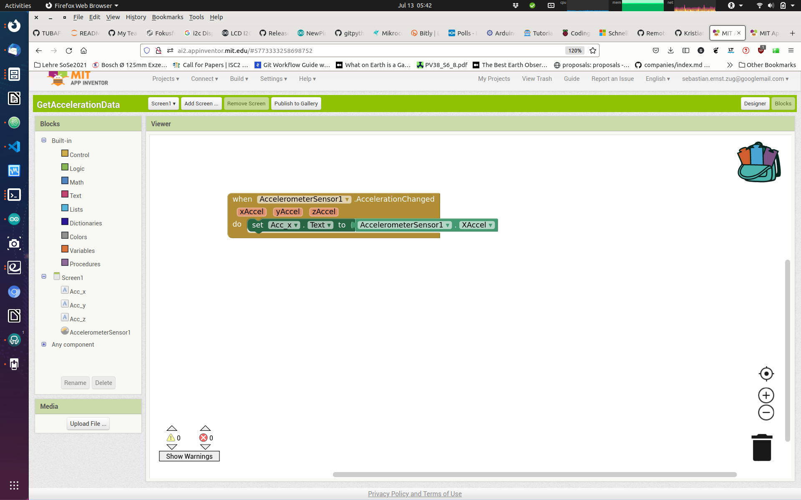
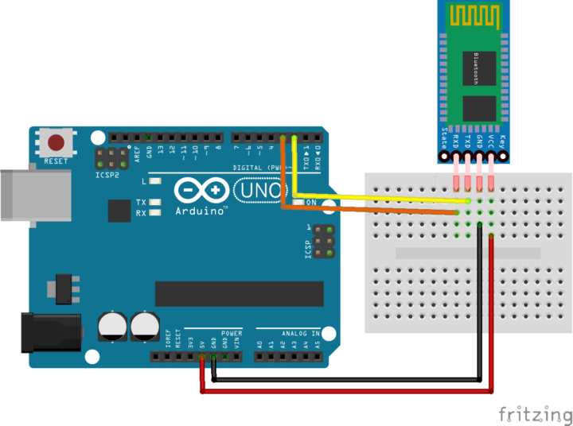
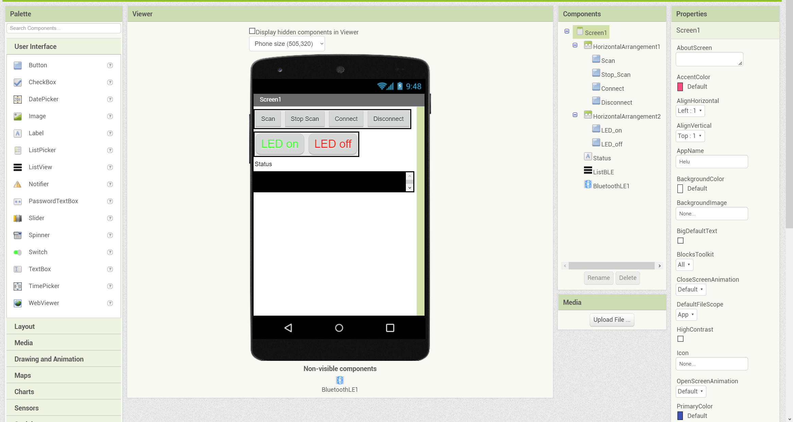
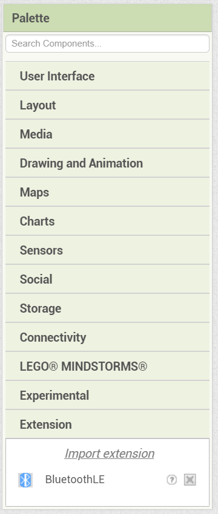

<!--

author:   Sebastian Zug & André Dietrich
email:    zug@ovgu.de   & andre.dietrich@ovgu.de
version:  0.0.5
language: de
narrator: Deutsch Female

link:     https://cdnjs.cloudflare.com/ajax/libs/animate.css/3.7.0/animate.min.css

import: https://raw.githubusercontent.com/LiaTemplates/Rextester/master/README.md
        https://raw.githubusercontent.com/LiaTemplates/WebDev/master/README.md
        https://github.com/LiaTemplates/AVR8js/main/README.md#10
        https://raw.githubusercontent.com/LiaTemplates/NetSwarm-Simulator/master/README.md
-->

[](https://liascript.github.io/course/?https://raw.githubusercontent.com/liaScript/ArduinoEinstieg/master/ArduinoMeetsMobile.md#1)


# Mikrocontroller & App-Entwicklung

Prof. Dr. Sebastian Zug,
Technische Universität Bergakademie Freiberg

------------------------------

<!-- width="80%" -->

<h2>Herzlich Willkommen!</h2>

> Die interaktive Ansicht dieses Kurses ist unter folgendem [Link](https://liascript.github.io/course/?https://raw.githubusercontent.com/liaScript/ArduinoEinstieg/master/ArduinoMeetsMobile.md#1) verfügbar.

Der Quellcode der Materialien ist unter https://github.com/liaScript/ArduinoEinstieg/blob/master/ArduinoMeetsMobile.md zu finden.


## Zielstellung

<!--
style="width: 100%; max-width: 860px; display: block; margin-left: auto; margin-right: auto;"
-->
```ascii
                                 US Sensor
                USB/Serielle         |         Serielle                     Bluetooth
                Schnittstelle        v         Schnittstelle                            
╔══════════════╗              +-------------+              +-------------+             ╔══════════════╗
║ Arduino IDE  ║ LED-Cmds     | Arduino     | ---------->  | HC-06       |             ║ Handy-App    ║      
║              ║ -----------> |             |  Messungen   | Bluetooth   |             ║              ║
║              ║              |             |              | to          |  )))   (((  ║              ║
║              ║ Display Cmds |             | <----------  | Serial      |             ║              ║   
║              ║ -----------> |             |  Commands    |             |             ║              ║   
╚══════════════╝              +-------------+              +-------------+             ╚══════════════╝      
                                 |       |                                     
                                 v       v                              
                              Display   LED             
```

## Arduino Einführung im Schnelldruchlauf

Jedes Arduinoprogramm umfasst 2 grundlegende Funktionen `setup()` und `loop()`.


<div>
  <wokwi-led color="red" pin="13" port="B" label="13"></wokwi-led>
  <span id="simulation-time"></span>
</div>
```cpp       arduino.cpp
const int ledPin = 13;

void setup() {
  pinMode(ledPin, OUTPUT);
}

void loop() {
  digitalWrite(ledPin, HIGH);  
  delay(1000);                
  digitalWrite(ledPin, LOW);
  delay(1000);  
}
```
@AVR8js.sketch

### Arduino IDE


Wichtige Grundeinstellungen:

+ Richtigen Port für den Programmiervorgang auswählen (Tools -> Port)
+ Richtigen Controller auswählen (Tools -> Board)
+ Richtige Baudrate für die Serielle Schnittstellen

### Hello World

*Und jetzt sind Sie dran!*

Laden Sie das Beispielprogramm "Blink" in Ihren Editor:

Datei -> Beispiele -> Basics -> Blink

Kompilieren und flashen Sie das Programm! Wichtige Tastaturbefehle sind dabei

| Tastenkombination | Bedeutung                |
| ----------------- | ------------------------ |
| Strg-R            | Kompilieren (Ve**R**ify) |
| Strg-U            | Flashend (**U**pload)    |
| Strg-T            | Code korrekt einrücken   |
| Strg-Shift-M      | Seriellen Monitor öffnen |
| Strg-L            | Cursor auf Zeile setzen  |

### Serielle Schnittstelle

Was fehlt? Ich möchte irgendwie in den Rechner schauen können :-)

Die Serielle Schnittstelle (häufig auch als UART) bezeichnet ermöglicht das
Versenden und den Empfang von Textnachrichten. Damit können Sie zum Beispiel
Messwerte ausgeben oder das Erreichen bestimmter Programmpositionen anzeigen.

Die folgenden Beispiele vermitteln grundlegende Programmierkonstrukte in C++.
Diese können in der Simulation ausgeführt werden.  

<div>
  <span id="simulation-time"></span>
</div>
```cpp       arduino.cpp
void setup() {
  Serial.begin(9600);
  Serial.println("Hello World");
}

void loop() {
}
```
@AVR8js.sketch

Arduino kennt zwei Varianten der Ausgabe mit `print` - das einfache `print` und `println`. Welchen Unterschied vermuten Sie?

## App Inventor

Herausforderungen bei der Umsetzung:

+ Der App Entwicklungsrechner (Ihr Laptop) und das Android Device müssen sich im gleichen WLAN befinden
+ Die iPads unterstützen keine native Bluetooth Kommunikation, sondern nur den modernen Bluetooth Low Energy (BLE) Standard.

https://appinventor.mit.edu/

### App-Inventor Einführungsbeispiele

                               {{0-1}}
********************************************************************************

Einlesen des Beschleunigungssensors
---------------------------------------




> Offenbar sind die Werte von 0-6 nicht geeignet um diese für die Ansteuerung der LEDs zu verwenden. Wie war das noch mal in welchen Größenordnungen durften die Eingangsgrößen liegen? Welche Anpassungen sind nötig?

> Aufgabe: Fügen Sie weitere Strings hinzu, die andere Buttons, Textfelder, Slider oder eine TextToSpeech Komponente aktivieren!

********************************************************************************

                                 {{1-2}}
********************************************************************************

Speech-to-Text Modul
---------------------------------------


> Aufgabe: Schalten Sie das grüne Licht wieder aus, wenn "Licht aus" gesagt wurde.

********************************************************************************

### App-Inventor + Mikrocontroller

Erweitern Sie Ihre Schaltung um einen HC-06 Bluetooth Dongle und steuern Sie den Status einer LED über die Eingaben der Pins. Die Beschaltung entnehmen Sie dem obigen Schaubild.



```c
#include <SoftwareSerial.h>

char Incoming_value = 0;

const byte rxPin = 2;
const byte txPin = 3;

// Set up a new SoftwareSerial object
SoftwareSerial mySerial (rxPin, txPin);

void setup()
{
  mySerial.begin(9600);     
  mySerial.println("Los geht's");    
  pinMode(13, OUTPUT);       
}

void loop()
{
  if(mySerial.available() > 0)  
  {
    Incoming_value = mySerial.read();      
    mySerial.print(Incoming_value);        
    mySerial.print("\n");        
    if(Incoming_value == '1')             
      digitalWrite(13, HIGH);  
    else if(Incoming_value == '0')       
      digitalWrite(13, LOW);   
  }                            
}
```

> Frage: Warum brauchen wir die Software-Serial [Link](https://docs.arduino.cc/learn/built-in-libraries/software-serial) Implementierung?


Die .aia Datei finden Sie unter [Github-Link](https://github.com/LiaScript/ArduinoEinstieg/raw/master/CodeExamples/ProjektwocheGymnasium/check_bluetooth/CheckBLConnection.aia)

### App-Inventor (für iOS) + Mikrocontroller

Wie bereits erwähnt, unterstützen iOS-Geräte nur Kommunikation mit einem Bluetooth-LE-Modul, andersherum sind die Bluetooth-LE-Module auch mit Android kompatibel.

Die .aia-Datei finden Sie unter [Github-Link](https://github.com/LiaScript/ArduinoEinstieg/raw/master/CodeExamples/ProjektwocheGymnasium/check_bluetooth/BLE_Connection.aia)



> Beachten Sie, dass Sie die Suche zuerst stoppen müssen, bevor sie das als "HmSoft" aufgeführte BLE-Modul auswählen können

> Bei der Verwendung mehrere HmSofts in einem Raum sollte das Handy direkt an das Modul gehalten werden, damit das Richtige oben in der Liste auftaucht!

Zusätzlich muss eine Erweiterung (.aix) für das Bluetooth-LE-Modul installiert werden, diese finden Sie unter [Github-Link](https://github.com/LiaScript/ArduinoEinstieg/raw/master/CodeExamples/ProjektwocheGymnasium/check_bluetooth/BLE_Module.aix)



## Freie Anwendungsentwicklung

Und jetzt sind Sie gefragt:

1. Senden Sie die Messwerte an die Text-to-Speech Schnittstelle
2. Steuern Sie die LED durch 3 Slider für die Farbwerte
3. Steuern Sie die LEDs durch den Beschleunigungssensor, so dass mit der Neigung die Farben angepasst werden.
4. ...
