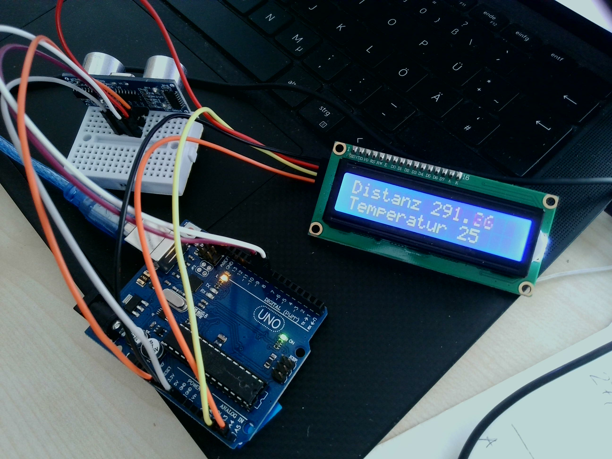

<!--

author:   Sebastian Zug & André Dietrich
email:    zug@ovgu.de   & andre.dietrich@ovgu.de
version:  1.0.1
language: de
narrator: Deutsch Female

link:     https://cdnjs.cloudflare.com/ajax/libs/animate.css/3.7.0/animate.min.css

import: https://github.com/LiaTemplates/AVR8js/main/README.md#10
        https://raw.githubusercontent.com/LiaScript/CodeRunner/master/README.md

-->

# Compiler, Register, Bug - Wie arbeitet eigentlich ein Computerchip?


Prof. Dr. Sebastian Zug, Technische Universität Bergakademie Freiberg

-------------------------------------------------------------------------------

<!-- width="50%" -->

<font size="6"> Herzlich willkommen </font>
-------------------------------------------------------------------------------

> Dieser Kurs wurde mit LiaScipt erstellt. Die interaktive Ansicht dieses Kurses ist unter folgendem [Link](https://liascript.github.io/course/?https://raw.githubusercontent.com/liaScript/ArduinoEinstieg/master/CompilerRegisterBug.md#1) verfügbar.

## Anwendungsbeispiel 

> __"Entwickeln Sie einen Distanzmesser, der einen Abstandswert ermittelt und ausgibt"__


[^1]: Firma Bosch "Laser Distanzmesser Zamo"

{{1}}
> **Frage:** Welche Funktionen sollte unser Distanzsensor haben?

{{2}}
> **Frage:** Was brauchen wir dafür?

### Antwort 1: Distanzsensor

> Was war das noch mal, "Schallgeschwindigkeit"

                                {{1-3}}
***************************************************************************


[^1]

Für eine gleichförmige Bewegung können wir den Weg als Produkt aus dem Messintervall und der halben Laufzeit abbilden.

$$s = v \cdot \frac{t}{2}$$


***************************************************************************

                                {{2-3}}
***************************************************************************
Leider gibt es ein Problem, die Schallgeschwindigkeit ist nicht konstant! Annäherungsweise gilt

$$V (m/s) = 331.3 + (0.606 × T) $$

Versuchen wir eine kleine Fehlerabschätzung, wenn wir den Temperatureinfluss ignorieren.

```python CalcUltraSonicSpeed.py
def calcUSspeed(T):
  return 331.3 + (0.606 * T)

print(calcUSspeed(25))
```
@LIA.eval(`["main.py"]`, `none`, `python3 main.py`)

***************************************************************************

[^1]: roboticlab.eu "Funktionsweise eines Ultraschall-Entfernungsmessers."


### Antwort 2: Mikrocontroller

+ Was heißt das eigentlich "Mikrocontroller"?

{{1-2}}
> ... eAls Mikrocontroller (auch µController, µC, MCU oder Einchipmikrorechner) werden Halbleiterchips bezeichnet, die einen Prozessor und zugleich auch Peripheriefunktionen enthalten. In vielen Fällen befindet sich auch der Arbeits- und Programmspeicher teilweise oder komplett auf demselben Chip. .. [^3].

+ Was ist das Arduino Projekt?

{{2}}
> Arduino ist eine aus Soft- und Hardware bestehende
> ... Plattform. Beide Komponenten sind im Sinne von Open
> Source quelloffen. Die Hardware besteht aus einem einfachen E/A-Board mit
> einem Mikrocontroller und analogen und digitalen Ein- und Ausgängen.

{{2}}
  https://www.arduino.cc/

{{2}}
  
  [^4]

[^3]: nach Wikipedia "Mikrocontroller"
[^4]: aus entsprechendem Artikel "Spiegel Online" http://www.spiegel.de/netzwelt/gadgets/arduino-erklaert-das-kann-der-microcontroller-a-1105328.html


### Antwort 3: Display

{{0-1}}
Welches Display zu welchem Zweck?

{{0-1}}
<!-- width="70%" -->

{{1-2}}
<!-- width="40%" -->

{{1-2}}
<!-- width="40%" -->

## Umsetzung

                                {{0-1}}
***************************************************************************

Wie können wir unsere Idee strukturieren? 

+ Umrechnen der abgelaufenen Zeit in `cm` anhand der Schallgeschwindigkeit
+ Warten bis zur Rückkehr des Signals
+ Darstellen auf dem Dislplay
+ Aussenden eines Ultraschall-Pings
+ Bestimmung der Temperatur

> Bringen Sie die Bausteine in eine richtige Reihenfolge!

***************************************************************************

                                {{1-3}}
***************************************************************************

> Ok, und wie erklären wir das jetzt einem Computer?

```prog.hex
:100000000C9472000C947E000C947E000C947E0084
:100010000C947E000C947E000C947E000C947E0068
:100020000C947E000C947E000C947E000C947E0058
…
:1000A0000C947E000C947E000C947E000C947E00D8
:1000B0000C947E000C947E000C947E000C947E00C8
:1000C0000C947E000C947E000C947E000C947E00B8
:1000D0000C947E000C947E000C947E000C947E00A8
:1000E0000C947E0011241FBECFEFD1E2DEBFCDBF46
:1000F00000E00CBF0E9480000C9483000C94000070
:0A010000279A2F98FFCFF894FFCF            45
:00000001FF
```

***************************************************************************

                                {{2-3}}
***************************************************************************

> __Upps, ich glaube wir brauchen etwas Hilfe!__

> _Compiler wird eine Software genannt, die einen in einer Programmiersprache_
> _geschrieben Quellcode so übersetzt, dass sie von Maschinen verstanden_
> _werden können._

Dabei kann die Art des Quellcodes sehr unterschiedlich ausfallen!

***************************************************************************

### Variante 1: C++ Code

<div>
  <wokwi-led color="red" pin="13" port="B" label="13"></wokwi-led>
  <span id="simulation-time"></span>
</div>
```cpp       arduino.cpp
const int ledPin = 13;

void setup() {
  pinMode(ledPin, OUTPUT);
}

void loop() {
  digitalWrite(ledPin, HIGH);  
  delay(1000);                
  digitalWrite(ledPin, LOW);
  delay(1000);  
}
```
@AVR8js.sketch


###  Variante 2: Grafische Programmierung

Mikrocontroller")

> Wir würden im folgenden beide Varianten benutzen, um unsere Anwendung umzusetzen.

## Implementierung




### Inbetriebnahme des Displays

... das machen wir mit Roberta


### Ultraschallsensor

> Zur Erinnerung:
> 
> + Aussenden eines Ultraschall-Pings
> + Warten bis zur Rückkehr des Signals
> + Umrechnen der abgelaufenen Zeit in `cm` anhand der Schallgeschwindigkeit
> + ...

Link auf die Dokumentation der Funktion `PulseIn` [Link](https://www.arduino.cc/reference/en/language/functions/advanced-io/pulsein/)

```c     B_UltraSonic.c
const int trigPin = 8;
const int echoPin = 9;

float temp = 25;
const float us_speed = (331.3 + (0.606 * temp)) / 1000 / 1000 * 100;

long duration;
float distance;

void setup() {
  pinMode(trigPin, OUTPUT);
  pinMode(echoPin, INPUT);
  Serial.begin(9600);
}

void loop() {
  digitalWrite(trigPin, LOW);
  delayMicroseconds(5);
  digitalWrite(trigPin, HIGH);
  delayMicroseconds(10);
  digitalWrite(trigPin, LOW);

  duration = pulseIn(echoPin, HIGH);
  Serial.print(duration);

  delay(50);
}
```
Wie integrieren wir die Abbildung auf cm? 

### Und nun alles zusammen ...

Welche Funktionen brauchen wir also?

<!--
style="width: 60%; max-width: 460px; display: block; margin-left: auto; margin-right: auto;"
-->
```ascii
            .------------------------.
            |                        |
            v                        |
 ╔══════════════════════╗            |
 ║ Aussenden eines Ping ║            |
 ╚══════════════════════╝            |
            |                        |
            v                        |
 ╔══════════════════════╗            |
 ║ Warten bis Rückkehr  ║            |
 ╚══════════════════════╝            |
            |                        |
            v                        |
 ╔══════════════════════╗            |
 ║ Umrechnen            ║            |
 ╚══════════════════════╝            |
            |                        |
            v                        |
 ╔══════════════════════╗            |
 ║ Ausgabe Display      ║            |
 ╚══════════════════════╝            |
            |                        |
            '------------------------╯
```

{{1}}
```c     D_Final.c
#include <Wire.h>
#include <LiquidCrystal_PCF8574.h>

int lcdi2c = 0x27;
LiquidCrystal_PCF8574 lcd(lcdi2c);

const int trigPin = 8;
const int echoPin = 9;
float temp = 25;
const float us_speed = (331.3 + (0.606 * temp)) / 1000 / 1000 * 100;

float distance;

void showMeanDistance(){
  lcd.setCursor(0, 0);
  lcd.print("Distanz ");
  lcd.print(distance, 2);
  // Todo Positionskorrektur
  lcd.setCursor(0, 1);
  lcd.print("Temperatur ");
  lcd.print(temp, 0);
}

void readMeanDistance(){
  long duration;

  // Starten der Messung
  digitalWrite(trigPin, LOW);
  delayMicroseconds(5);
  digitalWrite(trigPin, HIGH);
  delayMicroseconds(10);
  digitalWrite(trigPin, LOW);

  // Warten bis zur Rückkehr
  duration = pulseIn(echoPin, HIGH);
  // Umrechnen
  distance = duration * us_speed / 2;
  Serial.println(distance);
}

void setup()
{
  lcd.begin(16, 2);
  lcd.setBacklight(255);
  lcd.clear();
  pinMode(trigPin, OUTPUT);
  pinMode(echoPin, INPUT);
  Serial.begin(9600);
}

void loop()
{
  readMeanDistance();
  showMeanDistance();
  delay(50);
}
```

## Wie geht es weiter?

{{0-1}}
************************

Unser Chef hat sich neue Ideen ausgedacht ...

1. Die Auflösung ist ihm zu gering!
2. Bestimmte Materialien werden nur schlecht erkannt.
3. Das Display wäre schlecht ablesbar und wir sollten unser Messsystem mit dem Mobiltelefon koppeln ...

************************

{{1-2}}
***************************
Worüber würden wir in einem ingenieurwissenschaftlichen Studium sprechen?

+ Was läuft hinter der Bühne ab? Wie arbeiten die einzelnen Komponenten des Rechners?
+ Wie kann man die Qualität und Robustheit der Messung steigern?
+ Wie setzen wir den Entwicklungsprozess um?

... diese und alle anderen Fragen rund ums Studiums beantworte ich gern gleich im Anschluss, oder ...

**Informationstage / Schnupper-Events an der TU Bergakademie**
* Frühjahrsakademie MATHEMATIK 
* Schüleruniversität  [http://tu-freiberg.de/schueleruni/anmeldung](http://tu-freiberg.de/schueleruni/anmeldung)       
* Campustage                              

> Weiterführende Materialien auf der Basis von LiaScript gibt es unter [https://github.com/SebastianZug/VL_ProzeduraleProgrammierung](https://github.com/SebastianZug/VL_ProzeduraleProgrammierung). Hier werden sowohl die Konzepte von C als auch der objektorientierten Programmierung eingeführt.

************************

{{2}}
> __Danke für die Aufmerksamkeit!__
