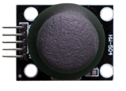

<!--

author:   Sebastian Zug & André Dietrich
email:    zug@ovgu.de   & andre.dietrich@ovgu.de
version:  0.0.1
language: de
narrator: Deutsch Female

script:   https://felixhao28.github.io/JSCPP/dist/JSCPP.es5.min.js

@JSCPP.__eval
<script>
  try {
    var output = "";
    JSCPP.run(`@0`, `@1`, {stdio: {write: s => { output += s }}});
    output;
  } catch (msg) {
    var error = new LiaError(msg, 1);

    try {
        var log = msg.match(/(.*)\nline (\d+) \(column (\d+)\):.*\n.*\n(.*)/);
        var info = log[1] + " " + log[4];

        if (info.length > 80)
          info = info.substring(0,76) + "..."

        error.add_detail(0, info, "error", log[2]-1, log[3]);
    } catch(e) {}

    throw error;
    }
</script>
@end


@JSCPP.eval: @JSCPP.__eval(@input, )

@JSCPP.eval_input: @JSCPP.__eval(@input,`@input(1)`)

@output: <pre class="lia-code-stdout">@0</pre>

@output_: <pre class="lia-code-stdout" hidden="true">@0</pre>


script:   https://ajax.googleapis.com/ajax/libs/jquery/1.11.3/jquery.min.js

@Rextester.__eval
<script>
//var result = null;
var error  = false;

console.log = function(e){ send.lia("log", JSON.stringify(e), [], true); };

function grep_(type, output) {
  try {
    let re_s = ":(\\d+):(\\d+): "+type+": (.+)";

    let re_g = new RegExp(re_s, "g");
    let re_i = new RegExp(re_s, "i");

    let rslt = output.match(re_g);

    let i = 0;
    for(i = 0; i < rslt.length; i++) {
        let e = rslt[i].match(re_i);

        rslt[i] = { row : e[1]-1, column : e[2], text : e[3], type : type};
    }
    return [rslt];
  } catch(e) {
    return [];
  }
}

$.ajax ({
    url: "https://rextester.com/rundotnet/api",
    type: "POST",
    timeout: 10000,
    data: { LanguageChoice: @0,
            Program: `@input`,
            Input: `@1`,
            CompilerArgs : @2}
    }).done(function(data) {
        if (data.Errors == null) {
            let warnings = grep_("warning", data.Warnings);

            let stats = "\n-------Stat-------\n"+data.Stats.replace(/, /g, "\n");

            if(data.Warnings)
              stats = "\n-------Warn-------\n"+data.Warnings + stats;

            send.lia("log", data.Result+stats, warnings, true);
            send.lia("eval", "LIA: stop");

        } else {
            let errors = grep_("error", data.Errors);

            let stats = "\n-------Stat-------\n"+data.Stats.replace(/, /g, "\n");

            if(data.Warning)
              stats = data.Errors + data.Warnings + stats;
            else
              stats = data.Errors + data.Warnings + stats;

            send.lia("log", stats, errors, false);
            send.lia("eval", "LIA: stop");
        }
    }).fail(function(data, err) {
        send.lia("log", err, [], false);
        send.lia("eval", "LIA: stop");
    });

"LIA: wait"
</script>
@end


@Rextester.eval: @Rextester.__eval(6, ,"-Wall -std=gnu99 -O2 -o a.out source_file.c")

@Rextester.eval_params: @Rextester.__eval(6, ,"@0")

@Rextester.eval_input: @Rextester.__eval(6,`@input(1)`,"-Wall -std=gnu99 -O2 -o a.out source_file.c")

-->

# II. Coding-Night

**Evangelisches Gymnasium Doberlug-Kirchhain, 22. Februar 2019**

Sebastian Zug, Technische Universität Bergakademie Freiberg

------------------------------

<!-- width="80%" -->

> Die interaktive Ansicht dieses Kurses ist unter folgendem [Link](https://liascript.github.io/course/?https://raw.githubusercontent.com/liaScript/ArduinoEinstieg/master/Course_01.md#1) verfügbar.

Herzlich Willkommen!

## 1. Auffrischung

+ Was unterscheidet ein eingebettetes System vom Standarddesktop-Rechner?

{{1-6}}
> ... ein elektronischer Rechner ..., der in einen technischen Kontext
> eingebunden ist. Dabei übernimmt der (Kleinst-)Rechner entweder
> Überwachungs-, Steuerungs- oder Regelfunktionen ... weitestgehend unsichtbar
> für den Benutzer .. [^1].


{{2-6}}
+ Was macht ein Compiler?

{{3-6}}
> Compiler wird eine Software genannt, die einen in einer Programmiersprache
> geschrieben Quellcode so übersetzt, dass sie von Maschinen verstanden
> werden können.

{{4-6}}
+ Wofür steht das Arduino Projekt?

{{5-6}}
> Arduino ist eine aus Soft- und Hardware bestehende
> Physical-Computing-Plattform. Beide Komponenten sind im Sinne von Open
> Source quelloffen. Die Hardware besteht aus einem einfachen E/A-Board mit
> einem Mikrocontroller und analogen und digitalen Ein- und Ausgängen.
{{5-6}}
https://www.arduino.cc/

{{5-6}}
[^1] nach Wikipedia "Eingebettete Systeme"


## 2. Arduino Hardware / Software

Was sind die Grundelemente eines Arduino-Programmes?

```c    HelloWorld.c
int led 13;

// the setup function runs once when you press reset or power the board
void setup() {
  // initialize digital pin led = 13 as an output.
  pinMode(led, OUTPUT);
}

// the loop function runs over and over again forever
void loop() {
  digitalWrite(led, HIGH);   // turn the LED on (HIGH is the voltage level)
  delay(1000);               // wait for a second
  digitalWrite(led, LOW);    // turn the LED off by making the voltage LOW
  delay(1000);               // wait for a second
}
```

<!-- width="100%" -->

### 2a. Programmiervorgang

Und wie kommt das Ganze nun auf den Controller?

<!-- width="80%" -->

Nutzen Sie bei der Bedienung Short-Keys!

| Tastenkombination| Befehl                               |
|:-----------------|:-------------------------------------|
| Ctrl + S         | Save                                 |
| Ctrl + Shift + S | Save as                              |
| Ctrl + N         | Open new sketch                      |
| Ctrl + Q         | Close                                |
| Ctrl + R         | Verify                               |
| Ctrl + U         | Upload                               |
| Ctrl + F         | Find                                 |
| Ctrl + T         | Adjusts the alignment and spacing    |
| Ctrl + /         | Comment                              |
| Ctrl + Shift + M | Open the serial monitor              |
| Ctrl + K         | Open sketch folder                   |


### 2b.Weitere Beispiele

Ok, Ausgaben klappen, wie sieht es mit Eingaben aus?

<!-- width="80%" -->


```c     ReadButton.c
// constants won't change. They're used here to set pin numbers:
const int buttonPin = 2;     // the number of the pushbutton pin
const int ledPin =  13;      // the number of the LED pin

// variables will change:
int buttonState = 0;         // variable for reading the pushbutton status

int setup() {
  pinMode(ledPin, INPUT);
  pinMode(buttonPin, INPUT);
}

void loop() {
  buttonState = digitalRead(buttonPin);

  // check if the pushbutton is pressed. If it is, the buttonState is HIGH:
  if (buttonState == HIGH) {
    digitalWrite(ledPin, HIGH)
  } else {
    digitalWrite(buttonPin, LOW);
  }
}
```

Und wie gehen wir bei der Fehlersuche vor?

1. Ruhe bewahren!
2. Ruhe bewahren!
3. Situation prüfen

    + Syntaktischer Fehler (Dein Kompiler meckert!)

    + Logischer Fehler (Du hast einen Denkfehler!)

    + Hardwarefehler (Ups, draufgetreten!)

4. Fehlermeldung aufmerksam lesen
5. ggf. Hypothesen aufstellen und prüfen

> **Aufgabe:** Debuggen Sie den obigen Quellcode!.

## 3. Unsere "Schatzkiste"

<!-- width="80%" -->

* Webseiten des Wiki des Herstellers mangolabs
   [https://www.mangolabs.de/wiki/](https://www.mangolabs.de/wiki/)

* Referenzübersicht Arduino

    + deutsch (unvollständig) https://www.arduino.cc/reference/de/

    + englisch https://www.arduino.cc/reference/en/


### 3a. Joystick statt Button

> **Aufgabe:** Recherchiere die Möglichkeiten des Joysticks, schreibe ein
> Programm, dass dessen Ausgaben auf die serielle Schnittstelle ausgibt.

<!-- width="30%" -->

{{1}}
Es wird ernst! Wir müssen den Taster elektrisch mit dem Board verbinden. Anweisungen unter ... [https://www.mangolabs.de/portfolio-item/ps2-joystick/#hello-world](https://www.mangolabs.de/portfolio-item/ps2-joystick/#hello-world)


{{2-4}}
> **Aufgabe:** Wandeln Sie das Programm so ab, dass beim bewegen des Joysticks
> eine Zahl verändert wird - zum Beispiel Inkrementieren beim Drücken nach
> vorn Dekrementieren beim Ziehen nach hinten.

{{3}}
```c                        LoesungJoystick.ino
int xPin = A1;
int yPin = A0;
int buttonPin = 2;

int xPosition = 0;
int yPosition = 0;
int buttonState = 0;

int count = 0;

void setup() {
  Serial.begin(9600);
  pinMode(xPin, INPUT);
  pinMode(yPin, INPUT);
  pinMode(buttonPin, INPUT_PULLUP);
}

void loop() {
  xPosition = analogRead(xPin);
  yPosition = analogRead(yPin);
  buttonState = digitalRead(buttonPin);

  if (buttonState == LOW) count = 0;
  if (xPosition > 700) count++;
  if (xPosition < 300) count--;
  Serial.println(count);
  delay(100);
}
```

### 3b. Display Einführung

*Langweilig ... ! Ich möchte was sehen!*

> **Aufgabe:** Verbinden Sie das Display mit dem Board entsprechend dem
> Beschaltungsplan.

[https://www.mangolabs.de/portfolio-item/lcd-i2c-display-2x16/#getting-started](https://www.mangolabs.de/portfolio-item/lcd-i2c-display-2x16/#getting-started)

Achtung für diese Aufgabe müssen Sie die zusätzliche Bibliothek _LiquidCrystal_PCF8574_
installieren. Informieren Sie sich, wie dies umzusetzen ist "How to install a library for Arduino?".

```c                   Display.ino
#include <Wire.h>
#include <LiquidCrystal_PCF8574.h>

int lcdi2c = 0x27; // <- Hart eingecodete Adresse, die nur für unser
                   // Beispiel funktioniert, vgl. Datenblatt

void setup()
{
  LiquidCrystal_PCF8574 lcd(lcdi2c);
  lcd.begin(16, 2);
  lcd.setBacklight(255);
  lcd.clear();
  lcd.setCursor(0, 0);
  lcd.print("Gymnasium Doki");
  lcd.setCursor(0, 1);
  lcd.print("2. Coding Night");
}

void loop()
{}
```
<!--
style="width: 100%; max-width: 460px; display: block; margin-left: auto; margin-right: auto;"
-->
````
    0                             15
    0 1 2 3 4 5 6 7 8 9 A B C D E F
   ╔═╤═╤═╤═╤═╤═╤═╤═╤═╤═╤═╤═╤═╤═╤═╤═╗
 0 ║G│y│m│n│a│s│i│u│m│ │D│o│k│i│ │ ║
   ╟─┼─┼─┼─┼─┼─┼─┼─┼─┼─┼─┼─┼─┼─┼─┼─╢
 1 ║2│.│C│o│d│i│n│g│ │N│i│g│h│t│ │ ║
   ╚═╧═╧═╧═╧═╧═╧═╧═╧═╧═╧═╧═╧═╧═╧═╧═╝
````


{{1}}
Welche Methoden stehen denn für das Display bereit?

{{1}}
** 1. Cursor Konfiguration**

{{1}}
| Name               | Bedeutung                       |
|:-------------------|:--------------------------------|
|  void noBlink();   |                                 |
|  void blink();     |  Blinkender Cursor              |
|  void noCursor();  |  Cursor unsichtbar              |
|  void cursor();    | Aktiviert den Cursor            |
|  void setCursor();    | Bewege den Cursor an eine Position           |


{{1}}
** 2. Bewegung des Cursors **

{{1}}
| Name               | Bedeutung                       |
|:-------------------|:--------------------------------|
|  void scrollDisplayLeft(); | Verschiebt den Inhalt um ein Feld nach links |
|  void scrollDisplayRight(); | ... nach rechts   |
|  void leftToRight();  | Textrichtung (Bewegung des Cursors nach dem Schreiben) |
|  void rightToLeft();  | ... nach links |
|  void autoscroll();   | Die Darstellung verschiebt sich automatisch mit dem erzeugen eines neuen Zeichens `lcd.print('A')` |
|  void noAutoscroll(); | ... aux |


{{1}}
** 3. Bewegung des Cursors**

{{1}}
| Name               | Bedeutung                       |
|:-------------------|:--------------------------------|
|  void print(); | Schreibt Text auf das Display, startet an der Stelle des Cursors |
|  void write(); | Schreibt ein Zeichen auf das Display |
|  void clear(); | Löschen des gesamten Displays |

{{2}}
**Welche Ausgaben generieren folgende Codefragmente?**

{{2}}
```c
lcd.setCursor(5, 1);
lcd.print("Gymnasium Doki");
```

{{2}}
<!--
style="width: 100%; max-width: 460px; display: block; margin-left: auto; margin-right: auto;"
-->
````
    0                             15
    0 1 2 3 4 5 6 7 8 9 A B C D E F
   ╔═╤═╤═╤═╤═╤═╤═╤═╤═╤═╤═╤═╤═╤═╤═╤═╗
 0 ║ │ │ │ │ │ │ │ │ │ │ │ │ │ │ │ ║
   ╟─┼─┼─┼─┼─┼─┼─┼─┼─┼─┼─┼─┼─┼─┼─┼─╢
 1 ║ │ │ │ │ │G│y│m│n│a│s│i│u│m│ │D║
   ╚═╧═╧═╧═╧═╧═╧═╧═╧═╧═╧═╧═╧═╧═╧═╧═╝
````


{{2}}
```c
lcd.setCursor(2, 1);
String s = "Das ist ein Test";
int number = s.length();
for (int i = 0; i< number; i++)
  lcd.write(s[i]);
```

{{2}}
<!--
style="width: 100%; max-width: 460px; display: block; margin-left: auto; margin-right: auto;"
-->
````
    0                             15
    0 1 2 3 4 5 6 7 8 9 A B C D E F
   ╔═╤═╤═╤═╤═╤═╤═╤═╤═╤═╤═╤═╤═╤═╤═╤═╗
 0 ║ │ │ │ │ │ │ │ │ │ │ │ │ │ │ │ ║
   ╟─┼─┼─┼─┼─┼─┼─┼─┼─┼─┼─┼─┼─┼─┼─┼─╢
 1 ║ │ │D│a│s│ │i│s│t│ │e│i│n│ │T│e║
   ╚═╧═╧═╧═╧═╧═╧═╧═╧═╧═╧═╧═╧═╧═╧═╧═╝
````

{{2}}
```c
lcd.setCursor(15, 1);
lcd.rightToLeft();
String s = "Das ist ein superlanger Text der gar nicht aufhört";
int number = s.length();
for (int i = 0; i< number; i++)
  lcd.write(s[i]);
```

{{2}}
<!--
style="width: 100%; max-width: 460px; display: block; margin-left: auto; margin-right: auto;"
-->
````
    0                             15
    0 1 2 3 4 5 6 7 8 9 A B C D E F
   ╔═╤═╤═╤═╤═╤═╤═╤═╤═╤═╤═╤═╤═╤═╤═╤═╗
 0 ║ │ │ │ │ │ │ │ │ │ │ │ │ │ │ │ ║
   ╟─┼─┼─┼─┼─┼─┼─┼─┼─┼─┼─┼─┼─┼─┼─┼─╢
 1 ║t│s│e│T│ │n│i│e│ │t│s│i│ │s│a│D║
   ╚═╧═╧═╧═╧═╧═╧═╧═╧═╧═╧═╧═╧═╧═╧═╧═╝
````


{{2}}
```c
lcd.setCursor(15, 1);
lcd.autoscroll();
String s = "Das ist ein superlanger Text der gar nicht aufhört";
int number = s.length();
for (int i = 0; i< number; i++){
  lcd.write(s[i]);
  delay(1000);
}
```
{{2}}
<!--
style="width: 100%; max-width: 460px; display: block; margin-left: auto; margin-right: auto;"
-->
````
    0                             15
    0 1 2 3 4 5 6 7 8 9 A B C D E F
   ╔═╤═╤═╤═╤═╤═╤═╤═╤═╤═╤═╤═╤═╤═╤═╤═╗
 0 ║ │ │ │ │ │ │ │ │ │ │ │ │ │ │ │ ║
   ╟─┼─┼─┼─┼─┼─┼─┼─┼─┼─┼─┼─┼─┼─┼─┼─╢
 1 ║ │ │ │ │ │ │ │ │ │ │ │ │D│a│s│ ║
   ╚═╧═╧═╧═╧═╧═╧═╧═╧═╧═╧═╧═╧═╧═╧═╧═╝
````

{{3}}
> **Aufgabe:** Lassen Sie auf dem Cursor die Namen der Kursteilnehmer durchlaufen.

{{3}}
```c                   ShowNames.ino
#include <Wire.h>
#include <LiquidCrystal_PCF8574.h>

int lcdi2c = 0x27;
LiquidCrystal_PCF8574 lcd(lcdi2c);

String names [] = {"Anja", "Alexander",
                   "Adrian", "Alfons",
                   "Alois", "Ariadne"};
int number = 5;

void setup()
{
  lcd.begin(16, 2);
  lcd.setBacklight(255);
}

void loop()
{
  for (int i=1; i< number; i++){
    // names[i]; Zugriff auf die Namen
  }
}
```

### 3c. Und jetzt alles zusammmen


> **Aufgabe:** Geben Sie auf dem Display die aktuelle Cursor-Position des
> Joysticks aus.

{{1}}
```c                   ShowPosition.ino
#include <Wire.h>
#include <LiquidCrystal_PCF8574.h>

int lcdi2c = 0x27;
LiquidCrystal_PCF8574 lcd(lcdi2c);

int xPin = A1;
int yPin = A0;
int buttonPin = 2;

int xPosition = 0;
int yPosition = 0;
int buttonState = 0;

int count = 0;

void setup() {
  pinMode(xPin, INPUT);
  pinMode(yPin, INPUT);
  pinMode(buttonPin, INPUT_PULLUP);
  lcd.begin(16, 2);
  lcd.setBacklight(255);
  lcd.clear();
}

void loop() {
  xPosition = analogRead(xPin);
  yPosition = analogRead(yPin);
  buttonState = digitalRead(buttonPin);

  lcd.clear();
  lcd.setCursor(12, 0);
  lcd.print(xPosition);
  lcd.setCursor(12, 1);
  lcd.print(yPosition);
  delay(100);
}
```

{{2}}
> **Aufgabe:** Implementieren Sie eine Anwnedung, die es erlaubt, sich innerhalb der Liste von Namen zu bewegen.
