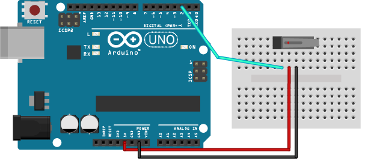
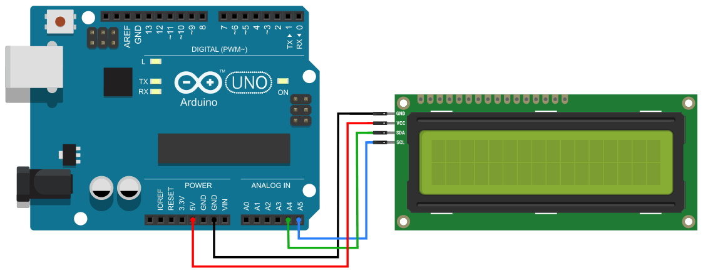

<!--

author:   Sebastian Zug & André Dietrich
email:    zug@ovgu.de   & andre.dietrich@ovgu.de
version:  0.0.5
language: de
narrator: Deutsch Female

link:     https://cdnjs.cloudflare.com/ajax/libs/animate.css/3.7.0/animate.min.css

import: https://raw.githubusercontent.com/LiaTemplates/Rextester/master/README.md
        https://raw.githubusercontent.com/LiaTemplates/WebDev/master/README.md
        https://github.com/LiaTemplates/AVR8js/main/README.md#10
        https://raw.githubusercontent.com/LiaTemplates/NetSwarm-Simulator/master/README.md
-->

[](https://liascript.github.io/course/?https://raw.githubusercontent.com/liaScript/ArduinoEinstieg/master/Course_00.md#1)


# Mikrocontroller Einführung II

**Eingebette Systeme**

Prof. Dr. Sebastian Zug,
Technische Universität Bergakademie Freiberg

------------------------------

<!-- width="80%" -->

<h2>Herzlich Willkommen!</h2>

> Die interaktive Ansicht dieses Kurses ist unter folgendem [Link](https://liascript.github.io/course/?https://raw.githubusercontent.com/liaScript/ArduinoEinstieg/master/Course_01.md#1) verfügbar.

Der Quellcode der Materialien ist unter https://github.com/liaScript/ArduinoEinstieg/blob/master/Course_01.md zu finden.


## 1. Auffrischung

+ Was unterscheidet ein eingebettetes System vom Standarddesktop-Rechner?

{{1-6}}
> ... ein elektronischer Rechner ..., der in einen technischen Kontext
> eingebunden ist. Dabei übernimmt der (Kleinst-)Rechner entweder
> Überwachungs-, Steuerungs- oder Regelfunktionen ... weitestgehend unsichtbar
> für den Benutzer .. [^1].


{{2-6}}
+ Was macht ein Compiler?

{{3-6}}
> Compiler wird eine Software genannt, die einen in einer Programmiersprache
> geschrieben Quellcode so übersetzt, dass sie von Maschinen verstanden
> werden können.

{{4-6}}
+ Wofür steht das Arduino Projekt?

{{5-6}}
> Arduino ist eine aus Soft- und Hardware bestehende
> Physical-Computing-Plattform. Beide Komponenten sind im Sinne von Open
> Source quelloffen. Die Hardware besteht aus einem einfachen E/A-Board mit
> einem Mikrocontroller und analogen und digitalen Ein- und Ausgängen.
{{5-6}}
https://www.arduino.cc/


[^1]: nach Wikipedia "Eingebettete Systeme"

## 2. Arduino Hardware / Software

Was sind die Grundelemente eines Arduino-Programmes?

```c    HelloWorld.c
int led 13;

// the setup function runs once when you press reset or power the board
void setup() {
  // initialize digital pin led = 13 as an output.
  pinMode(led, OUTPUT);
}

// the loop function runs over and over again forever
void loop() {
  digitalWrite(led, HIGH);   // turn the LED on (HIGH is the voltage level)
  delay(1000);               // wait for a second
  digitalWrite(led, LOW);    // turn the LED off by making the voltage LOW
  delay(1000);               // wait for a second
}
```

<!-- width="100%" -->


### 2a. Fehler

Ok, Ausgaben klappen, wie sieht es mit Eingaben aus?

<!-- width="80%" -->


```c     ReadButton.c
const int buttonPin = 2;     
const int ledPin =  13;      

// variables will change:
int buttonState = 0;        
int setup() {
  pinMode(ledPin, INPUT);
  pinMode(buttonPin, INPUT);
}

void loop() {
  buttonState = digitalRead(buttonPin);

  if (buttonState == HIGH) {
    digitalWrite(ledPin, HIGH)
  } else {
    digitalWrite(buttonpin, LOW);
  }
}
```

Und wie gehen wir bei der Fehlersuche vor?

1. Ruhe bewahren!
2. Ruhe bewahren!
3. Situation prüfen

    + Syntaktischer Fehler (Dein Kompiler meckert!)

    + Logischer Fehler (Du hast einen Denkfehler!)

    + Hardwarefehler (Ups, draufgetreten!)

4. Fehlermeldung aufmerksam lesen
5. ggf. Hypothesen aufstellen und prüfen

> **Aufgabe:** Debuggen Sie den obigen Quellcode!.

### 2b. Programmiervorgang

Und wie kommt das Ganze nun auf den Controller?

<!-- width="80%" -->

Nutzen Sie bei der Bedienung Short-Keys!

| Tastenkombination| Befehl                               |
|:-----------------|:-------------------------------------|
| Ctrl + S         | Save                                 |
| Ctrl + Shift + S | Save as                              |
| Ctrl + N         | Open new sketch                      |
| Ctrl + Q         | Close                                |
| Ctrl + R         | Verify                               |
| Ctrl + U         | Upload                               |
| Ctrl + F         | Find                                 |
| Ctrl + T         | Adjusts the alignment and spacing    |
| Ctrl + /         | Comment                              |
| Ctrl + Shift + M | Open the serial monitor              |
| Ctrl + K         | Open sketch folder                   |


## 3. Unsere "Schatzkiste"

<!-- width="80%" -->

* Referenzübersicht Arduino

    + deutsch (unvollständig) https://www.arduino.cc/reference/de/

    + englisch https://www.arduino.cc/reference/en/


### 3a. Joystick statt Button

> **Aufgabe:** Schließen Sie den Joystick entsprechend dem Schaltplan an

<!-- width="80%" -->

| Controller |  Joystick |
| ------- | --------|
| A0 |      VRx |
| A1 |      VRy  |
| D2 |      SW |
| GND |   GND |
| 5V |       +5V |


{{1}}
```c                        LoesungJoystick.ino
int xPin = A1;
int yPin = A0;
int buttonPin = 2;
 
int xPosition = 0;
int yPosition = 0;
int buttonState = 0;
 
void setup() {
  Serial.begin(9600); 
  pinMode(xPin, INPUT);
  pinMode(yPin, INPUT);
  pinMode(buttonPin, INPUT_PULLUP); 
}
 
void loop() {
  xPosition = analogRead(xPin);
  yPosition = analogRead(yPin);
  buttonState = digitalRead(buttonPin);
   
  Serial.print("X: ");
  Serial.print(xPosition);
  Serial.print(" | Y: ");
  Serial.print(yPosition);
  Serial.print(" | Button: ");
  Serial.println(buttonState);
 
  delay(100); // add some delay between reads
```


{{2-4}}
> **Aufgabe:** Wandeln Sie das Programm so ab, dass beim bewegen des Joysticks
> eine Zahl verändert wird - zum Beispiel Inkrementieren beim Drücken nach
> vorn Dekrementieren beim Ziehen nach hinten.

{{3}}
```c                        LoesungJoystick.ino
int yPin = A1;
int xPin = A0;
int buttonPin = 2;

int xPosition = 0;
int yPosition = 0;
int buttonState = 0;

int count = 0;

void setup() {
  Serial.begin(9600);
  pinMode(xPin, INPUT);
  pinMode(yPin, INPUT);
  pinMode(buttonPin, INPUT_PULLUP);
}

void loop() {
  xPosition = analogRead(xPin);
  yPosition = analogRead(yPin);
  buttonState = digitalRead(buttonPin);

  if (buttonState == LOW) count = 0;
  if (xPosition > 700) count++;
  if (xPosition < 300) count--;
  Serial.println(count);
  delay(100);
}
```

### 3b. Display Einführung

*Langweilig ... ! Ich möchte was sehen!*

> **Aufgabe:** Verbinden Sie das Display mit dem Board entsprechend dem
> Beschaltungsplan.

<!-- width="80%" -->

| Arduino |   LCD  |
|---|---|
| A4 |      SDA  |
| A5 |       SCL  |
| GND | GND  |
| 5V |       VCC  |


Achtung für diese Aufgabe müssen Sie die zusätzliche Bibliothek `LiquidCrystal`
installieren. Informieren Sie sich, wie dies umzusetzen ist "How to install a library for Arduino?".

```c                   Display.ino
#include <Wire.h>
#include <LiquidCrystal_PCF8574.h>

int lcdi2c = 0x27; // <- Hart eingecodete Adresse, die nur für unser
                   // Beispiel funktioniert, vgl. Datenblatt

void setup()
{
  LiquidCrystal_PCF8574 lcd(lcdi2c);
  lcd.begin(16, 2);
  lcd.setBacklight(255);
  lcd.clear();
  lcd.setCursor(0, 0);
  lcd.print("Gymnasium Döbeln");
  lcd.setCursor(0, 1);
  lcd.print("2. Coding Event");
}

void loop()
{}
```
<!--
style="width: 100%; max-width: 460px; display: block; margin-left: auto; margin-right: auto;"
-->
````
    0                             15
    0 1 2 3 4 5 6 7 8 9 A B C D E F
   ╔═╤═╤═╤═╤═╤═╤═╤═╤═╤═╤═╤═╤═╤═╤═╤═╗
 0 ║G│y│m│n│a│s│i│u│m│ │D│ö│b│e│l│n║
   ╟─┼─┼─┼─┼─┼─┼─┼─┼─┼─┼─┼─┼─┼─┼─┼─╢
 1 ║2│.│C│o│d│i│n│g│ │E│v│e│n│t│ │ ║
   ╚═╧═╧═╧═╧═╧═╧═╧═╧═╧═╧═╧═╧═╧═╧═╧═╝
````


{{1}}
Welche Methoden stehen denn für das Display bereit?

{{1}}
** 1. Cursor Konfiguration**

{{1}}
| Name               | Bedeutung                       |
|:-------------------|:--------------------------------|
|  void noBlink();   |                                 |
|  void blink();     |  Blinkender Cursor              |
|  void noCursor();  |  Cursor unsichtbar              |
|  void cursor();    | Aktiviert den Cursor            |
|  void setCursor();    | Bewege den Cursor an eine Position           |


{{1}}
** 2. Bewegung des Cursors **

{{1}}
| Name               | Bedeutung                       |
|:-------------------|:--------------------------------|
|  void scrollDisplayLeft(); | Verschiebt den Inhalt um ein Feld nach links |
|  void scrollDisplayRight(); | ... nach rechts   |
|  void leftToRight();  | Textrichtung (Bewegung des Cursors nach dem Schreiben) |
|  void rightToLeft();  | ... nach links |
|  void autoscroll();   | Die Darstellung verschiebt sich automatisch mit dem erzeugen eines neuen Zeichens `lcd.print('A')` |
|  void noAutoscroll(); | ... aux |


{{1}}
** 3. Bewegung des Cursors**

{{1}}
| Name               | Bedeutung                       |
|:-------------------|:--------------------------------|
|  void print(); | Schreibt Text auf das Display, startet an der Stelle des Cursors |
|  void write(); | Schreibt ein Zeichen auf das Display |
|  void clear(); | Löschen des gesamten Displays |

{{2}}
**Welche Ausgaben generieren folgende Codefragmente?**

{{2}}
```c
lcd.setCursor(5, 1);
lcd.print("Gymnasium Döbeln");
```

{{2}}
<!--
style="width: 100%; max-width: 460px; display: block; margin-left: auto; margin-right: auto;"
-->
````
    0                             15
    0 1 2 3 4 5 6 7 8 9 A B C D E F
   ╔═╤═╤═╤═╤═╤═╤═╤═╤═╤═╤═╤═╤═╤═╤═╤═╗
 0 ║ │ │ │ │ │ │ │ │ │ │ │ │ │ │ │ ║
   ╟─┼─┼─┼─┼─┼─┼─┼─┼─┼─┼─┼─┼─┼─┼─┼─╢
 1 ║ │ │ │ │ │G│y│m│n│a│s│i│u│m│ │D║
   ╚═╧═╧═╧═╧═╧═╧═╧═╧═╧═╧═╧═╧═╧═╧═╧═╝
````


{{2}}
```c
lcd.setCursor(2, 1);
String s = "Das ist ein Test";
int number = s.length();
for (int i = 0; i< number; i++)
  lcd.write(s[i]);
```

{{2}}
<!--
style="width: 100%; max-width: 460px; display: block; margin-left: auto; margin-right: auto;"
-->
````
    0                             15
    0 1 2 3 4 5 6 7 8 9 A B C D E F
   ╔═╤═╤═╤═╤═╤═╤═╤═╤═╤═╤═╤═╤═╤═╤═╤═╗
 0 ║ │ │ │ │ │ │ │ │ │ │ │ │ │ │ │ ║
   ╟─┼─┼─┼─┼─┼─┼─┼─┼─┼─┼─┼─┼─┼─┼─┼─╢
 1 ║ │ │D│a│s│ │i│s│t│ │e│i│n│ │T│e║
   ╚═╧═╧═╧═╧═╧═╧═╧═╧═╧═╧═╧═╧═╧═╧═╧═╝
````

{{2}}
```c
lcd.setCursor(15, 1);
lcd.rightToLeft();
String s = "Das ist ein superlanger Text der gar nicht aufhört";
int number = s.length();
for (int i = 0; i< number; i++)
  lcd.write(s[i]);
```

{{2}}
<!--
style="width: 100%; max-width: 460px; display: block; margin-left: auto; margin-right: auto;"
-->
````
    0                             15
    0 1 2 3 4 5 6 7 8 9 A B C D E F
   ╔═╤═╤═╤═╤═╤═╤═╤═╤═╤═╤═╤═╤═╤═╤═╤═╗
 0 ║ │ │ │ │ │ │ │ │ │ │ │ │ │ │ │ ║
   ╟─┼─┼─┼─┼─┼─┼─┼─┼─┼─┼─┼─┼─┼─┼─┼─╢
 1 ║t│s│e│T│ │n│i│e│ │t│s│i│ │s│a│D║
   ╚═╧═╧═╧═╧═╧═╧═╧═╧═╧═╧═╧═╧═╧═╧═╧═╝
````


{{2}}
```c
lcd.setCursor(15, 1);
lcd.autoscroll();
String s = "Das ist ein superlanger Text der gar nicht aufhört";
int number = s.length();
for (int i = 0; i< number; i++){
  lcd.write(s[i]);
  delay(1000);
}
```
{{2}}
<!--
style="width: 100%; max-width: 460px; display: block; margin-left: auto; margin-right: auto;"
-->
````
    0                             15
    0 1 2 3 4 5 6 7 8 9 A B C D E F
   ╔═╤═╤═╤═╤═╤═╤═╤═╤═╤═╤═╤═╤═╤═╤═╤═╗
 0 ║ │ │ │ │ │ │ │ │ │ │ │ │ │ │ │ ║
   ╟─┼─┼─┼─┼─┼─┼─┼─┼─┼─┼─┼─┼─┼─┼─┼─╢
 1 ║ │ │ │ │ │ │ │ │ │ │ │ │D│a│s│ ║
   ╚═╧═╧═╧═╧═╧═╧═╧═╧═╧═╧═╧═╧═╧═╧═╧═╝
````

{{3}}
> **Aufgabe:** Bauen Sie eine Laufschrift mit den Namen der Kursteilnehmer. Wenn das Ende erreicht ist, wird die Richtung umgekehrt.

{{3}}
```c                   ShowNames.ino
#include <Wire.h>
#include <LiquidCrystal_PCF8574.h>

int lcdi2c = 0x27;
LiquidCrystal_PCF8574 lcd(lcdi2c);

String names = "Anja Emil";

int number = 5;

void setup()
{
  lcd.begin(16, 2);
  lcd.setBacklight(255);
}

void loop()
{
  ...
}
```

### 3c. Und jetzt alles zusammmen


> **Aufgabe:** Geben Sie auf dem Display die aktuelle Cursor-Position des
> Joysticks aus.

{{1}}
```c                   ShowPosition.ino
#include <Wire.h>
#include <LiquidCrystal_PCF8574.h>

int lcdi2c = 0x27;
LiquidCrystal_PCF8574 lcd(lcdi2c);

int xPin = A1;
int xPin = A0;
int buttonPin = 2;

int xPosition = 0;
int yPosition = 0;
int buttonState = 0;

int count = 0;

void setup() {
  pinMode(xPin, INPUT);
  pinMode(yPin, INPUT);
  pinMode(buttonPin, INPUT_PULLUP);
  lcd.begin(16, 2);
  lcd.setBacklight(255);
  lcd.clear();
}

void loop() {
  xPosition = analogRead(xPin);
  yPosition = analogRead(yPin);
  buttonState = digitalRead(buttonPin);

  lcd.clear();
  lcd.setCursor(12, 0);
  lcd.print(xPosition);
  lcd.setCursor(12, 1);
  lcd.print(yPosition);
  delay(100);
}
```

{{2}}
> **Aufgabe:** Implementieren Sie eine Anwendung, die es erlaubt, sich innerhalb der Liste von Namen zu bewegen.
