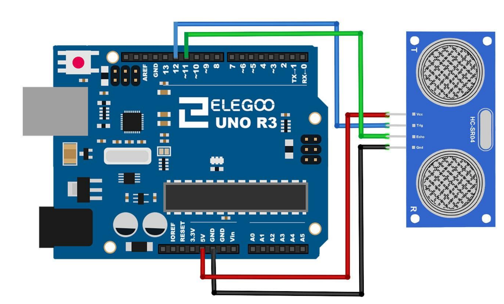
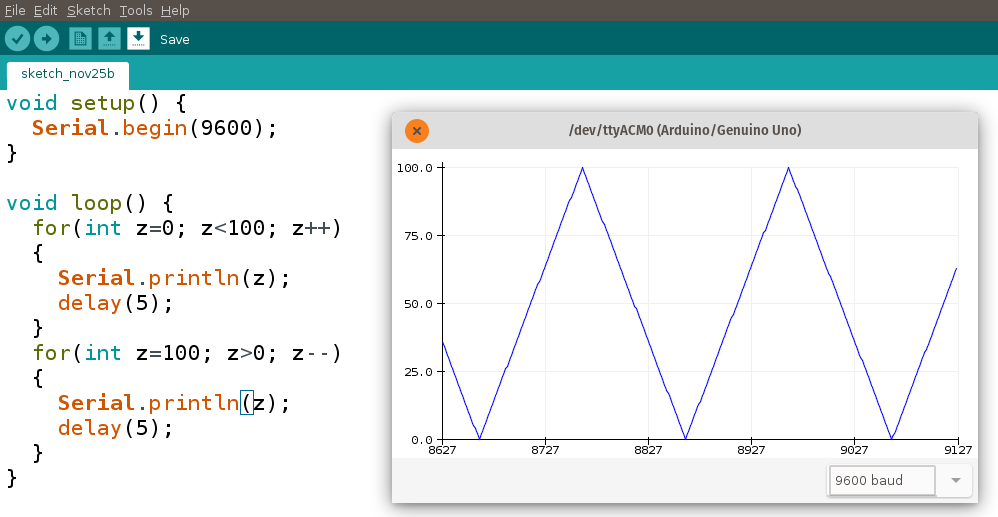
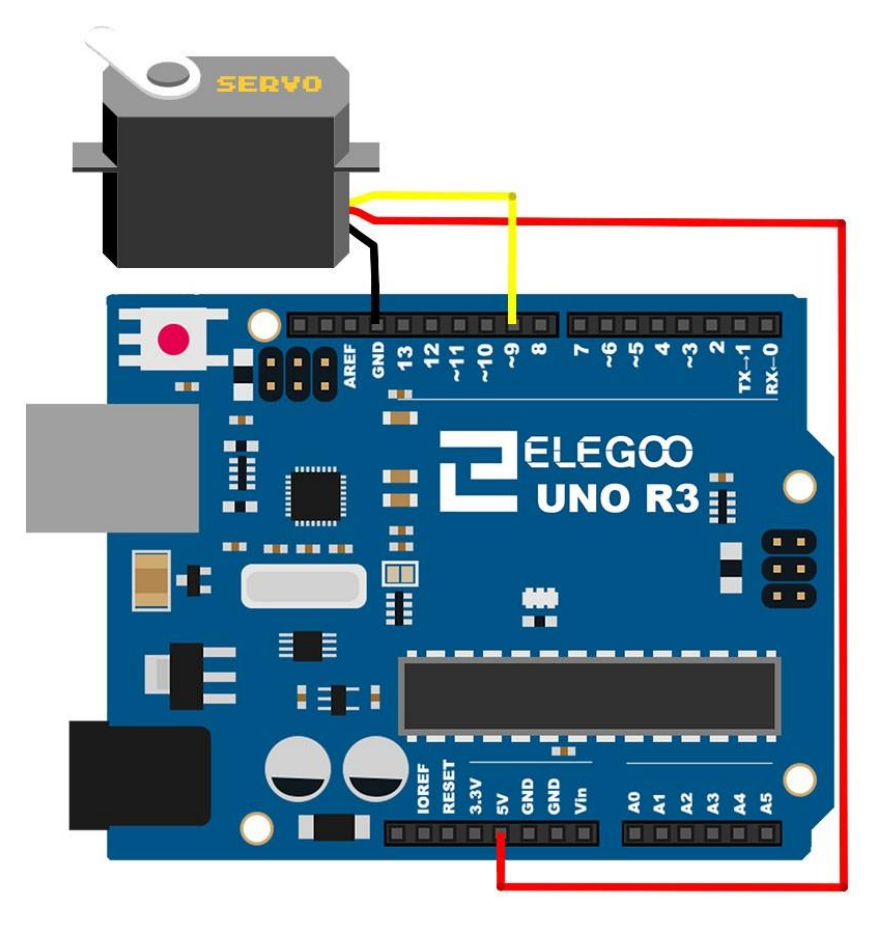
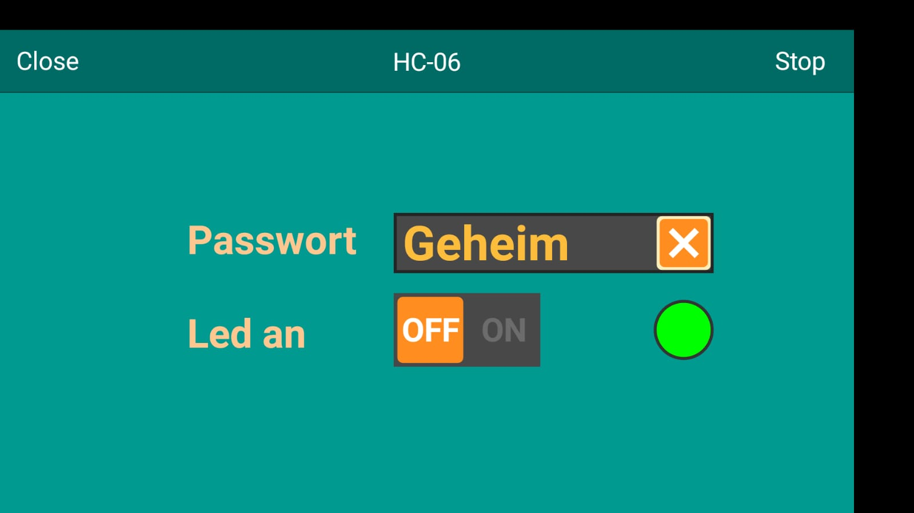

<!--

author:   Sebastian Zug & André Dietrich
email:    zug@ovgu.de   & andre.dietrich@ovgu.de
version:  0.0.1
language: de
narrator: Deutsch Female

link:     https://cdnjs.cloudflare.com/ajax/libs/animate.css/3.7.0/animate.min.css

import: https://raw.githubusercontent.com/LiaTemplates/Rextester/master/README.md
import: https://raw.githubusercontent.com/LiaTemplates/WebDev/master/README.md
import: https://raw.githubusercontent.com/LiaTemplates/NetSwarm-Simulator/master/README.md
-->


# Arduino Einführung III

**Eingebette Systeme**

Prof. Dr. Sebastian Zug,
Technische Universität Bergakademie Freiberg

------------------------------

<!-- width="80%" -->

<h2>Herzlich Willkommen!</h2>

> Die interaktive Ansicht dieses Kurses ist unter folgendem [Link](https://liascript.github.io/course/?https://raw.githubusercontent.com/liaScript/ArduinoEinstieg/master/Course_03.md#1) verfügbar.

https://github.com/liaScript/ArduinoEinstieg/blob/master/Course_03.md


## 0. Motivation für den heutigen Kurs

!?[Ziel](./images/UltraSonicBluetooth.mp4)<!-- width="80%" -->

## 1. Arduino Programmierung

Arduino nutzt eine C/C++ Semantik für die Programmierung, die folgende
Grundelemente bedient

+ Alle Anweisungen enden mit einem `;`
+ Variabeln sind typbehaftet (`int`, `char`, `float`, etc.)
+ wichtige Schlüsselwörter sind `for`, `if`, `while`, etc.
+ Kommentare werden durch `//` eingeleitet

<!-- width="80%" -->

Unter 2.4 folgen einige Beispiele für den Gebrauch der Schleifen und Verzweigungen.

### 2.1 Aufbau eines Arduino-Programmes

Jedes Arduinoprogramm umfasst 2 grundlegende Funktionen `setup()` und `loop()`.

```c
const int ledPin = 13;

// the setup function runs once when you press reset or power the board
void setup() {
  // initialize digital pin ledPin as an output.
  pinMode(ledPin, OUTPUT);
}

// the loop function runs over and over again forever
void loop() {
  digitalWrite(ledPin, HIGH);   // turn the LED on (HIGH is the voltage level)
  delay(1000);                  // wait for a second
  digitalWrite(ledPin, LOW);    // turn the LED off by making the voltage LOW
  delay(1000);                  // wait for a second
}
```

### 2.2 Arduino IDE

<!-- width="80%" -->

Wichtige Grundeinstellungen:

+ Richtigen Port für den Programmiervorgang auswählen (Tools -> Port)
+ Richtigen Controller auswählen (Tools -> Board)
+ Richtige Baudrate für die Serielle Schnittstellen

### 2.3 Hello World

*Und jetzt sind Sie dran!*

Laden Sie das Beispielprogramm "Blink" in Ihren Editor:

Datei -> Beispiele -> Basics -> Blink

Kompilieren und flashen Sie das Programm! Wichtige Tastaturbefehle sind dabei

| Tastenkombination | Bedeutung                |
| ----------------- | ------------------------ |
| Strg-R            | Kompilieren (Ve**R**ify) |
| Strg-U            | Flashend (**U**pload)    |
| Strg-T            | Code korrekt einrücken   |
| Strg-Shift-M      | Seriellen Monitor öffnen |
| Strg-L            | Cursor auf Zeile setzen  |

### 2.4 C++ Basiskonstrukte und die Serielle Schnittstelle

                              {{0-1}}
*******************************************************************************

Was fehlt? Ich möchte irgendwie in den Rechner schauen können :-)

Die Serielle Schnittstelle (häufig auch als UART) bezeichnet ermöglicht das
Versenden und den Empfang von Textnachrichten. Damit können Sie zum Beispiel
Messwerte ausgeben oder das Erreichen bestimmter Programmpositionen anzeigen.

Die folgenden Beispiele vermitteln grundlegende Programmierkonstrukte in C++.
Anhand des NetSwarm Simulator können diese ausgeführt werden.  Achtung, bis auf
die Serielle Schnittstelle können keine  weiteren Funktionalitäten genutzt
werden!

```c
void setup() {
  Serial.begin(9600);
  Serial.println("Hello World");
}

void loop() {
}
```
@NetSwarm.single_loop

Arduino kennt zwei Varianten der Ausgabe mit `print` - das einfache `print` und `println`. Welchen Unterschied vermuten Sie?
*******************************************************************************

                              {{1-2}}
*******************************************************************************

**Schleifen**

Was müssen wir tuen, um die Zahlen von 1 bis 10 auf dem Terminal anzuzeigen?

```c
void setup() {
  Serial.begin(9600);
  int counter = 0;
  for (int i = 0; i < 10; i++){
    Serial.println(counter);  
    counter = counter + 1;
  }
}

void loop() {
}
```
@NetSwarm.single_loop

Welche "Einsparmöglichkeiten" sehen Sie als erfahrener Programmierer in dem Beispiel? Wie kann der Code, mit der gleichen Ausgabe kürzer gestaltet werden?
*******************************************************************************

                              {{2-3}}
*******************************************************************************

**Verzweigungen**

Verzweigungen folgen dem Muster

```c
if (Bedingung) {
  // Anweisungen
}
else{               
  // Anweisungen       
}                      
```

wobei der `else` Abschnitt optional ist.

```c
void setup() {
  Serial.begin(9600);
  float value = 5.234;
  Serial.print(value);
  if (value > 10){
    Serial.println(" - Der Wert ist größer als 10!");
  }else{
    Serial.println(" - Der Wert ist kleiner als 10!");
  }
}

void loop() {
}
```
@NetSwarm.single_loop

*******************************************************************************


                              {{3-4}}
*******************************************************************************

Bedingungen werden dabei wie folgt formuliert:

```c
void setup() {
  Serial.begin(9600);
  int a = 2;
  if (a == 2) {Serial.println("a ist gleich zwei!");}
  if (a <= 5) {Serial.println("a ist kleiner oder gleich fünf!");}
  if (a != 3) {Serial.println("a ist ungleich drei!");}
  char b = 'g';
  if (b == 'z') {Serial.println("In b ist ein z gespeichert!");}
  else {Serial.println("In b ist kein z gespeichert!");}
}

void loop() {
}
```
@NetSwarm.single_loop

Für die Ausgabe von komplexeren, vorformatierten Ausdrücken können Sie auf einen
Befehl aus der C++ Standard-Bibliothek zurückgreifen `sprintf`

Eine anschauliche Dokumentation findet sich unter: [link](https://arduinobasics.blogspot.com/2019/05/sprintf-function.html)

*******************************************************************************


                              {{4-5}}
*******************************************************************************

Funktionen erlauben es uns bestimmte Algorithmen zu kapseln. Dadurch wird der
Code übersichtlicher und struktuierter. Die Wiederverwendbarkeit steigt.

Vervollständigen Sie das Beispiel, so dass die Methode `printOneToN` die Zahlenwerte
von 1 bis zu Übergabewert ausgibt.

```c
void printOneToN(int max){
  Serial.println("Offenbar fehlt Ihr Code!");  
}

void setup() {
  Serial.begin(9600);
  printOneToN(5);
}

void loop() {
}
```
@NetSwarm.single_loop

Recherchieren Sie, wie Sie der Funktion einen Rückgabewert geben können!

*******************************************************************************

## 3. Einstiegs-/Auffrischungsübung

> **Aufgabe:** Schreiben Sie einen Code, der das *SOS* Morsesignal über die
> Led ausgibt!

Passen Sie das Blink-Beispiel so an, dass ein SOS Code über das LED Signal
gesendet wird. Welche Anpassungen sind dafür notwendig?

                                   {{1}}
********************************************************************************

```c
const int ledPin = 13;
const int shortDelay = 1000;
const int longDelay = 1000;

const sos char [] = "ssslllsss";

void setup() {
  // initialize digital pin ledPin as an output.
  pinMode(ledPin, OUTPUT);
}

void blink(int duration){
  digitalWrite(ledPin, HIGH);   // turn the LED on (HIGH is the voltage level)
  delay(duration);              // wait for a second
  digitalWrite(ledPin, LOW);    // turn the LED off by making the voltage LOW
  delay(duration);              // wait for a second  
}

void short(){
  blink(shortDelay);
}

void long(){
  blink(longDelay);  
}

void loop() {
  for(int i = 0; sos[i] != '\0'; ++i) {
      if sos[i] == 'l' long();
      else short();
  }
}
```

Welche weiteren Möglichkeiten der Verbesserung sehen Sie?

********************************************************************************

## 4. Aufgabenkomplexe

<!-- width="80%" -->

* Webseiten des Wiki des Herstellers mangolabs
   [https://www.mangolabs.de/wiki/](https://www.mangolabs.de/wiki/)

* Webseiten des Herstellers elegoo / CD in der Box

* Referenzübersicht Arduino

    + deutsch (unvollständig) https://www.arduino.cc/reference/de/

    + englisch https://www.arduino.cc/reference/en/


### 3a. Distanzsensor als Input

                                    {{0}}
*******************************************************************************

> **Aufgabe:** Schalten Sie die LED mittels Ultraschallsensor an und aus
> (distanzabhäniger Lichtschalter)

<!-- width="100%" -->
*Verdrahtung des Ultraschallsensors (elegoo Handbuch Seite 82)*

ACHTUNG: Sie müssen für die Integration des Sensors noch die Bibliothek
`NewPing` installieren. Finden Sie dafür allein einen Weg? Recherchieren sie in
den Arduino Foren zur Frage "How to install a library for Arduino?"

```c               Sonar.ino
// Loesung
#include <NewPing.h>

const int triggerPin = 12;   
const int echoPin = 11;     
const int maxDistance = 100;
const int ledPin =  13;

NewPing sonar(triggerPin, echoPin, maxDistance);

void setup() {
  Serial.begin(9600);
  pinMode(ledPin, OUTPUT);
}

void loop() {
  delay(50);
  Serial.print("Der aktuelle Wert beträgt: ");
  Serial.println(sonar.ping_cm());
}
```

*******************************************************************************

                                   {{1}}
*******************************************************************************
> Stellen Sie die Distanzwerte nun mit dem Arduino-Plotter dar! Ein Beispiel zur
Verdeutlichung des Effekts:

```c               Plotter.ino
void setup() {
  Serial.begin(9600);
}

void loop() {
  for(int z=0; z<100; z++)
  {
    Serial.println(i);
    delay(5);
  }
  for(int z=100; z>0; z--)
  {
    Serial.println(i);
    delay(5);
  }
}
```

<!-- width="80%" -->

*******************************************************************************

### 3b. Ausgabe mittels Servo

Als Servomotor werden spezielle Elektromotoren bezeichnet, die die Kontrolle der Winkelposition ihrer Motorwelle sowie der Drehgeschwindigkeit und Beschleunigung erlauben. Sie bestehen aus einem Elektromotor, der zusätzlich mit einem Sensor zur Positionsbestimmung ausgestattet ist.

!?[ArduinoServo](https://www.youtube.com/watch?v=PrMgJSGK0Ls)

{{1}}
*******************************************************************************

> Aufgabe: Geben Sie die Distanzmessungen des Ultraschallsensors auf eine selbstgewählten Scale aus. Welche Einschränkungen sehen Sie?

Ok, beginnen wir mit der Verdrahtung, die Implementierung kennen Sie ja schon.
<!-- width="80%" -->


*******************************************************************************

### 3c. Nun wird gefunkt

{{0-2}}
*******************************************************************************

Wir wollen die eine Android Anwendung mit unserem Mikrocontroller koppeln. Dabei soll zunächst die Led des Controllers mit einem einfachen Button auf dem Smartphone verknüpft werden.

Wir erweitern dafür unsere Schaltung um einen Bluetooth Sender/Empfänger, so dass das
System mit uns Daten austauschen kann.

<!-- width="80%" -->[^1](Webseite des RemoteXY Projektes)

Zwei Schritte sind für die Anwendung nötig:

1. Sie müssen wiederum eine Bibliothek installieren. "RemoteXY" wird diesmal benötigt.
2. Sie müssen anhand der Webseite den Code für die Visualisierung erzeugen. Gehen Sie dazu auf http://remotexy.com/.

*******************************************************************************


{{1-2}}
*******************************************************************************

Am Ende entsteht ein Code, der den Datenaustausch zwischen Ihrem Handy und dem Arduino Board ausführt.

```c
//////////////////////////////////////////////
//        RemoteXY include library          //
//////////////////////////////////////////////

// RemoteXY select connection mode and include library
#define REMOTEXY_MODE__SOFTSERIAL
#include <SoftwareSerial.h>

#include <RemoteXY.h>

// RemoteXY connection settings
#define REMOTEXY_SERIAL_RX 2
#define REMOTEXY_SERIAL_TX 3
#define REMOTEXY_SERIAL_SPEED 9600


// RemoteXY configurate  
#pragma pack(push, 1)
uint8_t RemoteXY_CONF[] =
  { 255,0,0,1,0,62,0,8,13,0,
  129,0,17,13,18,6,17,68,105,115,
  116,97,110,99,101,32,109,101,97,115,
  117,114,101,109,101,110,116,0,66,130,
  33,25,36,28,2,26,129,0,20,52,
  18,6,17,48,99,109,0,129,0,69,
  52,18,6,17,51,48,99,109,0 };

// this structure defines all the variables of your control interface
struct {

    // output variable
  int8_t level_1; // =0..100 level position

    // other variable
  uint8_t connect_flag;  // =1 if wire connected, else =0

} RemoteXY;
#pragma pack(pop)

/////////////////////////////////////////////
//           END RemoteXY include          //
/////////////////////////////////////////////


void setup()
{
  RemoteXY_Init ();


  // TODO you setup code

}

void loop()
{
  RemoteXY_Handler ();


  // TODO you loop code
  // use the RemoteXY structure for data transfer


}
```

*******************************************************************************

{{2-3}}
********************************************************************************

> Schalten Sie die Arduino LED (PIN 13) mit dem Handy an und aus.

<!-- width="80%" -->

*Beschaltung des Bluetooth Dongles HC06*

Der Code wird nun mittels der zugehörigen Webseite http://remotexy.com/ generiert.

```c     Basisprogramm.ino
#define REMOTEXY_MODE__SOFTSERIAL
#include <SoftwareSerial.h>

#include <RemoteXY.h>

// RemoteXY connection settings
#define REMOTEXY_SERIAL_RX 2
#define REMOTEXY_SERIAL_TX 3
#define REMOTEXY_SERIAL_SPEED 9600

// RemoteXY configurate  
#pragma pack(push, 1)
uint8_t RemoteXY_CONF[] =
  { 255,1,0,0,0,43,0,8,13,0,
  2,0,14,17,22,11,2,26,31,31,
  79,78,0,79,70,70,0,129,0,14,
  7,18,6,17,51,46,32,67,111,100,
  105,110,103,32,78,105,103,104,116,0 };

struct {
    // input variable
  uint8_t switch_1; // =1 if switch ON and =0 if OFF
    // other variable
  uint8_t connect_flag;  // =1 if wire connected, else =0
} RemoteXY;
#pragma pack(pop)

#define PIN_SWITCH_1 13

void setup()
{
  RemoteXY_Init ();
  pinMode (PIN_SWITCH_1, OUTPUT);
  // TODO you setup code  
}

void loop()
{
  RemoteXY_Handler ();
  digitalWrite(PIN_SWITCH_1, (RemoteXY.switch_1==0)?LOW:HIGH);
  // TODO you loop code
  // use the RemoteXY structure for data transfer
}
```

*******************************************************************************

{{3-5}}
********************************************************************************

Erweitern Sie den Code so, dass Sie das System so, dass Sie ein Passwort überprüfen,
bevor die Lampe angeht.

<!-- width="80%" -->

Dafür müssen Sie:

+ ein "Edit" Feld in der Android-Anwendung einfügen
+ den zugehörigen Eintrag im Datenfeld auslesen
+ mit dem eigentlichen Passwort vergleichen
+ ggf. die LED anschalten

Hinweis: Sie sollten Ihr gemeines Passwort und die Input-Zeichenfolge als `String` speichern. Dann wird es möglich diese "als Ganzes" zu vergleichen.

```c
String inputString = "";
String password = "Geheim";


inputString = RemoteXY.edit_1;
if (inputString == password){... }
```

********************************************************************************
                                  {{4-5}}
********************************************************************************

```c  LösungPasswort.ino
#define PIN_SWITCH_1 13

String inputString = "";
String password = "Geheim";

void setup()
{
  RemoteXY_Init ();
  pinMode (PIN_SWITCH_1, OUTPUT);
  // TODO you setup code
}

void loop()
{
  RemoteXY_Handler ();
  inputString = RemoteXY.edit_1;
  if (inputString == password){
     digitalWrite(PIN_SWITCH_1, (RemoteXY.switch_1==0)?LOW:HIGH);
     RemoteXY.led_1_r = 0;
     RemoteXY.led_1_g = 255;
  }else{
     RemoteXY.led_1_r = 255;
     RemoteXY.led_1_g = 0;
  }
  // TODO you loop code
  // use the RemoteXY structure for data transfer
}
```

********************************************************************************

### 3d. ... und visualiziert

> Aufgabe: Senden Sie den aktuellen Wert des Ultraschallsensors an das Smartphone. Visualisieren Sie den Zustand in geeigneter Weise.
