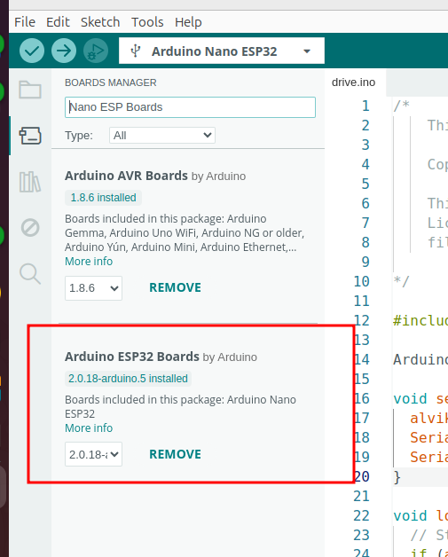
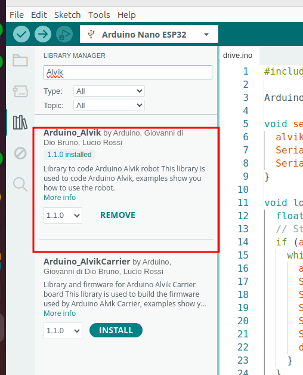

<!--

author:   Sebastian Zug & André Dietrich
email:    sebatian.zug@informatik.tu-freiberg.de & andre.dietrich@informatik.tu-freiberg.de
import:   https://github.com/LiaTemplates/AVR8js/main/README.md#10
version:  0.0.2
language: de
narrator: Deutsch Female

-->

[](https://liascript.github.io/course/?https://raw.githubusercontent.com/liaScript/ArduinoEinstieg/master/Course_03.md#1)


# Robotik / Mikrocontroller Einführung III

Prof. Dr. Sebastian Zug,
Technische Universität Bergakademie Freiberg

------------------------------

<!-- width="80%" -->

<h2>Herzlich Willkommen!</h2>

> Die interaktive Ansicht dieses Kurses ist unter folgendem [Link](https://liascript.github.io/course/?https://raw.githubusercontent.com/liaScript/ArduinoEinstieg/master/Course_03.md#1) verfügbar.

Der Quellcode der Materialien ist unter https://github.com/liaScript/ArduinoEinstieg/blob/master/Course_03.md zu finden.


## Blick zurück ...


### Begriffliche Auffrischung

+ Was unterscheidet ein eingebettetes System vom Standarddesktop-Rechner?

{{1-6}}
> ... ein elektronischer Rechner ..., der in einen technischen Kontext
> eingebunden ist. Dabei übernimmt der (Kleinst-)Rechner entweder
> Überwachungs-, Steuerungs- oder Regelfunktionen ... weitestgehend unsichtbar
> für den Benutzer .. [nach Wikipedia "Eingebettete Systeme"].


{{2-6}}
+ Was macht ein Compiler?

{{3-6}}
> Compiler wird eine Software genannt, die einen in einer Programmiersprache
> geschrieben Quellcode so übersetzt, dass sie von Maschinen verstanden
> werden können.

{{4-6}}
+ Wofür steht das Arduino Projekt?

{{5-6}}
> Arduino ist eine aus Soft- und Hardware bestehende
> Physical-Computing-Plattform. Beide Komponenten sind im Sinne von Open
> Source quelloffen. Die Hardware besteht aus einem einfachen E/A-Board mit
> einem Mikrocontroller und analogen und digitalen Ein- und Ausgängen.
{{5-6}}
https://www.arduino.cc/

### Generelle Syntax von Arduino Programmen

> Grundstruktur eines Arduino C++ Programms

<div>
  <wokwi-led color="red" pin="13" port="B" label="13"></wokwi-led>
  <span id="simulation-time"></span>
</div>
```cpp       arduino.cpp
const int ledPin = 13;

void setup() {
  pinMode(ledPin, OUTPUT);
}

void loop() {
  digitalWrite(ledPin, HIGH);  
  delay(1000);                
  digitalWrite(ledPin, LOW);
  delay(1000);  
}
```
@AVR8js.sketch

### C/C++ Programmerkonstrukte


                              {{0-1}}
*******************************************************************************

**Schleifen**

```c
for (initale Zuweisung Zählvariable, Bedingung für Schleifenweiterführung, Adaption Zählvariable) {
  // Anweisungen
}                  
```

Was müssen wir tuen, um die Zahlen von 1 bis 10 auf dem Terminal anzuzeigen?

<div>
  <span id="simulation-time"></span>
</div>
```cpp       arduino.cpp
void setup() {
  Serial.begin(9600);
  int counter = 0;
  for (int i = 0; i < 10; i++){
    Serial.println(counter);  
    counter = counter + 1;
  }
}

void loop() {
}
```
@AVR8js.sketch

Welche "Einsparmöglichkeiten" sehen Sie als erfahrener Programmierer in dem Beispiel? Wie kann der Code, mit der gleichen Ausgabe kürzer gestaltet werden?

*******************************************************************************

                              {{1-2}}
*******************************************************************************

**Verzweigungen**

Verzweigungen folgen dem Muster

```c
if (Bedingung) {
  // Anweisungen
}
else{               
  // Anweisungen       
}                      
```

wobei der `else` Abschnitt optional ist.

<div>
  <span id="simulation-time"></span>
</div>
```cpp       arduino.cpp
void setup() {
  Serial.begin(9600);
  float value = 5.234;
  Serial.print(value);
  if (value > 10){
    Serial.println(" - Der Wert ist größer als 10!");
  }else{
    Serial.println(" - Der Wert ist kleiner als 10!");
  }
}

void loop() {
}
```
@AVR8js.sketch


*******************************************************************************


                              {{2-3}}
*******************************************************************************

Bedingungen werden dabei wie folgt formuliert:

<div>
  <span id="simulation-time"></span>
</div>
```c      ardunino.cpp
void setup() {
  Serial.begin(9600);
  int a = 2;
  if (a == 2) {Serial.println("a ist gleich zwei!");}
  if (a <= 5) {Serial.println("a ist kleiner oder gleich fünf!");}
  if (a != 3) {Serial.println("a ist ungleich drei!");}
  char b = 'g';
  if (b == 'z') {Serial.println("In b ist ein z gespeichert!");}
  else {Serial.println("In b ist kein z gespeichert!");}
}

void loop() {
}
```
@AVR8js.sketch

*******************************************************************************

### Übungsbeispiel


> **Aufgabe:** Eine Ihrer Programmierererinnen hat einen Code geschrieben, der ein Treppenhauslicht zeitgesteuert aktiviert und deaktiviert.
>
> Probieren Sie den Code aus und erklären Sie die verwendeten Programmierkonstrukte. Hat sie alles richtig gemacht? Welche Verbesserungsvorschläg haben Sie?

<div>
  <wokwi-pushbutton color="red"   pin="3"  port="D"></wokwi-pushbutton>
  <wokwi-led color="red"   pin="13" port="B" label="13"></wokwi-led>
</div>
```cpp       ButtonLogic.cpp
void setup() {
  Serial.begin(115200);
  Serialprintln("Starte Programm");
  pinMode(3, INPUT);
  pinMode(13, OUTPUT);
  digitalWrite(13, LOW)
}

void delayedLed(int pin, int delayTime){
  // Ausgabe auf der seriellen Schnittstelle
  Serial.print("LED an ");
  Serial.print(pin);
  Serial.print(" für ");
  Serial.print(delayTime);
  Serial.println(" Millisekunden an.");
  // Schaltvorgang
  digitalWrite(pin, HIGH);
  delay(300);
  digitalWrite(pin, LOW);
}

void loop() {
  bool red = digitalread(3);
  if (red = 1) delayedLed(13, 3000)
}
```
@AVR8js.sketch


## Alvik Roboter 


### Einrichten der Umgebung 

1. Installieren Sie in Ihrer Arduino IDE die Entwicklungsumgebung für den Alvik Roboter. Dazu ist es notwendig die Boardverwaltung zu erweitern und __Arduino Nano ESP32__ zu installieren.



2. Installieren Sie die Bibliothek für den Alvik Roboter. Dazu ist es notwendig die Bibliotheksverwaltung zu öffnen und __Arduino Alvik__ zu installieren.




### Einstiegsbeispiel

Mit welchen Befehlen kann der Roboter gesteuert werden?

| Befehlt                               | Beschreibung                                                                              |
| ------------------------------------- | ----------------------------------------------------------------------------------------- |
| `alvik.move(50, CM)`                  | Fährt 50 cm vorwärts                                                                      |
| `alvik.rotate(50, DEG)`               | Dreht sich um 50 Grad                                                                     |
| `alvik.set_wheels_speed(20, 30, RPM)` | Bewege die Räder mit 20 bzw. 30 Umdrehunge pro Minute (_Rounds per minute_)               |
| `alvik.drive(50, 30, CM_S, DEG_S)`    | Fahre 50cm gerade aus und rotiere dabei mit einer Geschwindigkeit von 30 Grad pro Sekunde |

Für move und Rotate gibt es jeweils eine blockierende und eine nicht blockierende Variante. Was kann das bedeuten?

> Praktische Aufgabe 1: Wie weit wird der Roboter in diesem Beispiel fahren? Probieren Sie es aus und erklären Sie das Verhalten. Wie müsste der Code geändert werden, um einen Kreis mit einem Druchmesser von 50cm einmal vollständig abzufahren?

```cpp   Alvik.cpp
#include "Arduino_Alvik.h"

Arduino_Alvik alvik;

void setup() {
  alvik.begin();
  Serial.begin(9600);
  Serial.print("Los gehts ... warte auf Buttoneingabe!");
}

void loop() {
  // Start
  if (alvik.get_touch_ok()){
    alvik.drive(50, 30, CM_S, DEG_S);
    delay(3000);
    alvik.brake();
  }
  // Stop
  if (alvik.get_touch_cancel()){
    alvik.left_led.set_color(0,0,1);
    alvik.right_led.set_color(0,0,1);
    alvik.stop();
    delay(10000);
  }
}
```

> Praktische Aufgabe 2: Implementieren Sie eine Hin- und Herfahrt zwischen zwei 50 cm entfernten Punkten. Was beobachten Sie?

### Eisberg voraus

Der Roboter ist mit einem Distanzsensor im Frontbereich ausgestattet und kann so Hindernisse erkennen. Wie kann das genutzt werden?


```cpp   Alvik.cpp
#include "Arduino_Alvik.h"

Arduino_Alvik alvik;

void setup() {
  alvik.begin();
  Serial.begin(9600);
  Serial.print("Los gehts ... warte auf Buttoneingabe!");
}

void loop() {
  float distance_l, distance_cl, distance_c, distance_r, distance_cr;
  // Start
  if (alvik.get_touch_ok()){
    while (1){
      alvik.get_distance(distance_l, distance_cl, distance_c, distance_cr, distance_r);
      Serial.print(distance_l); Serial.print(" ");
      Serial.print(distance_cl); Serial.print(" ");
      Serial.print(distance_c); Serial.print(" ");
      Serial.print(distance_r); Serial.print(" ");
      Serial.print(distance_cr); Serial.println();
      delay(200);
    }
  }
  // Stop
  if (alvik.get_touch_cancel()){
    alvik.left_led.set_color(0,0,1);
    alvik.right_led.set_color(0,0,1);
    alvik.stop();
    delay(10000);
  }
}
```

> Praktische Aufgabe 3: Stoppen Sie, bei der Hin- und Herfahrt, sobald sich ein Hindernis auf Ihrer Route befindet. Wann ist ein Hindernis für uns überhaupt relevant? Wie können wir das erkennen?

> Praktische Aufgabe 4: Umfahren Sie das Hindernis!


### Follow my hand ...

> Praktische Aufgabe 5: Drehen Sie die Richtung der Kontrolle um, der Roboter soll Ihrer Hand folgen und versuchen den Abstand konstant zu halten.