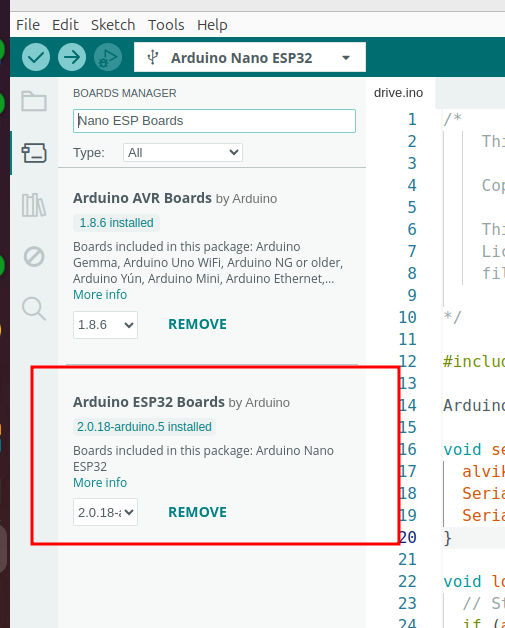
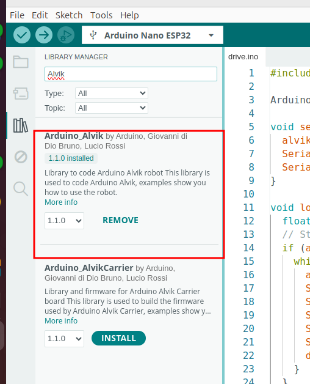
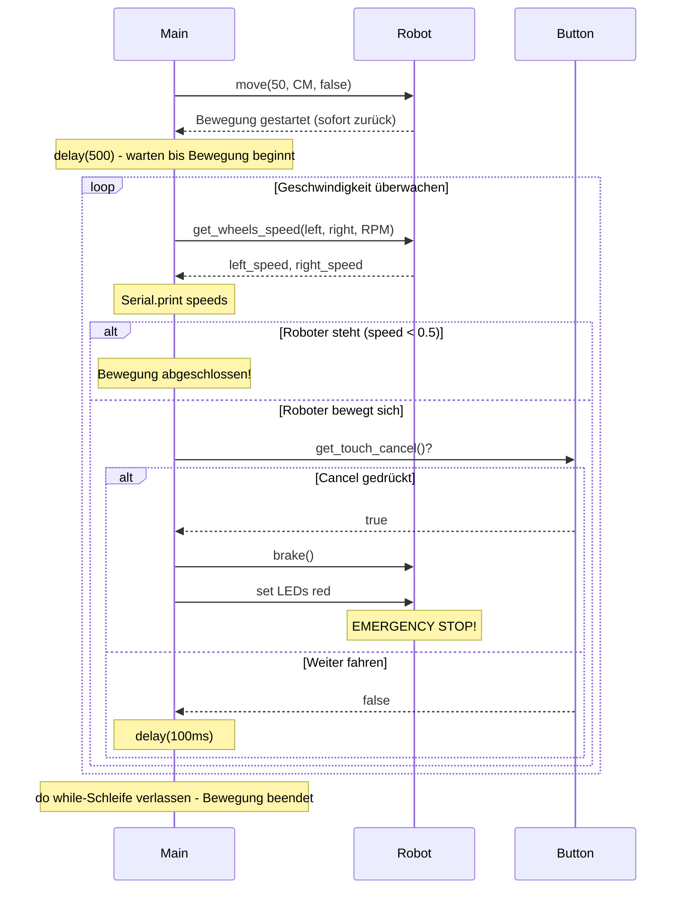

<!--

author:   Sebastian Zug & André Dietrich
email:    sebatian.zug@informatik.tu-freiberg.de & andre.dietrich@informatik.tu-freiberg.de
import:   https://github.com/LiaTemplates/AVR8js/main/README.md#10
          https://raw.githubusercontent.com/liaScript/mermaid_template/master/README.md
          https://raw.githubusercontent.com/LiaTemplates/Tikz-Jax/main/README.md
version:  0.0.1
language: de
narrator: Deutsch Female

-->

[](https://liascript.github.io/course/?https://raw.githubusercontent.com/liaScript/ArduinoEinstieg/master/Course_04.md#1)


# Robotik / Mikrocontroller Einführung III

Prof. Dr. Sebastian Zug,
Technische Universität Bergakademie Freiberg

------------------------------

<!-- width="80%" -->

<h2>Herzlich Willkommen!</h2>

> Die interaktive Ansicht dieses Kurses ist unter folgendem [Link](https://liascript.github.io/course/?https://raw.githubusercontent.com/liaScript/ArduinoEinstieg/master/Course_04.md#1) verfügbar.

Der Quellcode der Materialien ist unter https://github.com/liaScript/ArduinoEinstieg/blob/master/Course_04.md zu finden.


## Blick zurück ...


### Begriffliche Auffrischung

+ Was unterscheidet ein eingebettetes System vom Standarddesktop-Rechner?

{{1-6}}
> ... ein elektronischer Rechner ..., der in einen technischen Kontext
> eingebunden ist. Dabei übernimmt der (Kleinst-)Rechner entweder
> Überwachungs-, Steuerungs- oder Regelfunktionen ... weitestgehend unsichtbar
> für den Benutzer .. [nach Wikipedia "Eingebettete Systeme"].


{{2-6}}
+ Was macht ein Compiler?

{{3-6}}
> Compiler wird eine Software genannt, die einen in einer Programmiersprache
> geschrieben Quellcode so übersetzt, dass sie von Maschinen verstanden
> werden können.

{{4-6}}
+ Wofür steht das Arduino Projekt?

{{5-6}}
> Arduino ist eine aus Soft- und Hardware bestehende
> Physical-Computing-Plattform. Beide Komponenten sind im Sinne von Open
> Source quelloffen. Die Hardware besteht aus einem einfachen E/A-Board mit
> einem Mikrocontroller und analogen und digitalen Ein- und Ausgängen.
{{5-6}}
https://www.arduino.cc/

### Generelle Syntax von Arduino Programmen

> Grundstruktur eines Arduino C++ Programms

<div>
  <wokwi-led color="red" pin="13" port="B" label="13"></wokwi-led>
  <span id="simulation-time"></span>
</div>
```cpp       arduino.cpp
const int ledPin = 13;

void setup() {
  pinMode(ledPin, OUTPUT);
}

void loop() {
  digitalWrite(ledPin, HIGH);  
  delay(1000);                
  digitalWrite(ledPin, LOW);
  delay(1000);  
}
```
@AVR8js.sketch

### C/C++ Programmerkonstrukte


                              {{0-1}}
*******************************************************************************

**Schleifen**

```c
for (initale Zuweisung Zählvariable, Bedingung für Schleifenweiterführung, Adaption Zählvariable) {
  // Anweisungen
}                  
```

Was müssen wir tuen, um die Zahlen von 1 bis 10 auf dem Terminal anzuzeigen?

<div>
  <span id="simulation-time"></span>
</div>
```cpp       arduino.cpp
void setup() {
  Serial.begin(9600);
  for (int i = 0; i < 10; i++){
    Serial.print("Der Roboter hat bis ");
    Serial.print(i);  
    Serial.println(" gezaehlt.");
  }
}

void loop() {
}
```
@AVR8js.sketch

> Warum ist die Verwendung einer Schleife sinnvoller als die 10 Ausgaben nacheinander zu schreiben?

*******************************************************************************

                              {{1-2}}
*******************************************************************************

**Verzweigungen**

Verzweigungen folgen dem Muster

```c
if (Bedingung) {
  // Anweisungen
}
else{               
  // Anweisungen       
}                      
```

wobei der `else` Abschnitt optional ist.

<div>
  <span id="simulation-time"></span>
</div>
```cpp       arduino.cpp
void setup() {
  Serial.begin(9600);
  float speed;              // Variable für die Geschwindigkeit
  float distance = 5.234;   // Messwert des Sensors
  Serial.print(distance);
  if (distance > 10){
    Serial.println(" Wir haben genug Platz!");
    speed = 1;
  }else{
    Serial.println(" Das wird eng! Ich bremse ab!");
    speed = 0.5;
  }
  Serial.print("Aktuelle Geschwindigkeit: ");
  Serial.println(speed);
}

void loop() {
}
```
@AVR8js.sketch

> Wie müssten wir den Code erweitern, wenn wir drei Geschwindigkeitsstufen (schnell, mittel, langsam) hätten?

*******************************************************************************


## Alvik Roboter 


### Einrichten der Umgebung 

1. Installieren Sie in Ihrer Arduino IDE die Entwicklungsumgebung für den Alvik Roboter. Dazu ist es notwendig die Boardverwaltung zu erweitern und __Arduino Nano ESP32__ zu installieren.



2. Installieren Sie die Bibliothek für den Alvik Roboter. Dazu ist es notwendig die Bibliotheksverwaltung zu öffnen und __Arduino Alvik__ zu installieren.




### Einstiegsbeispiel

Mit welchen Befehlen kann der Roboter gesteuert werden?

| Befehlt                               | Beschreibung                                                                              |
| ------------------------------------- | ----------------------------------------------------------------------------------------- |
| `alvik.move(50, CM)`                  | Fährt 50 cm vorwärts                                                                      |
| `alvik.rotate(50, DEG)`               | Dreht sich um 50 Grad                                                                     |
| `alvik.set_wheels_speed(20, 30, RPM)` | Bewege die Räder mit 20 bzw. 30 Umdrehunge pro Minute (_Rounds per minute_)               |
| `alvik.drive(50, 30, CM_S, DEG_S)`    | Fahre 50cm gerade aus und rotiere dabei mit einer Geschwindigkeit von 30 Grad pro Sekunde |

Die Dokumentation der Alvik Bibliothek ist unter folgendem [Link](https://docs.arduino.cc/tutorials/alvik/api-overview/) zu finden.

> Praktische Aufgabe 1: Analysieren Sie das folgende Beispiel. Der Roboter soll eine Hin- und Herfahrt zwischen zwei 50 cm entfernten Punkten durchführen. Was beobachten Sie?


> <div>
``` latex  @tikz
\begin{tikzpicture}
  
  % Geplante Bewegung (grün)
  \draw[thick, ->] (1,5) -- (6,5) node[midway, above] {50cm hin};
  \draw[thick, ->] (6.25,5) arc (90:-95:0.25) node[midway, right, text width=2cm] {180 Grad drehen};
  \draw[thick, ->] (6,4.5) -- (1,4.5) node[midway, below] {50cm zurueck};

  \node at (1.0,5.5) [text width=1cm] {Start/ Ziel};

\end{tikzpicture}
```
</div>

> Übernehmen Sie den Code in Ihren Editor und probieren Sie es aus. Korrigieren Sie ggf. die Fehler und erklären Sie diese.

```cpp   Start.cpp
#include "Arduino_Alvik.h"

Arduino_Alvik alvik;

void setup() {
  alvik.begin();
  Serial.begin(9600);
  Serial.print("Los gehts ... warte auf Buttoneingabe!");
}

void loop() {
  // Start
  if (alvik.get_touch_ok()){
    // Hinfahrt: 50cm vorwärts
    alvik.move(50, CM)
    delay(1000);
    
    // 180 Grad Drehung
    alvik.rotate(90, DEG);
    delay(1000);
    
    // Rückfahrt: 50cm vorwärts (nach der Drehung)
    alvik.move(-50, CM);
    delay(1000);
    
    alvik.stop();
  }
}
```

> Brauchen wir das 


## Notstop

Wir nehmen an, dass unser Roboter ein autonomes Auto sei. Im Gefahrenfall, wollen wir die Bewegung mit dem Chancel Taster auf der Oberseite stoppen können. 

Eine Notfallsituation könnte im Code wie folgt aussehen:

```c
if (alvik.get_touch_cancel()) {
  alvik.brake();
  alvik.left_led.set_color(1,0,0);  // Rote LEDs für Stop
  alvik.right_led.set_color(1,0,0);
  Serial.println("STOP gedrückt - Bewegung abgebrochen!");
}
```

> Integrieren Sie die Notstopfunktion in unseren Code.

```cpp   Alvik.cpp
#include "Arduino_Alvik.h"

Arduino_Alvik alvik;

void setup() {
  alvik.begin();
  Serial.begin(9600);
  Serial.print("Los gehts ... warte auf Buttoneingabe!");
}

void loop() {
  // Start
  if (alvik.get_touch_ok()){
    // Hinfahrt: 50cm vorwärts
    alvik.move(50, CM);
    delay(1000);
    
    // 180 Grad Drehung
    alvik.rotate(180, DEG);
    delay(1000);
    
    // Rückfahrt: 50cm vorwärts (nach der Drehung)
    alvik.move(50, CM);
    delay(1000);
    
    alvik.stop();
  }
}
```

> Die Implementierung des Notstops funktioniert nicht wie erwartet. Warum?

### Konzept Lösung

| Aspekt                     | Synchrone Lösung                   | Asynchrone Lösung                      |
| -------------------------- | ---------------------------------- | -------------------------------------- |
| **Programmablauf**         | Blockierend - wartet auf Abschluss | Nicht-blockierend - sofortige Rückkehr |
| **Button-Reaktion**        | ❌ Nur zwischen Bewegungen möglich | ✅ Jederzeit während Bewegung          |
| **Reaktionszeit**          | 🐌 Langsam (mehrere Sekunden)     | ⚡ Schnell (50ms)                      |
| **Code-Komplexität**       | 🟢 Einfach zu verstehen           | 🟡 Etwas komplexer                    |
| **Ressourcenverbrauch**    | 🟢 Niedrig                        | 🟡 Leicht höher (Polling)             |
| **Benutzerfreundlichkeit** | ❌ Frustrierend bei Notfällen      | ✅ Responsive und sicher               |
| **Fehlerbehandlung**       | ❌ Schwierig während Bewegung      | ✅ Einfache Unterbrechung              |

### Asynchrone Lösung

Umsetzung des Notstops mit asynchroner Bewegungssteuerung

```cpp   Alvik.cpp
#include "Arduino_Alvik.h"

Arduino_Alvik alvik;

void setup() {
  alvik.begin();
  Serial.begin(9600);
  Serial.print("Los gehts ... warte auf Buttoneingabe!");
}

void loop() {
  float left_speed, right_speed;
  // Start
  if (alvik.get_touch_ok()){
    alvik.move(50, CM, false);      // false = nicht-blockierend
    delay(500);                     // Warten bis die Bewegung beginnt

    // Warten bis Bewegung abgeschlossen, aber Button überwachen
    do {
      delay(100);  // Kurz warten vor nächster Überprüfung
      alvik.get_wheels_speed(left_speed, right_speed, RPM);
      Serial.print(left_speed);
      Serial.print(",");
      Serial.println(right_speed);
      // Notstop prüfen
      if (alvik.get_touch_cancel()) {
        alvik.brake();
        alvik.left_led.set_color(1,0,0);  // Rote LEDs für Stop
        alvik.right_led.set_color(1,0,0);
        Serial.println("STOP gedrückt - Bewegung abgebrochen!");
      }
    } while(left_speed > 0.5 && right_speed > 0.5);
    delay(1000);
  
    alvik.stop();
    Serial.println("Bewegungssequenz abgeschlossen!");
  }
}
```

> Frage: Warum verwenden wir eine `do while` Schleife und keine `while` Schleife?

Visualisierung als Sequenzdiagramm

<div style="transform: scale(0.8); transform-origin: top left;">

</div>

> Jetzt müssten wir jedes mal eine Bewegung in eine nicht-blockierende Bewegung umwandeln und den Button in einer Schleife überwachen. Das ist aufwändig und fehleranfällig. Wie können wir das besser machen?

### Safe-Modus als Funktion 

Wir kapseln die asynchrone Bewegung in eine Funktion. Diese Funktion gibt einen Wahrheitswert zurück, der angibt, ob die Bewegung erfolgreich abgeschlossen wurde oder durch den Notstop abgebrochen wurde.

> Was war noch mal eine Funktion?

```cpp       arduino.cpp
void setup() {
  Serial.begin(9600);
  Serial.println("Funktion Beispiel");

  Serial.println(2+5);          // Hard codierte direkte Berechnung - Ganz schlecht
  
  int a = 2;
  int b = 5;
  Serial.println(a+b);          // Besser - aber immer noch schlecht

  Serial.println(add(a,b));     // Gut - Funktion für Addition
}

void loop() {
}

//  Funktionsname 
//   |
//   v   Übergabeparameter in Klammern 
int add(int x, int y) {          // Funktionsdefinition
  // tue etwas magisches
  int result = x + y;            // Zwischenspeicherung
  // noch mehr Magie
  return result;                 // Rückgabewert
}  
```
@AVR8js.sketch


```cpp   Alvik.cpp
#include "Arduino_Alvik.h"

Arduino_Alvik alvik;

// Asynchrone Move-Funktion mit Speed-basierter Stop-Button Überwachung
bool asynchron_move(float distance, int unit) {
  Serial.print("Starte Bewegung: ");
  Serial.print(distance);
  Serial.print(" ");
  Serial.println(unit == CM ? "cm" : "units");
  
  alvik.move(distance, unit, false);  // Nicht-blockierend starten
  // Kurz warten bis Bewegung beginnt
  delay(500);
  
  // Überwachungsschleife basierend auf Radgeschwindigkeit
  float left_speed, right_speed;
  do {
    delay(100);  // Alle 100ms prüfen
    alvik.get_wheels_speed(left_speed, right_speed, RPM);
    
    // Stop-Button prüfen
    if (alvik.get_touch_cancel()) {
      alvik.brake();
      alvik.left_led.set_color(1,0,0);  // Rote LEDs für Stop
      alvik.right_led.set_color(1,0,0);
      Serial.println("EMERGENCY STOP! Bewegung abgebrochen!");
      return false;  // Fehler - Bewegung wurde abgebrochen
    }
    
  } while(abs(left_speed) > 0.5 || abs(right_speed) > 0.5); // Solange sich Roboter bewegt
  
  Serial.println("Roboter steht - Bewegung abgeschlossen!");
  return true;  // Erfolgreich - Bewegung vollständig abgeschlossen
}

void setup() {
  alvik.begin();
  Serial.begin(9600);
  Serial.println("Safe-Move System bereit!");
}

void loop() {
  // Start
  if (alvik.get_touch_ok()){
    Serial.println("Starte Bewegungssequenz...");
    
    // Hinfahrt: 50cm vorwärts
    if (!asynchron_move(50, CM)) {
      Serial.println("Sequenz durch Benutzer abgebrochen!");
      return;  // Bei Stop komplette Sequenz beenden
    }
    delay(1000);
 
    alvik.stop();
    Serial.println("Bewegungssequenz abgeschlossen!");
  }
}
```

### Hinweis

Die Lösung ist intuitiv und gut verständlich aber nicht unproblematisch. Es gibt zwei wesentliche Schwächen:

1. Wir jonglieren mit Zeitabschätzungen - wie lange braucht der Roboter, um seine Geschwindigkeit zu erreichen?
2. Das Abbruchkriterium ist zu einfach und deckt zum Beispiel Drehungen nicht ab.
3. Die Funktion berücksichtigt nur Buttoneingaben aber keine weiteren Inputs wie zum Beispiel die Hinderniserkennung.

> Welche Lösungsansätze sehen Sie?


