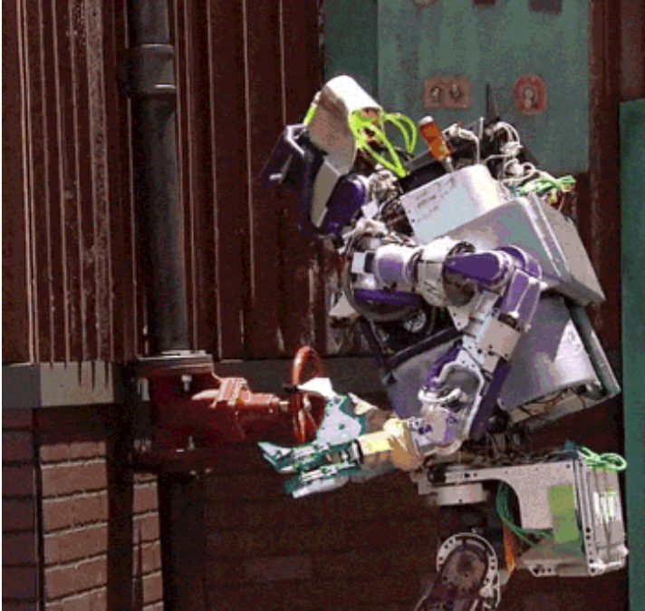
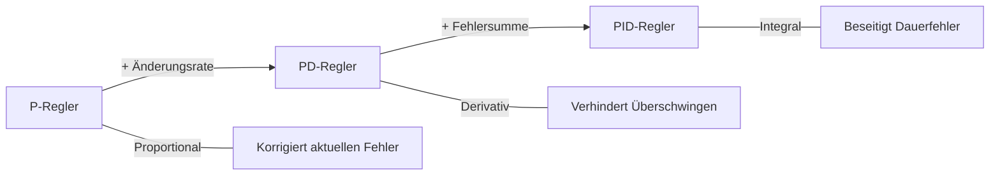

<!--

author:   Sebastian Zug & André Dietrich
email:    sebatian.zug@informatik.tu-freiberg.de & andre.dietrich@informatik.tu-freiberg.de
import:   https://github.com/LiaTemplates/AVR8js/main/README.md#10
          https://raw.githubusercontent.com/liaScript/mermaid_template/master/README.md
          https://raw.githubusercontent.com/LiaTemplates/Tikz-Jax/main/README.md
version:  0.0.1
language: de
narrator: Deutsch Female

-->

[](https://liascript.github.io/course/?https://raw.githubusercontent.com/liaScript/ArduinoEinstieg/master/Course_05.md#1)


# Robotik / Mikrocontroller Einführung V - Linienverfolgung

Prof. Dr. Sebastian Zug,
Technische Universität Bergakademie Freiberg

------------------------------

<!-- width="80%" -->

<h2>Herzlich Willkommen!</h2>

> Die interaktive Ansicht dieses Kurses ist unter folgendem [Link](https://liascript.github.io/course/?https://raw.githubusercontent.com/liaScript/ArduinoEinstieg/master/Course_05.md#1) verfügbar.

Der Quellcode der Materialien ist unter https://github.com/liaScript/ArduinoEinstieg/blob/master/Course_05.md zu finden.


## Aufwärmübung: Fehlersuche

<!-- width="60%" -->

Euer Kollege hat versucht, den Alvik so zu programmieren, dass er geradeaus fährt und bei einem Hindernis umdreht. Leider funktioniert das Programm nicht wie erwartet.

> **Aufgabe:** Findet die Fehler im Code! Überlegt zuerst gemeinsam, was der Code tun soll, und vergleicht das mit dem, was tatsächlich passiert. Übernehmt den Code in Euren Editor und testet ihn.

```cpp   Fehlersuche.cpp
#include "Arduino_Alvik.h"

Arduino_Alvik alvik;

void setup() {
  alvik.begin();
  Serial.begin(9600);
  Serial.println("Hindernis-Wender bereit!")
}

void loop() {
  if (alvik.get_touch_ok()){

    while (!alvik.get_touch_cancel()) {
      // Geradeaus fahren
      alvik.set_wheels_speed(30, 30, RPM);

      // Distanz zum Hindernis messen
      int left_dist, center_left_dist, center_dist;
      int center_right_dist, right_dist;
      alvik.get_distance(left_dist, center_left_dist, center_dist,
                         center_right_dist, right_dist);

      // Wenn Hindernis naeher als 15cm - umdrehen!
      if (center_dist > 15) {
        Serial.println("Hindernis erkannt! Drehe um ...");
        alvik.brake();
        delay(500);
        alvik.rotate(90, DEG);
        delay(500);
      }
    }
    alvik.brake();
  }
}
```

### Fehler 1: Der Code lässt sich nicht kompilieren

{{1}}
> Schaut Euch die `setup()` Funktion genau an. Was fehlt am Ende der `Serial.println` Zeile?

{{2}}
> **Lösung:** Es fehlt ein **Semikolon** nach `Serial.println("Hindernis-Wender bereit!")`. In C/C++ muss jede Anweisung mit `;` abgeschlossen werden.

### Fehler 2: Der Roboter dreht sich ständig, obwohl kein Hindernis da ist

{{3}}
> Wie lautet die Bedingung in der `if`-Abfrage? Was bedeutet `center_dist > 15`?

{{4}}
> **Lösung:** Die Vergleichsrichtung ist falsch! `center_dist > 15` bedeutet "wenn das Hindernis **weiter** als 15cm entfernt ist". Richtig wäre `center_dist < 15` - also "wenn das Hindernis **näher** als 15cm ist".

### Fehler 3: Der Roboter dreht sich nur halb

{{5}}
> Wie viel Grad sind eine halbe Drehung?

{{6}}
> **Lösung:** `alvik.rotate(90, DEG)` dreht nur um **90 Grad** (Vierteldrehung). Für eine vollständige Kehrtwende brauchen wir `alvik.rotate(180, DEG)`.

### Korrigierte Version

```cpp   FehlerKorrigiert.cpp
#include "Arduino_Alvik.h"

Arduino_Alvik alvik;

void setup() {
  alvik.begin();
  Serial.begin(9600);
  Serial.println("Hindernis-Wender bereit!");  // Semikolon ergaenzt
}

void loop() {
  if (alvik.get_touch_ok()){

    while (!alvik.get_touch_cancel()) {
      // Geradeaus fahren
      alvik.set_wheels_speed(30, 30, RPM);

      // Distanz zum Hindernis messen
      int left_dist, center_left_dist, center_dist;
      int center_right_dist, right_dist;
      alvik.get_distance(left_dist, center_left_dist, center_dist,
                         center_right_dist, right_dist);

      // Wenn Hindernis naeher als 15cm - umdrehen!
      if (center_dist < 15) {                    // < statt >
        Serial.println("Hindernis erkannt! Drehe um ...");
        alvik.brake();
        delay(500);
        alvik.rotate(180, DEG);                  // 180 statt 90
        delay(500);
      }
    }
    alvik.brake();
  }
}
```

> Testet die korrigierte Version! Der Roboter sollte jetzt geradeaus fahren und bei einem Hindernis umdrehen.

## Linienverfolgung - Das Konzept

**Wo begegnet uns Linienverfolgung?**

+ Industrieroboter in Lagerhallen folgen Linien auf dem Boden
+ Autonome Fahrzeuge erkennen Fahrbahnmarkierungen
+ Transportroboter in Krankenhäusern

> Unser Ziel: Der Alvik soll einer schwarzen Linie auf weissem Untergrund folgen.

### Wie funktioniert das?

Der Alvik verfügt über **drei Liniensensoren** auf der Unterseite:

+ Infrarot-LEDs senden Licht auf den Boden
+ Fototransistoren messen das reflektierte Licht
+ **Heller Untergrund** = viel Reflexion = hoher Sensorwert
+ **Dunkle Linie** = wenig Reflexion = niedriger Sensorwert

``` latex  @tikz
\begin{tikzpicture}[scale=1.2]

  % Boden
  \fill[white] (0,0) rectangle (8,2);
  \fill[black] (3.5,0) rectangle (4.5,2);

  % Beschriftung Boden
  \node at (2, -0.4) {Weiss (hell)};
  \node at (4, -0.4) {Schwarz};
  \node at (6, -0.4) {Weiss (hell)};

  % Roboter
  \draw[thick, fill=gray!30] (1.5,3) rectangle (6.5,4.5);
  \node at (4, 3.75) {\textbf{Alvik Roboter}};

  % Sensoren
  \fill[blue] (2.5,3) circle (0.15) node[above=0.3] {Links};
  \fill[blue] (4,3) circle (0.15) node[above=0.3] {Mitte};
  \fill[blue] (5.5,3) circle (0.15) node[above=0.3] {Rechts};

  % IR Strahlen
  \draw[->, red, thick, dashed] (2.5,3) -- (2.5,2);
  \draw[->, red, thick, dashed] (4,3) -- (4,2);
  \draw[->, red, thick, dashed] (5.5,3) -- (5.5,2);

  % Reflexion
  \draw[->, green, thick] (2.5,2) -- (2.8,2.8);
  \draw[->, green, thick] (5.5,2) -- (5.2,2.8);

  % Legende
  \node[red] at (8.5, 2.5) {IR-Licht};
  \node[green!60!black] at (8.5, 1.5) {Reflexion};

\end{tikzpicture}
```


### Die Liniensensoren auslesen

Der Alvik stellt drei Liniensensorwerte bereit:

```cpp
int left, center, right;
alvik.get_line_sensors(left, center, right);
```

| Sensor   | Variable | Position          |
| -------- | -------- | ----------------- |
| Links    | `left`   | Linker Sensor     |
| Mitte    | `center` | Mittlerer Sensor  |
| Rechts   | `right`  | Rechter Sensor    |

> Praktische Aufgabe 1: Lesen Sie die Sensorwerte aus und geben Sie diese auf der seriellen Schnittstelle aus. Bewegen Sie den Roboter über eine schwarze Linie und beobachten Sie die Werte.

```cpp   SensorAuslesen.cpp
#include "Arduino_Alvik.h"

Arduino_Alvik alvik;

void setup() {
  alvik.begin();
  Serial.begin(9600);
  Serial.println("Liniensensor-Test bereit!");
}

void loop() {
  int left, center, right;
  alvik.get_line_sensors(left, center, right);

  Serial.print("Links: ");
  Serial.print(left);
  Serial.print(" | Mitte: ");
  Serial.print(center);
  Serial.print(" | Rechts: ");
  Serial.println(right);

  delay(200);
}
```

> Was beobachten Sie? Welche Werte zeigen die Sensoren auf der schwarzen Linie und welche auf dem weissen Untergrund?


## Einfache Linienverfolgung

Je nachdem, welche Sensoren die Linie erkennen, muss der Roboter unterschiedlich reagieren:

| Links | Mitte | Rechts | Situation               | Reaktion          |
| :---: | :---: | :----: | ----------------------- | ----------------- |
| hell  | dunkel | hell  | Linie in der Mitte      | Geradeaus fahren  |
| dunkel | hell  | hell  | Linie links             | Nach links lenken |
| hell  | hell  | dunkel | Linie rechts            | Nach rechts lenken|
| hell  | hell  | hell   | Keine Linie             | Stoppen           |


> Praktische Aufgabe 2: Implementieren Sie eine einfache Linienverfolgung. Nutzen Sie Verzweigungen, um den Roboter auf der Linie zu halten.

```cpp   EinfacheLinienverfolgung.cpp
#include "Arduino_Alvik.h"

Arduino_Alvik alvik;

// Schwellwert: Ab wann gilt ein Sensor als "auf der Linie"?
const int SCHWELLWERT = 300;
const int SPEED = 20;  // Geschwindigkeit in RPM, ggf. anpassen !!!

void setup() {
  alvik.begin();
  Serial.begin(9600);
  Serial.println("Linienverfolgung bereit - OK druecken zum Start!");
}

void loop() {
  if (alvik.get_touch_ok()) {
    Serial.println("Starte Linienverfolgung...");

    while (!alvik.get_touch_cancel()) {
      int left, center, right;
      alvik.get_line_sensors(left, center, right);

      if (center < SCHWELLWERT) {
        // Linie in der Mitte - geradeaus
        // TODO: Beide Raeder mit gleicher Geschwindigkeit vorwaerts
        alvik.left_led.set_color(0, 1, 0);   // Gruen
        alvik.right_led.set_color(0, 1, 0);
      }
      else if (left < SCHWELLWERT) {
        // Linie links - nach links lenken
        // TODO: Welches Rad muss schneller drehen?
        alvik.left_led.set_color(1, 0, 0);   // Rot links
        alvik.right_led.set_color(0, 1, 0);
      }
      else if (right < SCHWELLWERT) {
        // Linie rechts - nach rechts lenken
        // TODO: Welches Rad muss schneller drehen?
        alvik.left_led.set_color(0, 1, 0);
        alvik.right_led.set_color(1, 0, 0);  // Rot rechts
      }
      else {
        // Keine Linie - stoppen
        // TODO: Roboter anhalten
        alvik.left_led.set_color(1, 0, 0);   // Rot
        alvik.right_led.set_color(1, 0, 0);
      }

      delay(50);  // Kurze Pause zwischen den Messungen
    }

    alvik.brake();
    Serial.println("Gestoppt!");
  }
}
```

> Testen Sie den Code auf einer schwarzen Linie. Was passiert bei Kurven? Was passiert, wenn der Roboter schneller fährt?


### Probleme der einfachen Lösung

Die einfache Lösung hat mehrere Schwächen:

1. **Ruckartiges Fahren**: Der Roboter wechselt abrupt zwischen Geradeaus, Links und Rechts
2. **Keine Abstufung**: Ob die Linie gerade so oder weit daneben ist - die Korrektur ist immer gleich stark
3. **Kurvenprobleme**: Bei scharfen Kurven verliert der Roboter leicht die Linie

> Wie könnten wir das verbessern? Wir brauchen eine **proportionale** Steuerung!


## Proportionale Linienverfolgung (P-Regler)


Statt nur zu entscheiden "links" oder "rechts", berechnen wir **wie weit** der Roboter von der Linie abweicht und korrigieren **proportional** dazu.

``` latex  @tikz
\begin{tikzpicture}[node distance=2.5cm, auto, >=stealth']

  % Blöcke
  \node[draw, rectangle, minimum width=2.5cm, minimum height=1cm] (soll) at (0,0) {Sollwert\\(Linie mittig)};
  \node[draw, rectangle, minimum width=2.5cm, minimum height=1cm, fill=yellow!20] (diff) at (4,0) {Fehler\\berechnen};
  \node[draw, rectangle, minimum width=2.5cm, minimum height=1cm, fill=orange!20] (regler) at (8,0) {P-Regler\\$kp \cdot error$};
  \node[draw, rectangle, minimum width=2.5cm, minimum height=1cm, fill=blue!20] (motor) at (12,0) {Motoren\\anpassen};

  % Pfeile
  \draw[->] (soll) -- (diff);
  \draw[->] (diff) -- (regler) node[midway, above] {$error$};
  \draw[->] (regler) -- (motor) node[midway, above] {$control$};

  % Rückkopplung
  \node[draw, rectangle, minimum width=2.5cm, minimum height=1cm, fill=green!20] (sensor) at (8,-2.5) {Liniensensoren\\auslesen};
  \draw[->] (motor.south) -- ++(0,-0.5) -- ++(2,0) -- ++(0,-2) -- (sensor.east);
  \draw[->] (sensor.west) -| (diff.south);

\end{tikzpicture}
```

### Position berechnen

Aus den drei Sensorwerten berechnen wir eine **Position** die angibt, wo sich die Linie relativ zum Roboter befindet:

$$
error = \frac{(right - left)}{(left + center + right)}
$$

| Situation          | left | center | right | error          | Bedeutung         |
| ------------------ | ---- | ------ | ----- | -------------- | ----------------- |
| Linie mittig       | hoch | niedrig | hoch | $\approx 0$   | Kein Fehler       |
| Linie links        | niedrig | hoch | hoch | $> 0$ (positiv)| Nach links korrigieren |
| Linie rechts       | hoch | hoch | niedrig | $< 0$ (negativ)| Nach rechts korrigieren |


### Steuerung berechnen

Der Korrekturfaktor `control` ergibt sich aus dem Fehler multipliziert mit einem Verstärkungsfaktor `kp`:

$$
control = kp \cdot error
$$

Die Radgeschwindigkeiten werden dann wie folgt angepasst:

+ **Linkes Rad**: $speed_{base} - control$
+ **Rechtes Rad**: $speed_{base} + control$

> Je grösser der Fehler, desto stärker die Korrektur. Der Parameter `kp` bestimmt, wie aggressiv der Roboter korrigiert.

### Umsetzung

> Praktische Aufgabe 3: Implementieren Sie die proportionale Linienverfolgung. Experimentieren Sie mit verschiedenen Werten für `kp` und `base_speed`.

```cpp   PLinienverfolgung.cpp
#include "Arduino_Alvik.h"

Arduino_Alvik alvik;

const float kp = 50.0;         // Proportionalfaktor - experimentieren!
const float base_speed = 30.0; // Grundgeschwindigkeit in RPM

void setup() {
  alvik.begin();
  Serial.begin(9600);
  Serial.println("P-Regler Linienverfolgung bereit!");
  Serial.println("OK = Start, Cancel = Stop");
}

void loop() {
  if (alvik.get_touch_ok()) {
    Serial.println("Starte P-Regler Linienverfolgung...");

    while (!alvik.get_touch_cancel()) {
      int left, center, right;
      alvik.get_line_sensors(left, center, right);

      // Summe berechnen (Division durch Null vermeiden)
      int sum = left + center + right;
      if (sum == 0) {
        alvik.brake();
        alvik.left_led.set_color(1, 0, 0);
        alvik.right_led.set_color(1, 0, 0);
        delay(50);
        continue;
      }

      // Fehler berechnen: positiv = Linie rechts, negativ = Linie links
      float error = (float)(right - left) / sum;

      // Korrektur berechnen
      float control = kp * error;

      // Radgeschwindigkeiten anpassen
      float left_speed = base_speed + control;
      float right_speed = base_speed - control;

      alvik.set_wheels_speed(left_speed, right_speed, RPM);

      // LED-Feedback
      if (abs(error) < 0.1) {
        alvik.left_led.set_color(0, 1, 0);   // Gruen = auf der Linie
        alvik.right_led.set_color(0, 1, 0);
      } else {
        alvik.left_led.set_color(1, 1, 0);   // Gelb = korrigiert
        alvik.right_led.set_color(1, 1, 0);
      }

      // Debug-Ausgabe
      Serial.print("L:");
      Serial.print(left);
      Serial.print(" C:");
      Serial.print(center);
      Serial.print(" R:");
      Serial.print(right);
      Serial.print(" | Error:");
      Serial.print(error);
      Serial.print(" | Control:");
      Serial.println(control);

      delay(50);
    }

    alvik.brake();
    Serial.println("Gestoppt!");
  }
}
```

### Parameter-Tuning

Der Wert von `kp` hat grossen Einfluss auf das Verhalten:

| kp-Wert | Verhalten                                          |
| ------- | -------------------------------------------------- |
| zu klein | Roboter reagiert zu langsam, verliert Linie in Kurven |
| optimal  | Sanfte, stabile Linienverfolgung                   |
| zu gross | Roboter schwingt hin und her (Oszillation)         |

> Praktische Aufgabe 4: Variieren Sie `kp` (z.B. 10, 30, 50, 80, 100) und `base_speed` (z.B. 15, 30, 50). Notieren Sie Ihre Beobachtungen in einer Tabelle.


## Erweiterung: Linienverfolgung als Funktion

Wie beim Notstop im letzten Kurs kapseln wir die Linienverfolgung in eine Funktion. So können wir sie einfach wiederverwenden:

```cpp   LinienFunktion.cpp
#include "Arduino_Alvik.h"

Arduino_Alvik alvik;

const float kp = 50.0;
const float base_speed = 30.0;

// Linienverfolgung für eine bestimmte Dauer (in Millisekunden)
// Gibt false zurück wenn durch Cancel abgebrochen
bool follow_line(unsigned long dauer_ms) {
  unsigned long startzeit = millis();

  while (millis() - startzeit < dauer_ms) {
    // Notstop prüfen
    if (alvik.get_touch_cancel()) {
      alvik.brake();
      alvik.left_led.set_color(1, 0, 0);
      alvik.right_led.set_color(1, 0, 0);
      Serial.println("Linienverfolgung abgebrochen!");
      return false;
    }

    int left, center, right;
    alvik.get_line_sensors(left, center, right);

    int sum = left + center + right;
    if (sum == 0) {
      alvik.brake();
      delay(50);
      continue;
    }

    float error = (float)(right - left) / sum;
    float control = kp * error;

    alvik.set_wheels_speed(base_speed + control, base_speed - control, RPM);
    delay(50);
  }

  alvik.brake();
  return true;
}

void setup() {
  alvik.begin();
  Serial.begin(9600);
  Serial.println("Linienverfolger mit Funktionen bereit!");
}

void loop() {
  if (alvik.get_touch_ok()) {
    Serial.println("Folge der Linie fuer 10 Sekunden...");

    if (follow_line(10000)) {
      Serial.println("Linienverfolgung erfolgreich beendet!");
      alvik.left_led.set_color(0, 0, 1);   // Blau = fertig
      alvik.right_led.set_color(0, 0, 1);
    } else {
      Serial.println("Abbruch durch Benutzer!");
    }
  }
}
```

> Praktische Aufgabe 5: Erweitern Sie das Programm so, dass der Roboter nach der Linienverfolgung umdreht und die Linie zurückfährt.


## Zusammenfassung und Ausblick


1. **Liniensensoren**: Der Alvik hat drei IR-Sensoren, die zwischen hell und dunkel unterscheiden
2. **Einfache Linienverfolgung**: Mit Verzweigungen (if/else) können wir grundlegend einer Linie folgen
3. **P-Regler**: Proportionale Steuerung führt zu sanfterem und stabilem Fahrverhalten
4. **Funktionen**: Kapselung ermöglicht Wiederverwendbarkeit und Integration des Notstops

### Ausblick

Die proportionale Steuerung (P-Regler) ist nur der erste Schritt. Für noch bessere Ergebnisse gibt es:

+ **PD-Regler**: Berücksichtigt zusätzlich die _Änderungsgeschwindigkeit_ des Fehlers (Derivativ-Anteil)
+ **PID-Regler**: Ergänzt um einen _Integral-Anteil_, der systematische Abweichungen ausgleicht



> Welche weiteren Sensoren des Alvik könnten wir kombinieren? Zum Beispiel: Linienverfolgung **mit** Hinderniserkennung!
