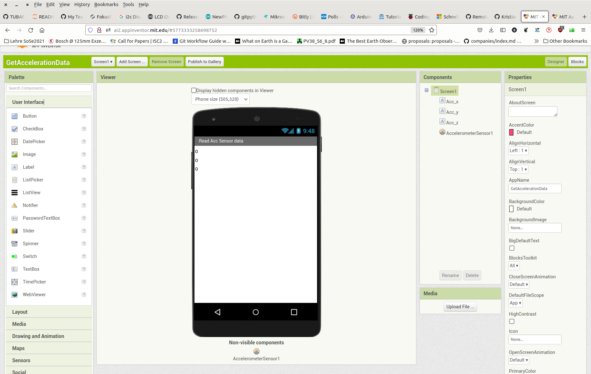
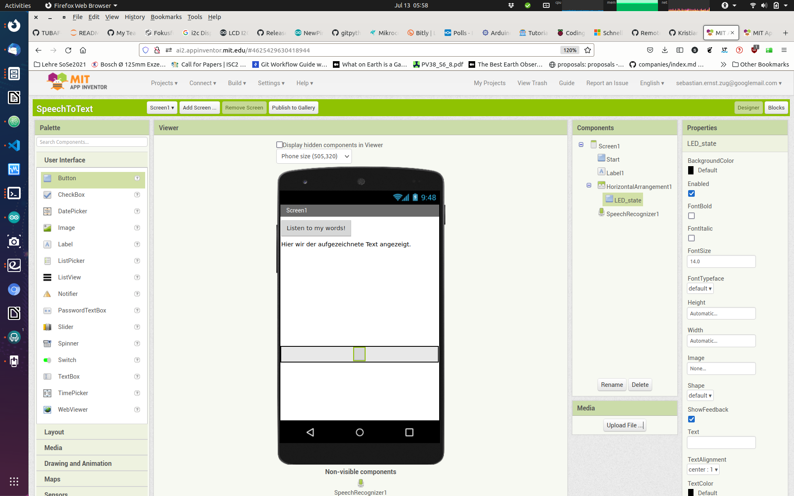

<!--

author:   Sebastian Zug & André Dietrich
email:    zug@ovgu.de   & andre.dietrich@ovgu.de
version:  0.0.5
language: de
narrator: Deutsch Female

link:     https://cdnjs.cloudflare.com/ajax/libs/animate.css/3.7.0/animate.min.css

import: https://raw.githubusercontent.com/LiaTemplates/Rextester/master/README.md
        https://raw.githubusercontent.com/LiaTemplates/WebDev/master/README.md
        https://github.com/LiaTemplates/AVR8js/main/README.md#10
        https://raw.githubusercontent.com/LiaTemplates/NetSwarm-Simulator/master/README.md
-->

[](https://liascript.github.io/course/?https://raw.githubusercontent.com/liaScript/ArduinoEinstieg/master/FlightToMars.md#1)


# Eine virtuelle Mission zum Mars - Schüleruni 2023

Prof. Dr. Sebastian Zug,
Technische Universität Bergakademie Freiberg

------------------------------

<!-- width="80%" -->

<h2>Herzlich Willkommen!</h2>

> Die interaktive Ansicht dieses Kurses ist unter folgendem [Link](https://liascript.github.io/course/?https://raw.githubusercontent.com/liaScript/ArduinoEinstieg/master/FlightToMars.md#1) verfügbar.

Der Quellcode der Materialien ist unter https://github.com/liaScript/ArduinoEinstieg/blob/master/FlightToMars.md zu finden.


## Zeitplan

Dienstag 15.08.2023


| Zeitfenster   | Ursprünglicher Inhalt                          | Angepasste Inhalte                                             |
| ------------- | ---------------------------------------------- | -------------------------------------------------------------- |
| 09:30 - 10:00 | Eingebettete Systeme                           | Mission Control to Mars - Fernsteuerung eines Mikrocontrollers |
| 10:00 - 11:30 | Sensorplattform                                |                                                                |
| 11:30 - 12:15 | Mittagspause                                   | unverändert                                                    |
| 12:15 - 14:00 | Mobile Roboter                                 | Einführung Bildverarbeitung mit Python und opencv              |
| 14:00 - 15:30 | 3D Scanner                                     | unverändert                                                    |
| ab 17:30      | Kennenlernen mit Studierenden und Mitarbeitern |                                                                |


## Zielstellung

```ascii
                                 US Sensor
                USB/Serielle         |         Serielle                     Bluetooth                        WLAN
                Schnittstelle        v         Schnittstelle                            
╔══════════════╗              +-------------+              +-------------+             ╔══════════════╗                ╔══════════════╗       
║ Arduino IDE  ║ LED-Cmds     | Arduino     | ---------->  | HC-06       |             ║ Handy-App    ║                ║ Browser      ║      
║              ║ -----------> |             |  Messungen   | Bluetooth   |             ║              ║                ║              ║
║              ║              |             |              | to          |  )))   (((  ║              ║    )))   (((   ║ App Inventor ║
║              ║ Display Cmds |             | <----------  | Serial      |             ║              ║                ║              ║   
║              ║ -----------> |             |  Commands    |             |             ║              ║                ║              ║   
╚══════════════╝              +-------------+              +-------------+             ╚══════════════╝                ╚══════════════╝      
                                 |       |                                     
                                 v       v                              
                              Display   LED             

 --------------------------------------------
                   Phase I 

                              ---------------------------------------------------------------------------------------------------------
                                                                            Phase II
```

Material:

+ Bastelbox mit Arduino und BL Modul 
+ Rechner mit dem App-Inventor 
+ Android Device mit Bluetooth

## Arduino Einführung im Schnelldruchlauf

Jedes Arduinoprogramm umfasst 2 grundlegende Funktionen `setup()` und `loop()`.


<div>
  <wokwi-led color="red" pin="13" port="B" label="13"></wokwi-led>
  <span id="simulation-time"></span>
</div>
```cpp       arduino.cpp
const int ledPin = 13;

void setup() {
  pinMode(ledPin, OUTPUT);
}

void loop() {
  digitalWrite(ledPin, HIGH);  
  delay(1000);                
  digitalWrite(ledPin, LOW);
  delay(1000);  
}
```
@AVR8js.sketch

### Arduino IDE


Wichtige Grundeinstellungen:

+ Richtigen Port für den Programmiervorgang auswählen (Tools -> Port)
+ Richtigen Controller auswählen (Tools -> Board)
+ Richtige Baudrate für die Serielle Schnittstellen

### Hello World

*Und jetzt sind Sie dran!*

Laden Sie das Beispielprogramm "Blink" in Ihren Editor:

Datei -> Beispiele -> Basics -> Blink

Kompilieren und flashen Sie das Programm! Wichtige Tastaturbefehle sind dabei

| Tastenkombination | Bedeutung                |
| ----------------- | ------------------------ |
| Strg-R            | Kompilieren (Ve**R**ify) |
| Strg-U            | Flashend (**U**pload)    |
| Strg-T            | Code korrekt einrücken   |
| Strg-Shift-M      | Seriellen Monitor öffnen |
| Strg-L            | Cursor auf Zeile setzen  |


### Serielle Schnittstelle

Was fehlt? Ich möchte irgendwie in den Rechner schauen können :-)

Die Serielle Schnittstelle (häufig auch als UART) bezeichnet ermöglicht das
Versenden und den Empfang von Textnachrichten. Damit können Sie zum Beispiel
Messwerte ausgeben oder das Erreichen bestimmter Programmpositionen anzeigen.

Die folgenden Beispiele vermitteln grundlegende Programmierkonstrukte in C++.
Diese können in der Simulation ausgeführt werden.  

<div>
  <span id="simulation-time"></span>
</div>
```cpp       arduino.cpp
void setup() {
  Serial.begin(9600);
  Serial.println("Hello World");
}

void loop() {
}
```
@AVR8js.sketch

Arduino kennt zwei Varianten der Ausgabe mit `print` - das einfache `print` und `println`. Welchen Unterschied vermuten Sie?


### C Flusskontrolle im Schnelldurchlauf

                              {{0-1}}
*******************************************************************************

**Schleifen**

Was müssen wir tuen, um die Zahlen von 1 bis 10 auf dem Terminal anzuzeigen?

<div>
  <span id="simulation-time"></span>
</div>
```cpp       arduino.cpp
void setup() {
  Serial.begin(9600);
  int counter = 0;
  for (int i = 0; i < 10; i++){
    Serial.println(counter);  
    counter = counter + 1;
  }
}

void loop() {
}
```
@AVR8js.sketch

Welche "Einsparmöglichkeiten" sehen Sie als erfahrener Programmierer in dem Beispiel? Wie kann der Code, mit der gleichen Ausgabe kürzer gestaltet werden?

*******************************************************************************

                              {{1-2}}
*******************************************************************************

**Verzweigungen**

Verzweigungen folgen dem Muster

```c
if (Bedingung) {
  // Anweisungen
}
else{               
  // Anweisungen       
}                      
```

wobei der `else` Abschnitt optional ist.

<div>
  <span id="simulation-time"></span>
</div>
```cpp       arduino.cpp
void setup() {
  Serial.begin(9600);
  float value = 5.234;
  Serial.print(value);
  if (value > 10){
    Serial.println(" - Der Wert ist größer als 10!");
  }else{
    Serial.println(" - Der Wert ist kleiner als 10!");
  }
}

void loop() {
}
```
@AVR8js.sketch


*******************************************************************************


                              {{2-3}}
*******************************************************************************

Bedingungen werden dabei wie folgt formuliert:

<div>
  <span id="simulation-time"></span>
</div>
```c      ardunino.cpp
void setup() {
  Serial.begin(9600);
  int a = 2;
  if (a == 2) {Serial.println("a ist gleich zwei!");}
  if (a <= 5) {Serial.println("a ist kleiner oder gleich fünf!");}
  if (a != 3) {Serial.println("a ist ungleich drei!");}
  char b = 'g';
  if (b == 'z') {Serial.println("In b ist ein z gespeichert!");}
  else {Serial.println("In b ist kein z gespeichert!");}
}

void loop() {
}
```
@AVR8js.sketch

Für die Ausgabe von komplexeren, vorformatierten Ausdrücken können Sie auf einen
Befehl aus der C++ Standard-Bibliothek zurückgreifen `sprintf`

Eine anschauliche Dokumentation findet sich unter: [link](https://arduinobasics.blogspot.com/2019/05/sprintf-function.html)

*******************************************************************************

## Anwendung 1: LED Steuerung per Serieller Schnittstelle

Die Arbeit mit der seriellen Schnittstelle vom Arduino zum PC kennen Sie bereits. Aber das Ganze funktioniert auch umgekehrt.

<div>
  <span id="simulation-time"></span>
</div>
```c      ardunino.cpp
char incomingByte;

void setup() {
  Serial.begin(9600);
}

void loop() {
  if (Serial.available() > 0) {
        incomingByte = Serial.read();
        Serial.write(incomingByte);
        if (incomingByte == 'A'){
          Serial.println("A gelesen");
        }
    }
}
```
@AVR8js.sketch

> **Aufgabe:** Erweitern Sie den Code, so dass wir die LED über 'A' an- und
> 'B' ausschalten können. Dazu "mischen" Sie den Code aus dieser und der vorangegangen Aufgabe.

## Anwendung 2: Display Steuerung per Serieller Schnittstelle

> **Aufgabe:** Verbinden Sie das Display mit dem Board entsprechend dem
> Beschaltungsplan.

<!-- width="80%" -->

| Arduino | LCD |
| ------- | --- |
| A4      | SDA |
| A5      | SCL |
| GND     | GND |
| 5V      | VCC |


Achtung für diese Aufgabe müssen Sie die zusätzliche Bibliothek `LiquidCrystal`
installieren. Informieren Sie sich, wie dies umzusetzen ist "How to install a library for Arduino?".

```c                   Display.ino
#include <Wire.h>
#include <LiquidCrystal_PCF8574.h>

int lcdi2c = 0x27; // <- Hart eingecodete Adresse, die nur für unser
                   // Beispiel funktioniert, vgl. Datenblatt

void setup()
{
  LiquidCrystal_PCF8574 lcd(lcdi2c);
  lcd.begin(16, 2);
  lcd.setBacklight(255);
  lcd.clear();
  lcd.setCursor(0, 0);
  lcd.print("Mission zum Mars");
  lcd.setCursor(0, 1);
  lcd.print("15.08.2023");
}

void loop()
{}
```
<!--
style="width: 100%; max-width: 460px; display: block; margin-left: auto; margin-right: auto;"
-->
````
    0                             15
    0 1 2 3 4 5 6 7 8 9 A B C D E F
   ╔═╤═╤═╤═╤═╤═╤═╤═╤═╤═╤═╤═╤═╤═╤═╤═╗
 0 ║M│i│s│s│i│o│n│ │z│u│m│ │M│a│r│s║
   ╟─┼─┼─┼─┼─┼─┼─┼─┼─┼─┼─┼─┼─┼─┼─┼─╢
 1 ║1│5│.│0│8│.│2│0│2│3│ │ │ │ │ │ ║
   ╚═╧═╧═╧═╧═╧═╧═╧═╧═╧═╧═╧═╧═╧═╧═╧═╝
````

> **Aufgabe:** Kombinieren Sie die Beispiele so, dass eine Eingabe auf der seriellen Schnittstelle eine Ausgabe auf dem Display bewirkt.

## Anwendung 3: LED Steuerung per Bluetooth 

```ascii
                                 US Sensor
                USB/Serielle         |         Serielle                     Bluetooth                        WLAN
                Schnittstelle        v         Schnittstelle                            
╔══════════════╗              +-------------+              +-------------+             ╔══════════════╗                ╔══════════════╗       
║ Arduino IDE  ║ LED-Cmds     | Arduino     | ---------->  | HC-06       |             ║ Handy-App    ║                ║ Browser      ║      
║              ║ -----------> |             |  Messungen   | Bluetooth   |             ║              ║                ║              ║
║              ║              |             |              | to          |  )))   (((  ║              ║    )))   (((   ║ App Inventor ║
║              ║ Display Cmds |             | <----------  | Serial      |             ║              ║                ║              ║   
║              ║ -----------> |             |  Commands    |             |             ║              ║                ║              ║   
╚══════════════╝              +-------------+              +-------------+             ╚══════════════╝                ╚══════════════╝      
                                 |       |                                     
                                 v       v                              
                              Display   LED             

 --------------------------------------------
                   Phase I 

                              ---------------------------------------------------------------------------------------------------------
                                                                            Phase II
```


> Der App Entwicklungsrechner (Ihr Laptop) und das Android Device müssen sich im gleichen WLAN befinden

> iPads unterstützen keine native Bluetooth Kommunikation, sondern nur den modernen Bluetooth Low Energy (BLE) Standard.

https://appinventor.mit.edu/

### App-Inventor Einführungsbeispiele

                               {{0-1}}
********************************************************************************

Einlesen des Beschleunigungssensors
---------------------------------------




> Offenbar sind die Werte von 0-6 nicht geeignet um diese für die Ansteuerung der LEDs zu verwenden. Wie war das noch mal in welchen Größenordnungen durften die Eingangsgrößen liegen? Welche Anpassungen sind nötig?

> Aufgabe: Fügen Sie weitere Strings hinzu, die andere Buttons, Textfelder, Slider oder eine TextToSpeech Komponente aktivieren!

********************************************************************************

                                 {{1-2}}
********************************************************************************

Speech-to-Text Modul
---------------------------------------




> Aufgabe: Schalten Sie das grüne Licht wieder aus, wenn "Licht aus" gesagt wurde.

********************************************************************************

### App-Inventor + Mikrocontroller

Erweitern Sie Ihre Schaltung um einen HC-06 Bluetooth Dongle und steuern Sie den Status einer LED über die Eingaben der Pins. Die Beschaltung entnehmen Sie dem obigen Schaubild.


```c
#include <SoftwareSerial.h>

char Incoming_value = 0;

const byte rxPin = 2;
const byte txPin = 3;

// Set up a new SoftwareSerial object
SoftwareSerial mySerial (rxPin, txPin);

void setup()
{
  mySerial.begin(9600);     
  mySerial.println("Los geht's");    
  pinMode(13, OUTPUT);       
}

void loop()
{
  if(mySerial.available() > 0)  
  {
    Incoming_value = mySerial.read();      
    mySerial.print(Incoming_value);        
    mySerial.print("\n");        
    if(Incoming_value == '1')             
      digitalWrite(13, HIGH);  
    else if(Incoming_value == '0')       
      digitalWrite(13, LOW);   
  }                            
}
```

> Frage: Warum brauchen wir die Software-Serial [Link](https://docs.arduino.cc/learn/built-in-libraries/software-serial) Implementierung?


Die .aia Datei finden Sie unter [Github-Link](https://github.com/LiaScript/ArduinoEinstieg/raw/master/CodeExamples/ProjektwocheGymnasium/check_bluetooth/BluetoothSave_to_LED.aia)


## Freie Anwendungsentwicklung

Und jetzt sind Sie gefragt:

1. Senden Sie die Messwerte an die Text-to-Speech Schnittstelle
2. Steuern Sie die LED durch 3 Slider für die Farbwerte
3. Steuern Sie die LEDs durch den Beschleunigungssensor, so dass mit der Neigung die Farben angepasst werden.
4. ...
