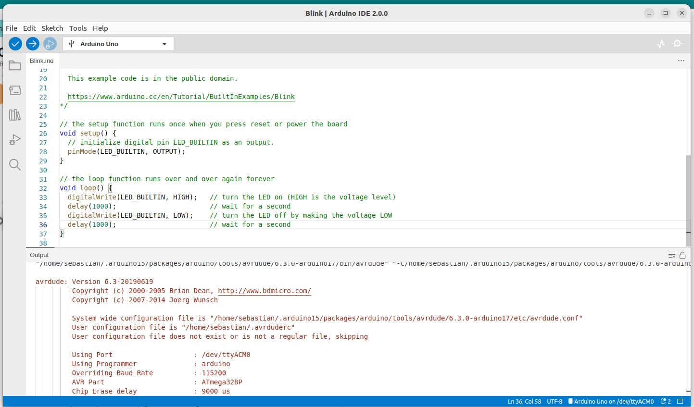

<!--

author:   Sebastian Zug & André Dietrich
email:    zug@ovgu.de   & andre.dietrich@ovgu.de
version:  1.0.1
language: de
narrator: Deutsch Female

@logo: <a href="https://www.hrk.de/weltoffene-hochschulen"></a>


link:     https://cdnjs.cloudflare.com/ajax/libs/animate.css/3.7.0/animate.min.css

import: https://github.com/LiaTemplates/AVR8js/main/README.md#10
        https://github.com/LiaTemplates/Pyodide
        https://raw.githubusercontent.com/LiaTemplates/WebDev/master/README.md

-->

# Sensor, Compiler, Leiterbahn – Einblick in die hardwarenahe Programmierung


Prof. Dr. Sebastian Zug, Technische Universität Bergakademie Freiberg

-------------------------------------------------------------------------------

<!-- width="50%" -->

-------------------------------------------------------------------------------

> Dieser Kurs wurde mit LiaScipt erstellt. Die interaktive Ansicht dieses Kurses ist unter folgendem [Link](https://liascript.github.io/course/?https://raw.githubusercontent.com/liaScript/ArduinoEinstieg/master/Introduction.md#1) verfügbar.

## 0. Warum Informatik? Warum Mikrocontroller?

              {{0-1}}
******************************************************************************
Schauen wir uns ein Anwendungsbeispiel an ...

<!-- width="40%" -->

> _"Mainstream cars may have up to 10 million lines of code and high-end luxury sedans can have nearly 100 million."_ (Your average car is a lot more code-driven than you think [Link](https://eu.usatoday.com/story/tech/columnist/2016/06/28/your-average-car-lot-more-code-driven-than-you-think/86437052/))

*******************************************************************************

{{1-2}}
> ... und warum die ganz kleinen Systeme? Ich will Webentwickler werden!

{{1-2}}
<!-- width="80%" -->

{{1-2}}
Link zu den Webseiten des Institutes: https://tu-freiberg.de/fakult1/inf

## 1. Einführung

+ Was heißt das eigentlich "Eingebettetes System"?

{{1-2}}
> ... ein elektronischer Rechner ..., der in einen technischen Kontext
> eingebunden ist. Dabei übernimmt der (Kleinst-)Rechner entweder
> Überwachungs-, Steuerungs- oder Regelfunktionen ... weitestgehend unsichtbar
> für den Benutzer .. [^1].

+ Wie programmiere ich einen Mikrocontroller?

{{2-3}}
> Compiler wird eine Software genannt, die einen in einer Programmiersprache
> geschrieben Quellcode so übersetzt, dass sie von Maschinen verstanden
> werden können.

+ Was ist das Arduino Projekt?

{{3}}
> Arduino ist eine aus Soft- und Hardware bestehende
> Physical-Computing-Plattform. Beide Komponenten sind im Sinne von Open
> Source quelloffen. Die Hardware besteht aus einem einfachen E/A-Board mit
> einem Mikrocontroller und analogen und digitalen Ein- und Ausgängen.

{{3}}
  https://www.arduino.cc/

{{3}}
  <!-- width="70%" -->
  [^3]

[^1]: nach Wikipedia "Eingebettete Systeme"
[^2]: http://21stdigitalhome.blogspot.com/2016/03/cross-compiling-compile-c-programs-on.html
[^3]: aus entsprechendem Artikel "Spiegel Online" http://www.spiegel.de/netzwelt/gadgets/arduino-erklaert-das-kann-der-microcontroller-a-1105328.html


## 2. Arduino Hardware / Software

{{0}}
**2.1 Die Hardware**

{{0}}
<!-- width="70%" -->

                              {{1}}
****************************************************************************
**2.2 Aufbau eines Arduino-Programmes**

Arduino nutzt eine C/C++ Semantik für die Programmierung, die folgende
Grundelemente bedient

<div>
  <wokwi-led color="red" pin="13" port="B" label="13"></wokwi-led>
  <span id="simulation-time"></span>
</div>
```cpp       arduino.cpp
const int ledPin = 13;

void setup() {
  pinMode(ledPin, OUTPUT);
}

void loop() {
  digitalWrite(ledPin, HIGH);  
  delay(1000);                
  digitalWrite(ledPin, LOW);
  delay(1000);  
}
```
@AVR8js.sketch


Was unterscheidet die Programmierung eines eingebettenten Systems von einem PC?

*******************************************************************************

                     {{2}}
********************************************************************************
**2.3 Arduino IDE**

<!-- width="80%" -->

Wichtige Grundeinstellungen:

+ Richtigen Port für den Programmiervorgang auswählen (Tools -> Port)
+ Richtigen Controller auswählen (Tools -> Board)
+ Richtige Baudrate für die Serielle Schnittstellen

********************************************************************************

{{3}}
**2.4 ... und jetzt mal praktisch**

## 3. Unser Projekt

*"Entwickeln Sie einen Distanzmesser, der einen Abstandswert ermittelt und ausgibt"*

<!-- width="50%" -->
[^1]

[^1]: Firma Bosch "Laser Distanzmesser Zamo"


{{1}}
> **Frage:** Was brauchen wir dafür?

### Distanzmessung mit Ultraschall

... Was war das noch mal, "Schallgeschwindigkeit"

<!-- width="40%" -->
[^1]

[^1]: roboticlab.eu "Funktionsweise eines Ultraschall-Entfernungsmessers."

Für eine gleichförmige Bewegung können wir den Weg als Produkt aus dem Messintervall und der halben Laufzeit abbilden.

$$s = v \cdot \frac{t}{2}$$


{{1-2}}
******************************
Leider gibt es ein Problem, die Schallgeschwindigkeit ist nicht konstant! Annäherungsweise gilt

$$V (m/s) = 331.3 + (0.606 × T) $$

Versuchen wir eine kleine Fehlerabschätzung, wenn wir den Temperatureinfluss ignorieren.

```python CalcUltraSonicSpeed.py
def calcUSspeed(T):
  return 331.3 + (0.606 * T)

print(calcUSspeed(25) / calcUSspeed(0))
```
@Pyodide.eval

******************************

{{2-3}}
******************************

Link auf die Dokumentation der Funktion `PulseIn` [Link](https://www.arduino.cc/reference/en/language/functions/advanced-io/pulsein/)

```c     B_UltraSonic.c
const int trigPin = 8;
const int echoPin = 9;

//float temp = 25;
//const float us_speed = (331.3 + (0.606 * temp)) / 1000 / 1000 * 100;

long duration;
float distance;

void setup() {
  pinMode(trigPin, OUTPUT);
  pinMode(echoPin, INPUT);
  Serial.begin(9600);
}

void loop() {
  digitalWrite(trigPin, LOW);
  delayMicroseconds(5);
  digitalWrite(trigPin, HIGH);
  delayMicroseconds(10);
  digitalWrite(trigPin, LOW);

  duration = pulseIn(echoPin, HIGH);
  Serial.print(duration);

  delay(50);
}
```
Wie integrieren wir die Abbildung auf cm? Das schauen wir uns jetzt mit dem realen System an [Link](https://github.com/LiaScript/ArduinoEinstieg/blob/master/CodeExamples/Introduction_to_Arduino/B_UltraSonic/B_UltraSonic.ino).

******************************

### Display

{{0-1}}
Welches Display zu welchem Zweck?

{{0-1}}
<!-- width="70%" -->

{{1-2}}
<!-- width="40%" -->

{{1-2}}
<!-- width="40%" -->

{{2}}
<!--
style="width: 80%; max-width: 460px; display: block; margin-left: auto; margin-right: auto;"
-->
````
    0                             15
    0 1 2 3 4 5 6 7 8 9 A B C D E F
   ╔═╤═╤═╤═╤═╤═╤═╤═╤═╤═╤═╤═╤═╤═╤═╤═╗
 0 ║h│e│l│l│o│ │w│o│r│l│d│ │ │ │ │ ║
   ╟─┼─┼─┼─┼─┼─┼─┼─┼─┼─┼─┼─┼─┼─┼─┼─╢
 1 ║T│U│ │F│r│e│i│b│e│r│g│ │ │ │ │ ║
   ╚═╧═╧═╧═╧═╧═╧═╧═╧═╧═╧═╧═╧═╧═╧═╧═╝
````

{{2}}
```c     C_Display.c
#include <LiquidCrystal.h>

LiquidCrystal lcd(8, 13, 9, 4, 5, 6, 7); // diese Pins werden benutzt

void setup()
{
  lcd.clear(); // LCD löschen
  lcd.begin(16, 2); // verfügbare Spalten und Zeilen
  lcd.setCursor(0,0); // 0. Spalte (= ganz links) und 0. Zeile (= oben)
  lcd.print("Hello World!");
  lcd.setCursor(0,1);
  lcd.print("TU Freiberg");
}

void loop()
{
  // Hier passiert nichts
}
```

{{1}}
Ausblick: `scrollDisplayLeft()` [Arduino Dokumentation](https://www.arduino.cc/en/Reference/LiquidCrystalScrollDisplayLeft)

### Und nun alles zusammen ...

Welche Funktionen brauchen wir also?

<!--
style="width: 60%; max-width: 460px; display: block; margin-left: auto; margin-right: auto;"
-->
```ascii
            .------------------------.
            |                        |
            v                        |
 ╔══════════════════════╗            |
 ║ Distanz einlesen     ║  n mal     |
 ╚══════════════════════╝            |
            |                        |
            v                        |
 ╔══════════════════════╗            |
 ║ Mittelwert berechnen ║            |
 ╚══════════════════════╝            |
            |                        |
            v                        |
 ╔══════════════════════╗            |
 ║ Ausgabe Display      ║            |
 ╚══════════════════════╝            |
            |                        |
            '------------------------╯
```

{{1}}
```c     D_Final.c
#include <Wire.h>
#include <LiquidCrystal_PCF8574.h>

int lcdi2c = 0x27;
LiquidCrystal_PCF8574 lcd(lcdi2c);

const int trigPin = 8;
const int echoPin = 9;
float temp = 25;
const float us_speed = (331.3 + (0.606 * temp)) / 1000 / 1000 * 100;

float distance;

void showMeanDistance(){
  lcd.setCursor(0, 0);
  lcd.print("Distanz ");
  lcd.print(distance, 2);
  // Todo Positionskorrektur
  lcd.setCursor(0, 1);
  lcd.print("Temperatur ");
  lcd.print(temp, 0);
}

void readMeanDistance(){
  long duration;
  digitalWrite(trigPin, LOW);
  delayMicroseconds(5);
  digitalWrite(trigPin, HIGH);
  delayMicroseconds(10);
  digitalWrite(trigPin, LOW);

  duration = pulseIn(echoPin, HIGH);
  distance = duration * us_speed / 2;
  Serial.println(distance);
  // Todo Messungen glätten
}

void setup()
{
  lcd.begin(16, 2);
  lcd.clear();
  pinMode(trigPin, OUTPUT);
  pinMode(echoPin, INPUT);
  Serial.begin(9600);
}

void loop()
{
  readMeanDistance();
  showMeanDistance();
  delay(50);
}
```

## 4. Wie geht es weiter?

{{0-1}}
************************
Unser Chef hat sich neue Ideen ausgedacht ...

1. Die Auflösung ist ihm zu gering!
2. Bestimmte Materialien werden nur schlecht erkannt.
3. Das Display wäre schlecht ablesbar und wir sollten unser Messsystem mit dem Mobiltelefon koppeln ...
************************

{{1-2}}
***************************
Worüber würden wir in einem ingenieurwissenschaftlichen Studium sprechen?

+ Was läuft hinter der Bühne ab? Wie arbeiten die einzelnen Komponenten des Rechners?
+ Wie kann man die Qualität und Robustheit der Messung steigern?
+ Wie setzen wir den Entwicklungsprozess um?

... diese und alle anderen Fragen rund ums Studiums beantworte ich gern gleich im Anschluss, oder ...

**Informationstage / Schnupper-Events an der TU Bergakademie**
* Frühjahrsakademie MATHEMATIK (29.03. bis 9.04.)
* Schüleruniversität (26.07. - 3.09.) [http://tu-freiberg.de/schueleruni/anmeldung](http://tu-freiberg.de/schueleruni/anmeldung)       
* Campustag (5.06.)                               

> Weiterführende Materialien auf der Basis von LiaScript gibt es unter [https://github.com/SebastianZug/VL_ProzeduraleProgrammierung](https://github.com/SebastianZug/VL_ProzeduraleProgrammierung). Hier werden sowohl die Konzepte von C als auch der objektorientierten Programmierung eingeführt.

************************

{{2}}
> __Danke für die Aufmerksamkeit!__
