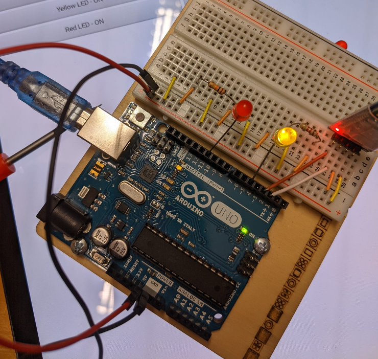
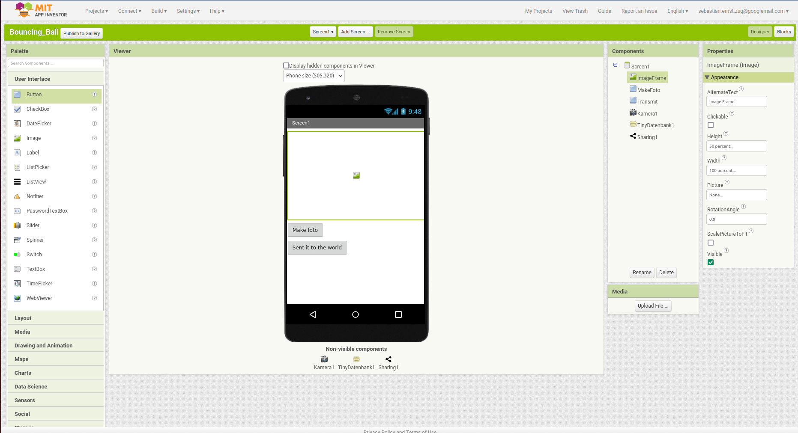
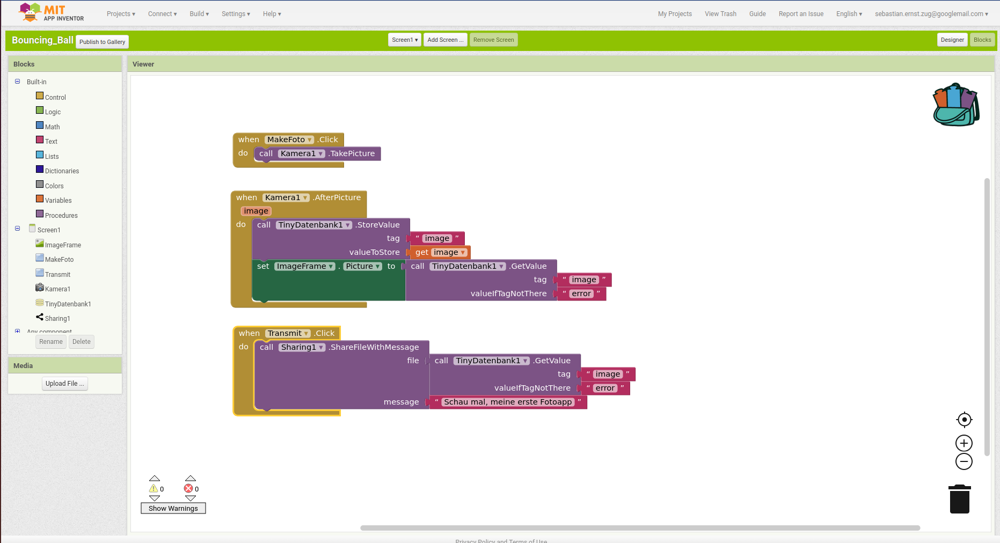
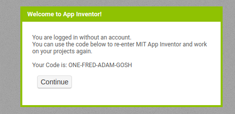
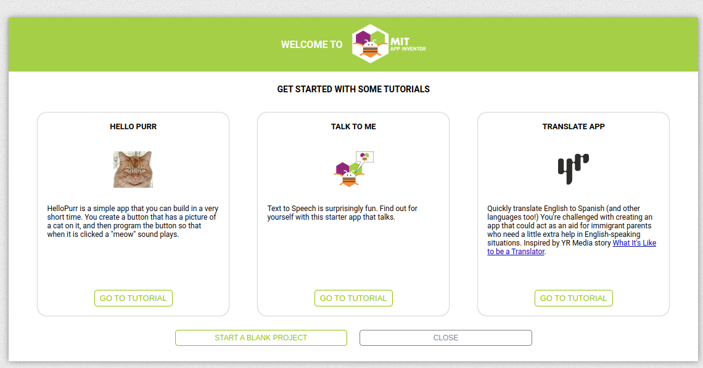
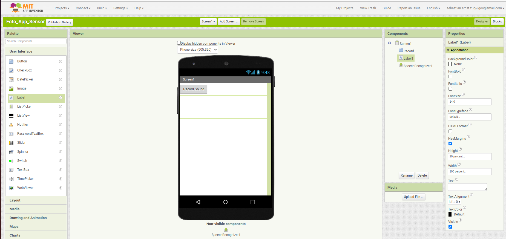
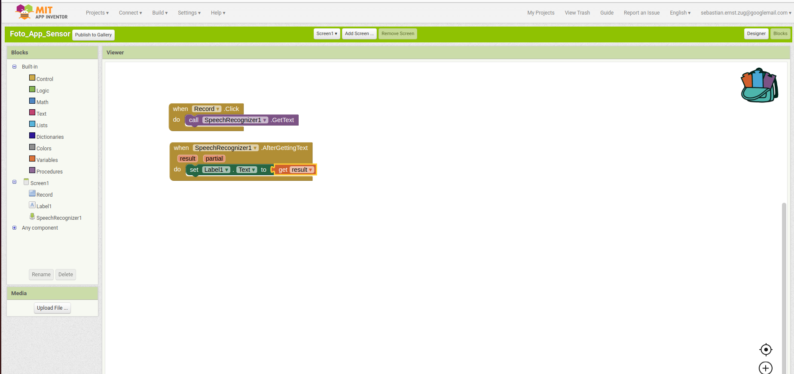
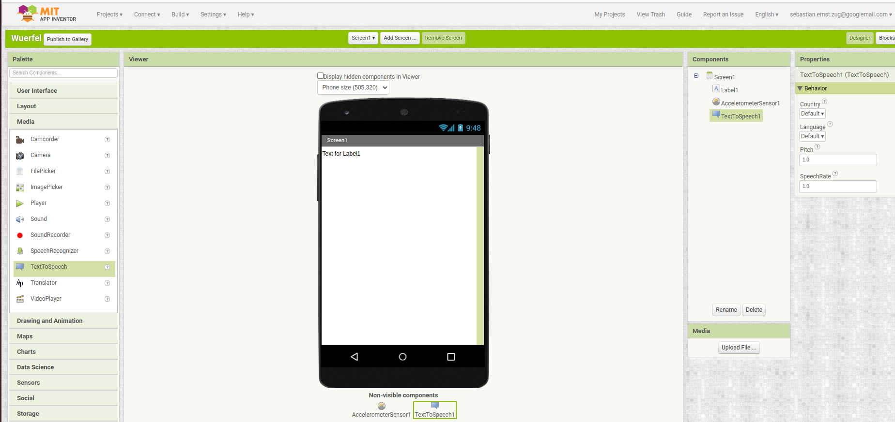
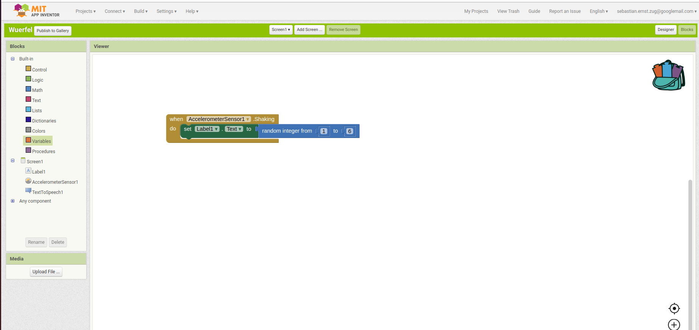

<!--

author:   Sebastian Zug & André Dietrich
email:    zug@ovgu.de   & andre.dietrich@ovgu.de
version:  0.0.1
language: de
narrator: Deutsch Female

import:   https://github.com/LiaTemplates/AVR8js/main/README.md#10

-->

[](https://liascript.github.io/course/?https://raw.githubusercontent.com/liaScript/ArduinoEinstieg/master/3days_Introduction_day3.md#1)


# Mikrocontroller & App-Entwicklung - Kurs 2023/24

Prof. Dr. Sebastian Zug,
Technische Universität Bergakademie Freiberg

------------------------------

<!-- width="80%" -->

<h2>Herzlich Willkommen!</h2>

> Die interaktive Ansicht dieses Kurses ist unter folgendem [Link](https://liascript.github.io/course/?https://raw.githubusercontent.com/liaScript/ArduinoEinstieg/master/MIT_App_Inventor_Motivation.md#1) verfügbar.

Der Quellcode der Materialien ist unter https://github.com/liaScript/ArduinoEinstieg/blob/master/MIT_App_Inventor_Motivation.md zu finden.

## Vision für die neue Saison 

| Termin           | Inhalt                                                    |
| ---------------- | --------------------------------------------------------- |
| 1. November 2023 | Wiederholung Grundlagen C++, Einführung App Inventor      |
| 2. ??? 2024      | Vertiefung App Inventor und Spielentwicklung              |
| 3. ??? 2024      | Verknüpfung mit dem Mikrocontroller, eigene IoT-Anwendung |



### Ausgangsbasis

> Wie weit waren wir gekommen? An welche Bauteile können Sie sich noch erinnern?

```ascii
                                 US Sensor
                USB/Serielle         |        
                Schnittstelle        v          
╔══════════════╗              +-------------+
║ Arduino IDE  ║ LED-Cmds     | Arduino     |      
║              ║ -----------> |             |
║              ║              |             |
║              ║ Distanzwerte |             |   
║              ║ <----------- |             |   
╚══════════════╝              +-------------+      
                                 |       |                                                             
                                 v       v                                                            .
                              Display   LED             
```

<div>
  <wokwi-led color="yellow" pin="5" port="B" label="5"></wokwi-led>
   <wokwi-led color="red" pin="6" port="B" label="6"></wokwi-led>
  <span id="simulation-time"></span>
</div>
```cpp       StringAuswertung.cpp
char Incoming_value = 0;

const byte yellowLedPin = 5;
const byte redLedPin = 6;

void setup()
{
  Serial.begin(9600);     
  Serial.println("Tippen Sie Y/y für gelb und R/r für rot");    
  pinMode(yellowLedPin, OUTPUT);  
  pinMode(redLedPin, OUTPUT);      
}

void loop()
{
  if(Serial.available() > 0)  
  {
    Incoming_value = Serial.read();      
    Serial.print(Incoming_value);        
    Serial.print("\n");        
    if(Incoming_value == 'Y')             
      digitalWrite(yellowLedPin, HIGH);  
    if(Incoming_value == 'y')       
      digitalWrite(yellowLedPin, LOW);   
    if(Incoming_value == 'R')             
      digitalWrite(redLedPin, HIGH);  
    if(Incoming_value == 'r')       
      digitalWrite(redLedPin, LOW);   
  }                            
}
```
@AVR8js.sketch


### Ziel

```ascii
                             US Sensor
            USB/Serielle         |       Serielle                  Bluetooth
            Schnittstelle        v       Schnittstelle                            
╔═══════════╗              +-----------+              +-----------+         ╔════════════╗
║ Arduino   ║ LED-Cmds     | Arduino   | ---------->  | HC-06     |         ║ Handy-App  ║      
║ IDE       ║ -----------> |           |  Messungen   | Bluetooth |         ║            ║
║           ║              |           |              | to        | ))) ((( ║            ║ ))) ((( Internet
║           ║ Distanzwerte |           | <----------  | Serial    |         ║            ║   
║           ║ <----------- |           |  Commands    |           |         ║            ║   
╚═══════════╝              +-----------+              +-----------+         ╚════════════╝      
                              |     |                                     
                              v     v                              
                           Display LED             
```

> Unser Mobiltelefon wird zur Schaltstelle für den Mikrocontroller!

> Plötzlich müssen wir für zwei Geräte Code schreiben - den Mikrocontroller und unser Smartphone.

**Demo**

## App Inventor Einführung

> Wie funktioniert das?





> Jetzt sind Sie an der Reihe!

### Aufbau der Umgebung

+ Ihr Entwicklungsrechner muss **mit dem Internet verbunden** sein.

+ Ihr Android-Gerät muss sich **im gleichen Netz wie Ihr Entwicklungsrechner** befinden. Dafür spannt mein Handy ein WLAN auf. Die Zugangsdaten stehen an der Tafel.

+ Öffnen des App-Inventor 

  + Variante A) Sie nutzen den App Inventor in der Cloud http://ai2.appinventor.mit.edu. Dafür müssen Sie sich mit Ihrem Google-Konto anmelden.
  + Variante B) Sie wollen sich nicht anmelden und lieber anonym bleiben https://code.appinventor.mit.edu/login/. Hier müssen Sie sich aber den _Revisit Code_ notieren, damit Sie später wieder auf Ihre App zugreifen können.



+ Starten Sie die Beispielapp _Hello Purr_!



> Erklären Sie den Aufbau des Programms - was müsste denn passieren?

### Installation auf dem Mobiltelefon

+ Installieren Sie die Ausführungsumgebung auf Ihrem Mobilfunkgerät 

| Betriebssystem | Link                                                                                             |
| -------------- | ------------------------------------------------------------------------------------------------ |
| Android        | https://play.google.com/store/apps/details?id=edu.mit.appinventor.aicompanion3&hl=de&gl=US&pli=1 |
| Apple          | https://apps.apple.com/de/app/mit-app-inventor/id1422709355?ign-itscg=30200&ign-itsct=apps_box   |


+ Öffnen Sie _Connect_ / _AI Companion_ um einen QR Code zu erhalten, der auf Ihr Projekt verweist.

+ Sie können die App auf Ihrem Gerät testen, indem Sie den QR-Code scannen. Sobald Sie den Code anpassen, wird die Änderung auch auf Ihrem Gerät vollzogen.

> Für eine echte Installation müssen Sie das Android Package (.apk) erzeugen und auf Ihrem Gerät installieren. Dafür müssen Sie sich mit Ihrem Google-Konto anmelden.

## Aufgaben

")

### Aufgabe 1: Foto App

Bauen Sie die App aus unserem Motivationsbeispiel nach! Experimentieren Sie mit Einstell- und Konfigurationsmöglichkeiten.

Sie können gern andere Sharing Methoden verwenden - Tauschen Sie Ihre Fotos aus, um zu prüfen, ob die App auch funktioniert.

### Aufgabe 2: Speech to Text

Lassen sie uns die Möglichkeiten der Spracherkennung nutzen, um die App zu steuern. Dafür starten wir mit einem einfachen Beispiel.





> Aufgabe 1: Passen Sie die App so an, dass die Sprachaufzeichnung über ein Schütteln des Gerätes gestartet wird. 

> Aufgabe 2: Versenden Sie den Text als Message an einen Sharing Partner (diesmal ohne Foto).

### Aufgabe 3: Würfel App

Wir wollen eine Würfelapp entwickeln, die uns die Augenzahl anzeigt, wenn wir das Gerät schütteln.





> Aufgabe 1: Erweitern Sie die App um eine Sprachausgabe, die die Augenzahl ansagt.

> Aufgabe 2: Erweitern Sie die App so, dass wir eine variable Anzahl von Würfelseiten einstellen können. Nutzen Sie dafür zum Beispiel einen Schieberegler.