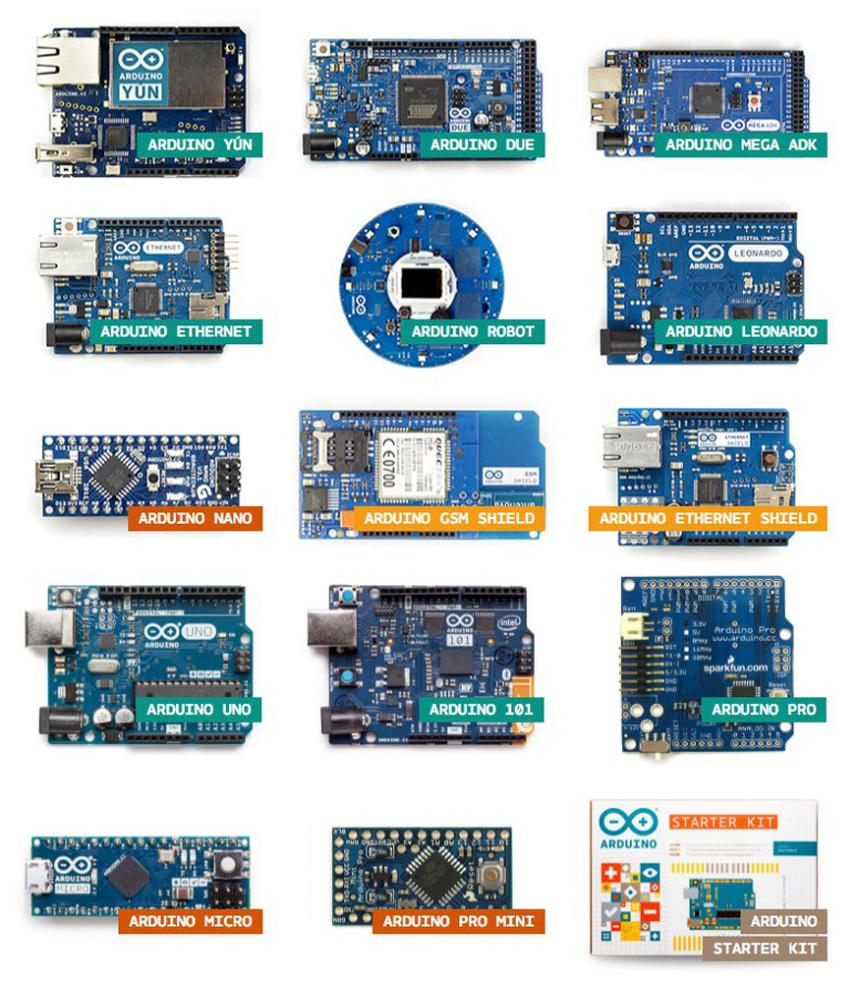
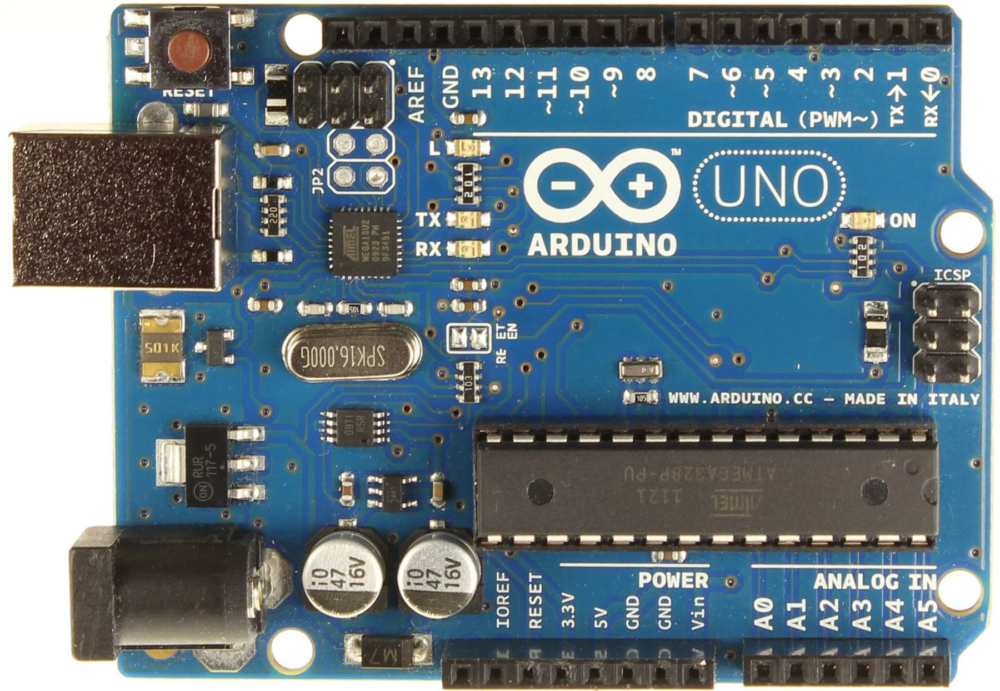
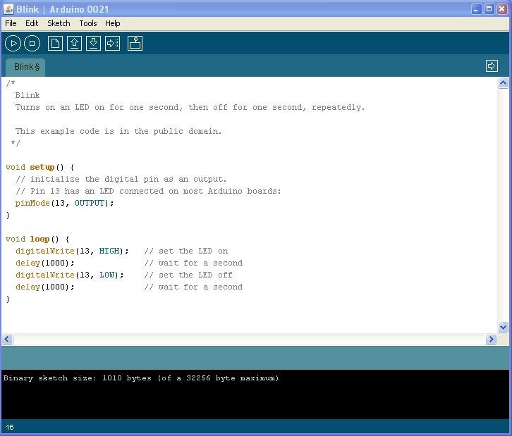
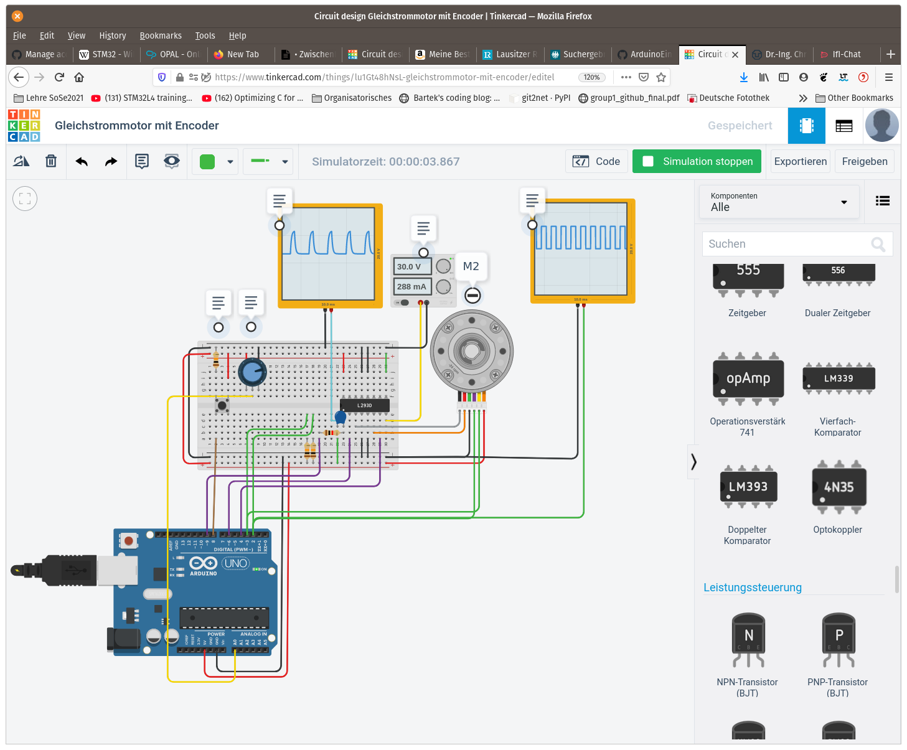
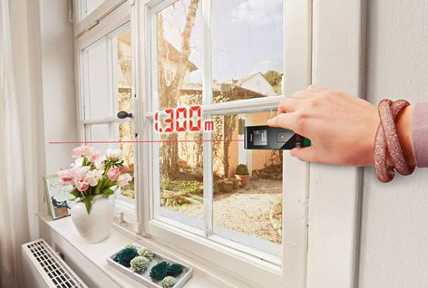
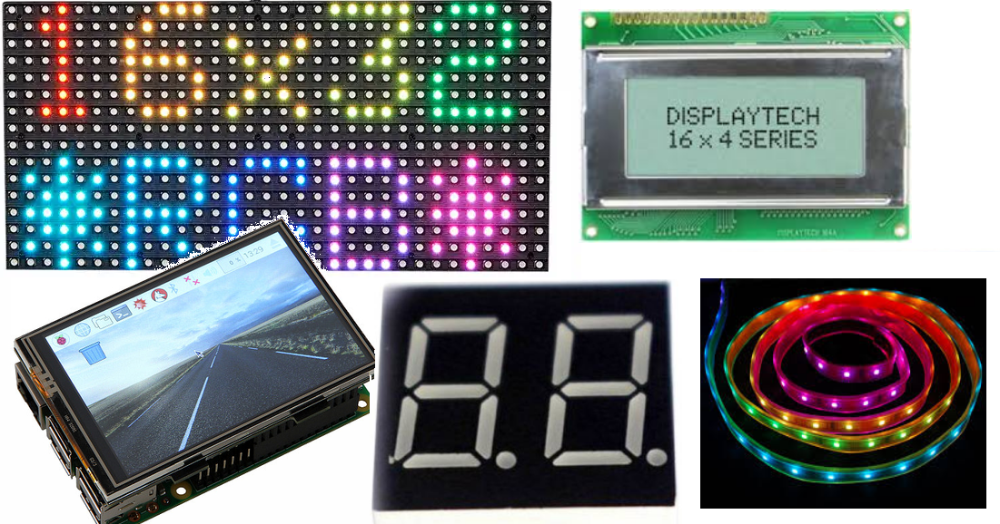

<!--

author:   Sebastian Zug & André Dietrich
email:    zug@ovgu.de   & andre.dietrich@ovgu.de
version:  1.0.1
language: de
narrator: Deutsch Female

@logo: <a href="https://www.hrk.de/weltoffene-hochschulen"></a>


link:     https://cdnjs.cloudflare.com/ajax/libs/animate.css/3.7.0/animate.min.css

import: https://github.com/LiaTemplates/AVR8js/main/README.md#10
        https://github.com/LiaTemplates/Pyodide
        https://raw.githubusercontent.com/LiaTemplates/WebDev/master/README.md
        https://raw.githubusercontent.com/LiaTemplates/NetSwarm-Simulator/master/README.md

-->

# Frühjahrsakademie 2020 - Einführung Mikrocontrollerprogrammierung


Prof. Dr. Sebastian Zug, Technische Universität Bergakademie Freiberg

-------------------------------------------------------------------------------

<!-- width="50%" -->

<font size="6"> Herzlich willkommen </font>
-------------------------------------------------------------------------------

> Dieser Kurs wurde mit LiaScipt erstellt. Die interaktive Ansicht dieses Kurses ist unter folgendem [Link](https://liascript.github.io/course/?https://raw.githubusercontent.com/LiaScript/ArduinoEinstieg/master/OnlineCourse.md#1) verfügbar.

## 0. Warum Informatik? Warum Mikrocontroller?

              {{0-1}}
******************************************************************************
Schauen wir uns ein Anwendungsbeispiel an ...

<!-- width="40%" -->

> _"Mainstream cars may have up to 10 million lines of code and high-end luxury sedans can have nearly 100 million."_ (Your average car is a lot more code-driven than you think [Link](https://eu.usatoday.com/story/tech/columnist/2016/06/28/your-average-car-lot-more-code-driven-than-you-think/86437052/))

*******************************************************************************

{{1-2}}
> ... und warum die ganz kleinen Systeme? Ich will Webentwickler werden!

{{1-2}}
<!-- width="80%" -->

{{1-2}}
Link zu den Webseiten des Institutes: https://tu-freiberg.de/fakult1/inf

## 1. Einführung

+ Was heißt das eigentlich "Eingebettetes System"?

{{1-2}}
> ... ein elektronischer Rechner ..., der in einen technischen Kontext
> eingebunden ist. Dabei übernimmt der (Kleinst-)Rechner entweder
> Überwachungs-, Steuerungs- oder Regelfunktionen ... weitestgehend unsichtbar
> für den Benutzer .. [^1].

+ Wie programmiere ich einen Mikrocontroller?

{{2-3}}
> Compiler wird eine Software genannt, die einen in einer Programmiersprache
> geschrieben Quellcode so übersetzt, dass sie von Maschinen verstanden
> werden können.

+ Was ist das Arduino Projekt?

{{3}}
> Arduino ist eine aus Soft- und Hardware bestehende
> Physical-Computing-Plattform. Beide Komponenten sind im Sinne von Open
> Source quelloffen. Die Hardware besteht aus einem einfachen E/A-Board mit
> einem Mikrocontroller und analogen und digitalen Ein- und Ausgängen.

{{3}}
  https://www.arduino.cc/

{{3}}
  <!-- width="70%" -->
  [^3]

[^1]: nach Wikipedia "Eingebettete Systeme"
[^2]: http://21stdigitalhome.blogspot.com/2016/03/cross-compiling-compile-c-programs-on.html
[^3]: aus entsprechendem Artikel "Spiegel Online" http://www.spiegel.de/netzwelt/gadgets/arduino-erklaert-das-kann-der-microcontroller-a-1105328.html


## 2. Arduino Hardware / Software

{{0}}
**2.1 Die Hardware**

{{0}}
<!-- width="70%" -->

                              {{1}}
****************************************************************************
**2.2 Aufbau eines Arduino-Programmes**

Arduino nutzt eine C/C++ Semantik für die Programmierung, die folgende
Grundelemente bedient

<div>
  <wokwi-led color="red" pin="13" port="B" label="13"></wokwi-led>
  <span id="simulation-time"></span>
</div>
```cpp       arduino.cpp
const int ledPin = 13;

void setup() {
  pinMode(ledPin, OUTPUT);
}

void loop() {
  digitalWrite(ledPin, HIGH);  
  delay(1000);                
  digitalWrite(ledPin, LOW);
  delay(1000);  
}
```
@AVR8js.sketch


Was unterscheidet die Programmierung eines eingebettenten Systems von einem PC?

*******************************************************************************

                     {{2}}
********************************************************************************
**2.3 Arduino IDE**

<!-- width="80%" -->

Wichtige Grundeinstellungen:

+ Richtigen Port für den Programmiervorgang auswählen (Tools -> Port)
+ Richtigen Controller auswählen (Tools -> Board)
+ Richtige Baudrate für die Serielle Schnittstellen

********************************************************************************

{{3}}
********************************************************************************
**2.4 ... und jetzt mal praktisch**

Leider heute nicht in praktischer Anwendung dafür im Simulator ...

<!-- width="80%" -->

********************************************************************************

## **Praktisch** in Thinkercad

https://www.tinkercad.com/things/6bDoMstpXoO

Erweiterungen

+ Nutzen Sie eine Variable um den PIN für die LED zu kodieren.
+ Was müssen wir tuen, damit unsere LED 3 mal blinkt und dann aus bleibt?

## 3. C/C++ Basiskonstrukte und die Serielle Schnittstelle

                              {{0}}
****************************************************************************

**Schleifen**

Wie sieht eine Lösung für die letzte Aufgabe aus?

<div>
  <wokwi-led color="red" pin="13" port="B" label="13"></wokwi-led>
  <span id="simulation-time"></span>
</div>
```cpp       arduino.cpp
const int ledPin = 13;

void setup() {
  pinMode(ledPin, OUTPUT);
  for (int i = 0; i < 3; i++){
    digitalWrite(ledPin, HIGH);  
    delay(1000);                
    digitalWrite(ledPin, LOW);
    delay(1000);  
  }
}

void loop() {
  digitalWrite(ledPin, LOW);
}
```
@AVR8js.sketch

****************************************************************************

                                  {{1}}
****************************************************************************

**Verzweigungen**

Verzweigungen folgen dem Muster

```c
if (Bedingung) {
  // Anweisungen
}
else{               
  // Anweisungen       
}                      
```

wobei der `else` Abschnitt optional ist. Bedingungen werden dabei wie folgt formuliert:

```c
int a = 2;
if (a == 2) {...}
if (a <= 5) {...}
if (a != 3) {...}
if ((a != 3) && (a > 1)) {...}
char b = 'g';
if (b == 'z') {...}
else {...}
```

<div>
  <wokwi-pushbutton color="green" pin="2"  port="D"></wokwi-pushbutton>
  <wokwi-pushbutton color="red"   pin="3"  port="D"></wokwi-pushbutton>
  <wokwi-led color="green"   pin="12" port="B" label="13"></wokwi-led>
  <wokwi-led color="red"   pin="13" port="B" label="13"></wokwi-led>
</div>
```cpp       ButtonLogic.cpp
//#include "iso646.h"

void setup() {
  Serial.begin(115200);
  pinMode(2, INPUT);
  pinMode(3, INPUT);
  pinMode(12, OUTPUT);
  pinMode(13, OUTPUT);
  digitalWrite(12, HIGH);
  digitalWrite(13, LOW);
}

void loop() {
  bool green = digitalRead(2);
  bool red = digitalRead(3);

  if (green == 1) {digitalWrite(13, HIGH);}
  else{digitalWrite(13, LOW);}
  if (red == 1) {digitalWrite(13, LOW);}
  else{digitalWrite(13, HIGH);}
  delay(250);
}
```
@AVR8js.sketch

****************************************************************************

## **Praktisch** in Thinkercad

https://www.tinkercad.com/things/6bDoMstpXoO

Erweiterungen

+  Morsen Sie SOS mit der kleinen LED
+  Schalten Sie die LED mit dem Taster ein und aus


## 4. Serielle Schnittstelle

Was fehlt? Ich möchte irgendwie in den Rechner schauen können :-)

Die Serielle Schnittstelle (häufig auch als UART) bezeichnet ermöglicht das
Versenden und den Empfang von Textnachrichten. Damit können Sie zum Beispiel
Messwerte ausgeben oder das Erreichen bestimmter Programmpositionen anzeigen.

Die folgenden Beispiele vermitteln grundlegende Programmierkonstrukte in C++.
Anhand des NetSwarm Simulator können diese ausgeführt werden.  Achtung, bis auf
die Serielle Schnittstelle können keine  weiteren Funktionalitäten genutzt
werden!

<div>
  <span id="simulation-time"></span>
</div>
```cpp       arduino.cpp
void setup() {
  Serial.begin(9600);
  Serial.println("Hello World");
}

void loop() {
}
```
@AVR8js.sketch

Arduino kennt zwei Varianten der Ausgabe mit `print` - das einfache `print` und `println`. Welchen Unterschied vermuten Sie?

Für die Ausgabe von komplexeren, vorformatierten Ausdrücken können Sie auf einen
Befehl aus der C++ Standard-Bibliothek zurückgreifen `sprintf`

Eine anschauliche Dokumentation findet sich unter: [link](https://arduinobasics.blogspot.com/2019/05/sprintf-function.html)

<div>
  <span id="simulation-time"></span>
</div>
```cpp       arduino.cpp
int incomingByte = 0; // for incoming serial data

void setup() {
  Serial.begin(9600); // opens serial port, sets data rate to 9600 bps
}

void loop() {
  // send data only when you receive data:
  if (Serial.available() > 0) {
    // read the incoming byte:
    incomingByte = Serial.read();

    // say what you got:
    Serial.print("I received: ");
    Serial.println(incomingByte, DEC);
  }
}
```
@AVR8js.sketch


## **Praktisch** in Thinkercad

https://www.tinkercad.com/things/6bDoMstpXoO

Erweiterungen

+  Geben Sie den Zustand der Led über die Serielle Schnittstelle aus.
+  Steuern Sie die LED über die Serielle Schnittstelle (A==an, B==aus)


## 5. Unser Projekt

*"Entwickeln Sie einen Distanzmesser, der einen Abstandswert ermittelt und ausgibt"*

<!-- width="50%" -->
[^1]

[^1]: Firma Bosch "Laser Distanzmesser Zamo"


{{1}}
> **Frage:** Was brauchen wir dafür?

### A) Distanzmessung mit Ultraschall

... Was war das noch mal, "Schallgeschwindigkeit"

<!-- width="40%" -->
[^1]

[^1]: roboticlab.eu "Funktionsweise eines Ultraschall-Entfernungsmessers."

Für eine gleichförmige Bewegung können wir den Weg als Produkt aus dem Messintervall und der halben Laufzeit abbilden.

$$s = v \cdot \frac{t}{2}$$


{{1-2}}
******************************
Leider gibt es ein Problem, die Schallgeschwindigkeit ist nicht konstant! Annäherungsweise gilt

$$V (m/s) = 331.3 + (0.606 × T) $$

Versuchen wir eine kleine Fehlerabschätzung, wenn wir den Temperatureinfluss ignorieren.

```python CalcUltraSonicSpeed.py
def calcUSspeed(T):
  return 331.3 + (0.606 * T)

print(calcUSspeed(25) / calcUSspeed(0))
```
@Pyodide.eval

******************************

{{2-3}}
******************************

Link auf die Dokumentation der Funktion `PulseIn` [Link](https://www.arduino.cc/reference/en/language/functions/advanced-io/pulsein/)

```c     B_UltraSonic.c
const int trigPin = 8;
const int echoPin = 9;

float temp = 25;
const float us_speed = (331.3 + (0.606 * temp)) / 1000 / 1000 * 100;

long duration;
float distance;

void setup() {
  pinMode(trigPin, OUTPUT);
  pinMode(echoPin, INPUT);
  Serial.begin(9600);
}

void loop() {
  digitalWrite(trigPin, LOW);
  delayMicroseconds(5);
  digitalWrite(trigPin, HIGH);
  delayMicroseconds(10);
  digitalWrite(trigPin, LOW);

  duration = pulseIn(echoPin, HIGH);
  distance = us_speed * t / 2;
  Serial.print(duration);

  delay(50);
}
```

******************************

## **Praktisch** in Thinkercad

https://www.tinkercad.com/things/eq8IPtCBDgi

Erweiterung:

+ "Fangen" Sie die Situation ab, dass sich kein Objekt im  Sensorkegel befindet
+ Geben Sie die Distanzwerte über die Serielle Schnittstelle aus
+ Realisieren Sie einen "Alarm" aus, wenn ein Wert kleiner als 10cm  erreicht wurde.

### B) Display

{{0-1}}
Welches Display zu welchem Zweck?

{{0-1}}
<!-- width="70%" -->


## **Praktisch** in Thinkercad

https://www.tinkercad.com/things/jC4D8frxDph

Erweiterung:

+ Verschieben Sie den Nullpunkt so dass die Folge an der obersten LED beginnt
+ Passen Sie das Programm so an, dass  
    + ein umlaufendes einzelnes Licht entsteht
    + im Abstand von 2 sich Lichtpulse auf dem gesamten Kreis  bewegen
+ Steuern Sie die Farben dafür über die Serielle Schnittstelle

### C) Und nun alles zusammen

Welche Funktionen brauchen wir also insgesamt?

<!--
style="width: 60%; max-width: 460px; display: block; margin-left: auto; margin-right: auto;"
-->
```ascii
            .------------------------.
            |                        |
            v                        |
 ╔══════════════════════╗            |
 ║ Distanz einlesen     ║  n mal     |
 ╚══════════════════════╝            |
            |                        |
            v                        |
 ╔══════════════════════╗            |
 ║ Mittelwert berechnen ║            |
 ╚══════════════════════╝            |
            |                        |
            v                        |
 ╔══════════════════════╗            |
 ║ Ausgabe Display      ║            |
 ╚══════════════════════╝            |
            |                        |
            '------------------------╯
```

## **Praktisch** in Thinkercad

https://www.tinkercad.com/things/eq8IPtCBDgi

Erweiterung:

+ Integrieren Sie den Schalter und den Button in unsere Sensoranwendung.

## 6. Wie geht es weiter?

{{0-1}}
************************
Unser Chef hat sich neue Ideen ausgedacht ...

1. Die Auflösung des LED Rings ist ihm zu gering!
2. Bestimmte Materialien werden nur schlecht erkannt.
3. Das Display wäre schlecht ablesbar und wir sollten unser Messsystem mit dem Mobiltelefon koppeln ...
************************

{{1-2}}
***************************
Worüber würden wir in einem ingenieurwissenschaftlichen Studium sprechen?

+ Was läuft hinter der Bühne ab? Wie arbeiten die einzelnen Komponenten des Rechners?
+ Wie kann man die Qualität und Robustheit der Messung steigern?
+ Wie setzen wir den Entwicklungsprozess um?

... diese und alle anderen Fragen rund ums Studiums beantworte ich gern gleich im Anschluss, oder ...

**Informationstage / Schnupper-Events an der TU Bergakademie**
* Schüleruniversität (26.07. - 3.09.) [http://tu-freiberg.de/schueleruni/anmeldung](http://tu-freiberg.de/schueleruni/anmeldung)       
* Campustag (5.06.)                               

> Weiterführende Materialien auf der Basis von LiaScript gibt es unter [https://github.com/SebastianZug/VL_ProzeduraleProgrammierung](https://github.com/SebastianZug/VL_ProzeduraleProgrammierung). Hier werden sowohl die Konzepte von C als auch der objektorientierten Programmierung eingeführt.

************************

{{2}}
> __Danke für die Aufmerksamkeit!__
