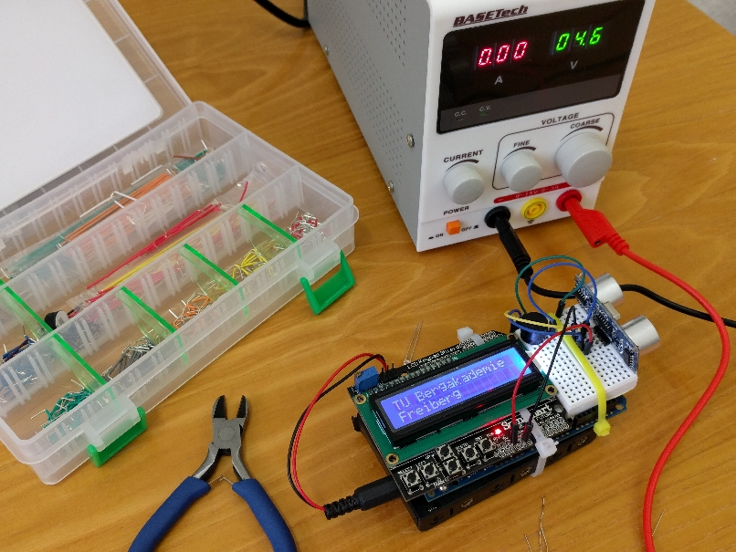
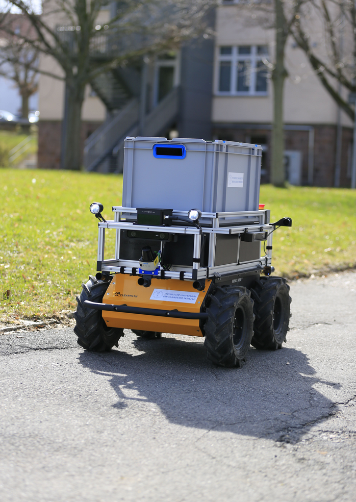
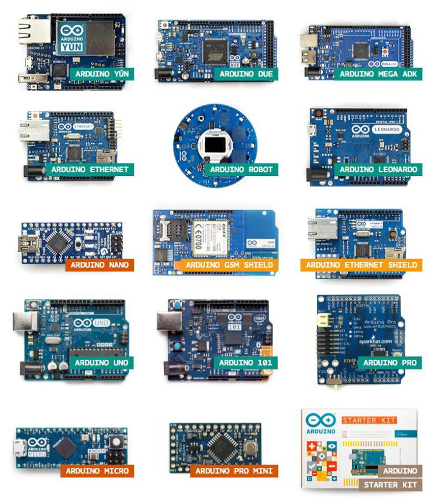
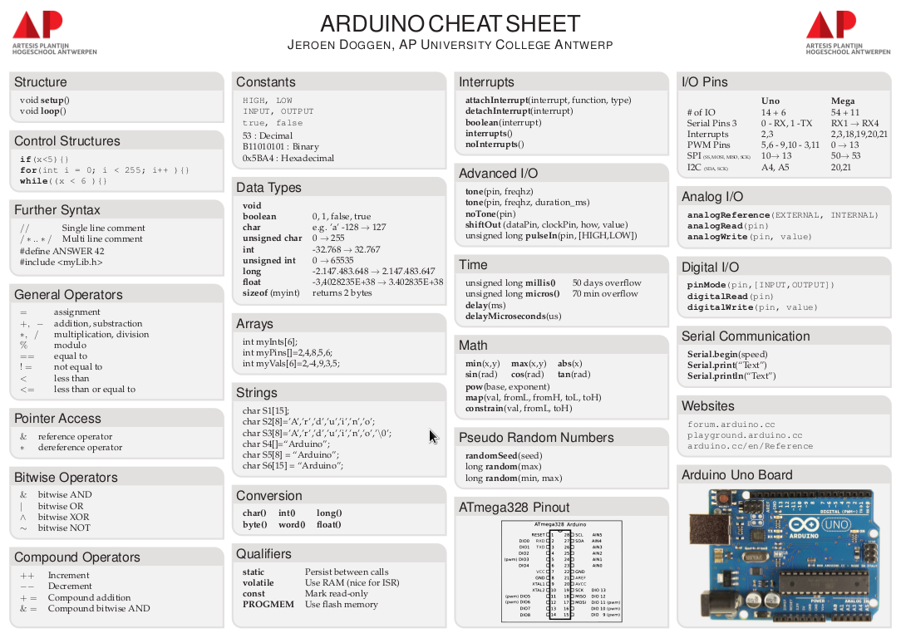
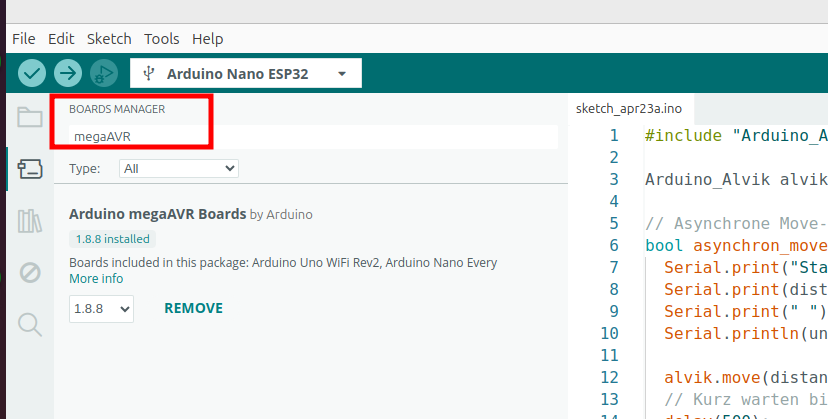
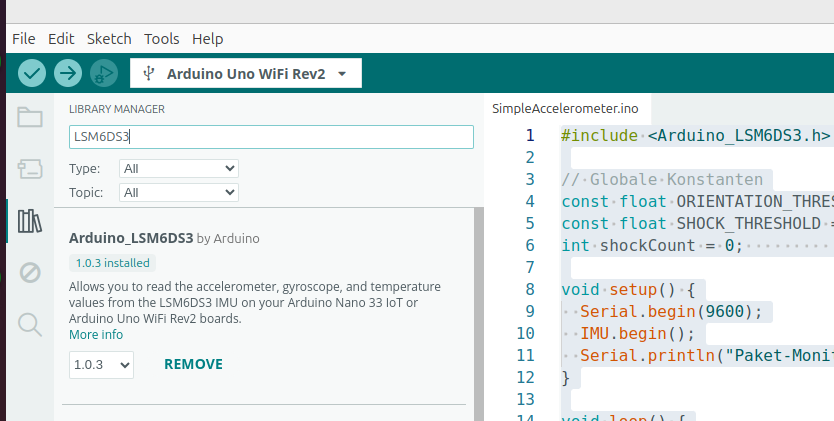

<!--

author:   Sebastian Zug & André Dietrich
email:    zug@ovgu.de   & andre.dietrich@ovgu.de
version:  0.0.1
language: de
narrator: Deutsch Female

import: https://raw.githubusercontent.com/LiaTemplates/WebDev/master/README.md
        https://github.com/LiaTemplates/AVR8js/main/README.md#10
        https://raw.githubusercontent.com/LiaTemplates/NetSwarm-Simulator/master/README.md

link:     ./style.css

@style
.flex-container {
    display: flex;
    flex-wrap: wrap; /* Allows the items to wrap as needed */
    align-items: stretch;
    gap: 20px; /* Adds both horizontal and vertical spacing between items */
}

.flex-child { 
    flex: 1;
    margin-right: 20px; /* Adds space between the columns */
}

@media (max-width: 600px) {
    .flex-child {
        flex: 100%; /* Makes the child divs take up the full width on slim devices */
        margin-right: 0; /* Removes the right margin */
    }
}
@end

-->

[](https://liascript.github.io/course/?https://raw.githubusercontent.com/liaScript/ArduinoEinstieg/master/Parcel_monitor.md#1)


# Bytes & Strom

Einstieg in die Mikrocontroller Programmierung
================================

<section class="flex-container">

<!-- class="flex-child" style="min-width: 250px;" -->
> **Tag der Technik, Landesschule Pforta, 2025**
> 
> Prof. Dr. Sebastian Zug
>
> Technische Universität Bergakademie Freiberg
>
> <h2>Herzlich Willkommen!</h2>

<!-- class="flex-child" style="min-width: 250px;" -->


</section>

Die interaktive Ansicht dieses Kurses ist unter folgendem [Link](https://liascript.github.io/course/?https://raw.githubusercontent.com/liaScript/ArduinoEinstieg/master/Parcel_monitor.md#1) verfügbar.
Der Quellcode der Materialien ist unter https://github.com/liaScript/ArduinoEinstieg/blob/master/Parcel_monitor.md zu finden.

## Kennenlernen

> __Wer bin ich und was macht man so an der TUBAF?__




> __Wer sind Sie? Was erwarten Sie vom heutigen Tutorial?__

## Einführung

**Was heißt das eigentlich "Eingebettetes System"?**

                              {{1-2}}
*******************************************************************************
> _... ein elektronischer Rechner ..., der in einen technischen Kontext_
> _eingebunden ist. Dabei übernimmt der (Kleinst-)Rechner entweder_
> _Überwachungs-, Steuerungs- oder Regelfunktionen ... weitestgehend unsichtbar_
> _für den Benutzer .. \[nach Wikipedia "Eingebettete Systeme"\]._

| PC / Laptop                    | Eingebettetes System                             |
| ------------------------------ | ------------------------------------------------ |
| ist für viele Dinge verwendbar | Macht *eine* Sache                               |
| hat Bildschirm, Tastatur       | Hat oft nur Sensoren und Aktoren, ist unsichtbar |
| wird von Menschen bedient      | Arbeitet automatisch im Hintergrund              |

*******************************************************************************

**Wie programmiere ich einen Mikrocontroller?**

                              {{2-3}}
*******************************************************************************
> _Compiler wird eine Software genannt, die einen in einer Programmiersprache_
> _geschrieben Quellcode so übersetzt, dass sie von Maschinen verstanden_
> _werden können._
*******************************************************************************

**Was ist das Arduino Projekt?**

                                 {{3}}
*******************************************************************************
> _Arduino ist eine aus Soft- und Hardware bestehende_
> _Physical-Computing-Plattform. Beide Komponenten sind im Sinne von Open_
> _Source quelloffen. Die Hardware besteht aus einem einfachen E/A-Board mit_
> _einem Mikrocontroller und analogen und digitalen Ein- und Ausgängen._

  https://www.arduino.cc/



*******************************************************************************

## Arduino Programmierung

Arduino nutzt eine C/C++ Semantik für die Programmierung, die folgende
Grundelemente bedient

+ Alle Anweisungen enden mit einem `;`
+ Variabeln sind typbehaftet (`int`, `char`, `float`, etc.)
+ wichtige Schlüsselwörter sind `for`, `if`, `while`, etc.
+ Kommentare werden durch `//` eingeleitet



### Aufbau eines Arduino-Programmes

Jedes Arduinoprogramm umfasst 2 grundlegende Funktionen `setup()` und `loop()`. Funktionen strukturieren den Code in einzelne Abschnitte, die durch ihren Namen aufgerufen werden können.

<div>
  <wokwi-led color="red" pin="13" port="B" label="13"></wokwi-led>
  <span id="simulation-time"></span>
</div>
```cpp       arduino.cpp
const int ledPin = LED_BUILTIN; // Pin 13 für UNO Boards
                                // Pin 25 für MegaAVR Boards 

void setup() {
  pinMode(ledPin, OUTPUT);
}

void loop() {
  digitalWrite(ledPin, HIGH);  
  delay(1000);                
  digitalWrite(ledPin, LOW);
  delay(1000);  
}
```
@AVR8js.sketch

### Zeit für echte Hardware!

<!-- class="reference" -->
> **Aufgabe 0:** *Laden Sie das obige Programm auf Ihren Arduino hoch und lassen Sie die LED blinken!*

**Was Sie jetzt machen:**

1. **Arduino anschließen** - USB-Kabel mit dem Computer verbinden
2. **Arduino IDE öffnen** - Das ist unser "Werkzeugkasten"
3. **Programm übertragen** - Vom Computer zum Mikrocontroller
4. **LED blinken sehen** - Euer erstes echtes Embedded System!

> **ACHTUNG:** Sie müssen noch die speziellen Pakete für unser Board installieren! 



> **Challenge für die Schnellen:** *Könnt ihr die Blinkgeschwindigkeit ändern, ohne in den Code zu schauen? Experimentieren Sie mit den delay()-Werten!*

### Hürden, Probleme, Hinweise

**1. Aktivieren Sie die Ausgaben beim Compilieren und Hochladen**

**2. Die typischen "ersten Hürden" (und wie ihr sie meistert):**

| Problem                 | Lösung                          |
| ----------------------- | ------------------------------- |
| "Arduino nicht erkannt" | Anderes USB-Kabel probieren     |
| "Port nicht gefunden"   | Tools → Port → richtigen wählen |
| "Upload failed"         | Reset-Knopf am Arduino drücken  |
| "LED blinkt nicht"      | Code nochmal hochladen          |

**3. Hände weg von der Maus!**

| Tastenkombination | Bedeutung                            |
| ----------------- | ------------------------------------ |
| Strg-R            | Kompilieren (Ve**R**ify)             |
| Strg-U            | Flashend (**U**pload)                |
| Strg-T            | Code korrekt einrücken               |
| Strg-Shift-M      | Seriellen Monitor öffnen             |
| Strg-L            | Cursor auf Zeile laut Eingabe setzen |

## C++ Basiskonstrukte

> `Hello World` funktioniert schon mal, aber es fehlt uns ein besseres Sprachverständnis, um reale Probleme zu lösen.

Um die Abläufe besser zu verstehen möchte irgendwie in den Rechner schauen können :-)

Die Serielle Schnittstelle (häufig auch als UART) bezeichnet ermöglicht das
Versenden und den Empfang von Textnachrichten. Damit können Sie zum Beispiel
Messwerte ausgeben oder das Erreichen bestimmter Programmpositionen anzeigen.

Die folgenden Beispiele vermitteln grundlegende Programmierkonstrukte in C++.
Diese können in der Simulation ausgeführt werden.  

<div>
  <span id="simulation-time"></span>
</div>
```cpp       arduino.cpp
void setup() {
  Serial.begin(9600);
  Serial.println("Hello World");
}

void loop() {
}
```
@AVR8js.sketch

> **Challenge:** *Geben Sie den Zustand der LED über die Serielle Schnittstelle aus*

### Schleifen

Was müssen wir tuen, um die Zahlen von 1 bis 10 auf dem Terminal anzuzeigen?

<div>
  <span id="simulation-time"></span>
</div>
```cpp       arduino.cpp
void setup() {
  Serial.begin(9600);
  int counter = 0;
  for (int i = 0; i < 10; i++){
    Serial.println(counter);  
    counter = counter + 1;
  }
}

void loop() {
}
```
@AVR8js.sketch

<!-- class="reference" -->
> **Aufgabe 2:** Welche "Einsparmöglichkeiten" sehen Sie als erfahrener Programmierer in dem Beispiel? Wie kann der Code, mit der gleichen Ausgabe kürzer gestaltet werden?

### Verzweigungen

                              {{0-1}}
*******************************************************************************

Verzweigungen folgen dem Muster

```c
if (Bedingung) {
  // Anweisungen
}
else{               
  // Anweisungen       
}                      
```

wobei der `else` Abschnitt optional ist.

<div>
  <span id="simulation-time"></span>
</div>
```cpp       arduino.cpp
void setup() {
  Serial.begin(9600);
  float value = 5.234;
  Serial.print(value);
  if (value > 10){
    Serial.println(" - Der Wert ist größer als 10!");
  }else{
    Serial.println(" - Der Wert ist kleiner als 10!");
  }
}

void loop() {
}
```
@AVR8js.sketch

*******************************************************************************

                              {{1-2}}
*******************************************************************************

Bedingungen werden dabei wie folgt formuliert:

<div>
  <span id="simulation-time"></span>
</div>
```c      ardunino.cpp
void setup() {
  Serial.begin(9600);
  int a = 2;
  if (a == 2) {Serial.println("a ist gleich zwei!");}
  if (a <= 5) {Serial.println("a ist kleiner oder gleich fünf!");}
  if (a != 3) {Serial.println("a ist ungleich drei!");}
  char b = 'g';
  if (b == 'z') {Serial.println("In b ist ein z gespeichert!");}
  else {Serial.println("In b ist kein z gespeichert!");}
}

void loop() {
}
```
@AVR8js.sketch

Für die Ausgabe von komplexeren, vorformatierten Ausdrücken können Sie auf einen
Befehl aus der C++ Standard-Bibliothek zurückgreifen `sprintf`

Eine anschauliche Dokumentation findet sich unter: [link](https://arduinobasics.blogspot.com/2019/05/sprintf-function.html)

*******************************************************************************

### Einstiegsübung

<!-- class="reference" -->
> **Aufgabe 3:** Schreiben Sie einen Code, der das *SOS* Morsesignal über die
> Led ausgibt!

Welche Anpassungen sind dafür an unserem Beispiel vornehmen?

```c
const int ledPin = LED_BUILTIN;

// the setup function runs once when you press reset or power the board
void setup() {
  // initialize digital pin ledPin as an output.
  pinMode(ledPin, OUTPUT);
}

// the loop function runs over and over again forever
void loop() {
  digitalWrite(ledPin, HIGH);   // turn the LED on (HIGH is the voltage level)
  delay(1000);                  // wait for a second
  digitalWrite(ledPin, LOW);    // turn the LED off by making the voltage LOW
  delay(1000);                  // wait for a second
}
```

## Praxisbeispiel - Der Paket-Monitor 📦

> **Die Mission:** *Euer brandneues Smartphone ist unterwegs! Aber was passiert mit dem Paket während der Reise? Wird es sanft transportiert oder wild herumgeschleudert?*

*Stellt euch vor:*

- 📱 Euer 800€ Smartphone reist durch halb Europa
- 🚚 LKW, Flugzeug, Lieferwagen - überall wird es bewegt  
- 📦 Aber **wie** wird es bewegt? Sanft oder ruppig?
- 🕵️ **Wir werden zu Paket-Detektiven!**

**Echte Probleme, die wir lösen:**

- Wurde mein Paket fallen gelassen? 
- War der Transport zu ruppig für fragile Ware?
- Kann ich beweisen, dass der Schaden beim Transport entststand?

                              {{1}}
*******************************************************************************
**Das ist kein Science-Fiction - das machen echte Firmen!**

Lieferdienstleister nutzen ähnliche Technologien:

- Temperatur-Monitoring für Medikamente 🌡️
- Schock-Sensoren für teure Elektronik 📱  
- GPS-Tracking für wertvolle Fracht 🛰️
- Feuchtigkeits-Sensoren für empfindliche Waren 💧

*******************************************************************************

### Wie spürt Arduino Bewegung? - Der IMU-Sensor

                              {{0-1}}
*******************************************************************************

> **IMU = Inertial Measurement Unit** - *Das ist Arduinos "Gleichgewichtssinn"!*

**Unser Arduino UNO R4 WiFi hat einen eingebauten "Supersinn":**


Wer findet den Sensor, der mit einem Koordinatensystem gekennzeichnet ist?

*******************************************************************************

                              {{1-2}}
*******************************************************************************

**Das Geheimnis: Winzig kleine schwingende Strukturen!**

Der LSM6DS3 in unserem Arduino ist ein **MEMS-Sensor** (Micro-Electro-Mechanical System):

```ascii
    Feste Elektrode    Bewegliche Masse    Feste Elektrode
         |                    |                    |
    +---------+          +---------+          +---------+
    |    |    |    ~~~   |  MASSE  |   ~~~    |    |    |
    +---------+          +---------+          +---------+
         |                    |                    |
    Kapazität C1         Trägeheitsmoment     Kapazität C2
```

**So funktioniert's:**
1. **Mikro-Wippe**: Eine winzige Masse (nur wenige Mikrometer!) hängt an flexiblen Federn
2. **Beschleunigung** → Masse bewegt sich → **Kapazität ändert sich**
3. **Elektronik misst** die Kapazitätsänderung → **digitaler Wert**

https://www.st.com/en/mems-and-sensors/lsm6ds3tr-c.html


*******************************************************************************

                              {{1-2}}
*******************************************************************************

Der **LSM6DS3** Sensor jeweils in 3 Achsen messen:

| Was misst er?      | Einheit                | Wofür?                   |
| ------------------ | ---------------------- | ------------------------ |
| **Beschleunigung** | g (Erdbeschleunigung)  | Stöße, Fallen, Schütteln |
| **Rotation**       | °/s (Grad pro Sekunde) | Drehen, Kippen, Rollen   |

> Man bezeichnet solche Sensoren auch als **6-DOF IMU** (6 Degrees of Freedom).

*******************************************************************************

### Anwendungbeispiel 



**Wie gießen wir das Ganze jetzt in Code?**

```cpp       arduino.cpp
#include <Arduino_LSM6DS3.h>

void setup() {
  Serial.begin(9600);
  IMU.begin();
}

void loop() {
  float x, y, z;

  if (IMU.accelerationAvailable()) {
    IMU.readAcceleration(x, y, z);

    Serial.print(x);
    Serial.print('\t');
    Serial.print(y);
    Serial.print('\t');
    Serial.println(z);
  }
}
```

> Warum brauchen wir die Abfrage `IMU.accelerationAvailable()`?

### Paket-Lage - Wo ist "oben"? 

                              {{0-1}}
*******************************************************************************

> **Die Herausforderung:** *Liegt das Paket richtig herum oder steht es auf dem Kopf? Das ist wichtig für fragile Ware!*

**Das Geheimnis: Die Erdanziehung als Kompass!**

> *"Die Erdanziehung ist unser kostenloser Orientierungssensor!"*

| Beschreibung       | X-Achse             | Y-Achse             | Z-Achse             |
| ------------------ | ------------------- | ------------------- | ------------------- |
| Richtig herum      | $\approx 0.0g$      | $\approx 0.0g$      | $\approx +1.0g$     |
| Verkehrt herum     | $\approx 0.0g$      | $\approx 0.0g$      | $\approx -1.0g$     |
| Rechte Seite unten | $\approx +1.0g$     | $\approx 0.0g$      | $\approx 0.0g$      |
| Linke Seite unten  | $\approx -1.0g$     | $\approx 0.0g$      | $\approx 0.0g$      |
| Vorderseite unten  | $\approx 0.0g$      | $\approx +1.0g$     | $\approx 0.0g$      |
| Rückseite unten    | $\approx 0.0g$      | $\approx -1.0g$     | $\approx 0.0g$      |

*******************************************************************************

                              {{1-2}}
*******************************************************************************

**Warum 0.7g statt 1.0g als Schwellwert?**

| Szenario          | Z-Achse Messung       | Grund                            |
| ----------------- | --------------------- | -------------------------------- |
| **Perfekte Welt** | $Z = 1.000g$ (exakt)  | Theoretischer Idealfall          |
| **Reale Welt**    | $Z = 0.95g \pm 0.05g$ | Rauschen + Ungenauigkeit         |
| **Schräg**        | $Z = 0.8g$            | Arduino nicht perfekt horizontal |


*******************************************************************************

                              {{2-3}}
*******************************************************************************

**Praktischer Lage-Detektor:**

```cpp       arduino.cpp
#include <Arduino_LSM6DS3.h>

// Globale Konstanten für Schwellwerte
const float ORIENTATION_THRESHOLD = 0.7;

void setup() {
  Serial.begin(9600);
  IMU.begin();
  Serial.println("Paket-Lage-Detektor gestartet!");
}

void loop() {
  float x, y, z;
  String lage;
  
  if (IMU.accelerationAvailable()) {
    IMU.readAcceleration(x, y, z);
    // Achtung: Beachte den Unterschied zwischen abs() und fabs()!
    // abs() ist für Integer, fabs() für float/double
    if ((fabs(z) > fabs(x)) && (fabs(z) > fabs(y))) {
      // Z-Achse dominiert
      if (z > ORIENTATION_THRESHOLD) {
        lage = "NORMAL (richtig herum)";
      } else if (z < -ORIENTATION_THRESHOLD) {
        lage = "KOPFÜBER (verkehrt herum!)";
      }
    }
    Serial.print("Lage: ");
    Serial.print(lage);
    Serial.print(" | X:");
    Serial.print(x, 2);
    Serial.print(" Y:");
    Serial.print(y, 2);
    Serial.print(" Z:");
    Serial.println(z, 2);
  }
  
  delay(1000);
}
```

<!-- class="reference" -->
> **Aufgabe 4:** *Erweitern Sie den Code, um auch die seitliche Lage zu erkennen!*

*******************************************************************************

### Schock-Erkennung - Wurde mein Paket misshandelt? 💥

> **Das Drama:** *Euer iPhone-Paket wird gerade aus dem LKW geladen... RUMMS! Hat der Zusteller es fallen gelassen? Zeit für Paket-Forensik!*

                              {{0-1}}
*******************************************************************************

**Warum reicht die Lage-Erkennung nicht aus?**

Bisher konnten wir nur erkennen, **wie** das Paket liegt. Aber was ist mit **dynamischen Ereignissen**?

| Ereignis              | Was passiert                | Problem                            |
| --------------------- | --------------------------- | ---------------------------------- |
| **Sanfter Transport** | Konstante 1g nach unten     | ✅ Lage-Detektor funktioniert      |
| **LKW-Fahrt**         | Leichte Schwankungen 1-1.5g | ✅ Noch im normalen Bereich        |
| **Sturz/Schlag** 💥   | **Kurzer Peak >3g**         | ❌ **Lage-Detektor übersieht es!** |


*******************************************************************************

                              {{1-2}}
*******************************************************************************

**Das "Blind Spot"-Problem: Warum einzelne Achsen nicht reichen**

| Schock-Szenario | X-Achse  | Y-Achse  | Z-Achse | Einzelachsen-Alarm?   | Realität       |
| --------------- | -------- | -------- | ------- | --------------------- | -------------- |
| **Frontal**     | **3.5g** | 0.2g     | 0.1g    | ✅ X-Achse alarmiert  | Erkannt        |
| **Seitlich**    | 0.1g     | **3.2g** | 0.3g    | ✅ Y-Achse alarmiert  | Erkannt        |
| **Schräg**      | 1.8g     | 1.9g     | 1.7g    | ❌ Keine Achse > 2.0g | **ÜBERSEHEN!** |

**Das Problem:** Schräge Stöße verteilen sich auf alle Achsen. Keine einzelne Achse überschreitet den Schwellwert, aber die Gesamtbelastung ist hoch.

*******************************************************************************

                              {{2-3}}
*******************************************************************************

**Die Lösung: 3D-Vektor-Magnitude**

> *"Die Vektorlänge ist wie ein '360°-Radar' für Erschütterungen - nichts entgeht ihm!"*

**Praktischer Schock-Detektor:**

```cpp       arduino.cpp
#include <Arduino_LSM6DS3.h>

// Globale Konstanten
const float ORIENTATION_THRESHOLD = 0.7;   // Lageerkennung
const float SHOCK_THRESHOLD = 2.5;         // Schockerkennung ab 2.5g

void setup() {
  Serial.begin(9600);
  IMU.begin();
  Serial.println("Paket-Monitor mit Schock-Erkennung gestartet!");
}

void loop() {
  float x, y, z, magnitude;

  if (IMU.accelerationAvailable()) {
    IMU.readAcceleration(x, y, z);
    
    magnitude = sqrt(x*x + y*y + z*z);
    
    if (magnitude > SHOCK_THRESHOLD) {
      Serial.print("⚠️  SCHOCK erkannt! Stärke: "); 
      Serial.print(magnitude, 2);
      Serial.println("g");
    }
  }
}
```

<!-- class="reference" -->
> **Aufgabe 5:** Fügen Sie eine Zählvariable hinzu, die die Anzahl der Schocks speichert und die maximale Schockstärke ermittelt.

*******************************************************************************

                              {{4-5}}
*******************************************************************************

**Test-Szenarien für euren Paket-Monitor:**

| Experiment               | Erwartete Magnitude | Was passiert                 |
| ------------------------ | ------------------- | ---------------------------- |
| **Ruhig liegen**         | ≈ 1.0g              | Keine Schocks                |
| **Sanft bewegen**        | 1.0-1.5g            | Keine Schocks                |
| **Auf Tisch klopfen**    | 2-4g                | ⚠️ Leichter Schock         |
| **Fallen lassen** (10cm) | 4-8g                | ⚠️⚠️ Starker Schock      |
| **Heftig schütteln**     | 3-6g                | ⚠️⚠️⚠️ Mehrere Schocks |

> **Challenge:** *Testet verschiedene "Transport-Szenarien" und sammelt Schock-Daten!*

**Real-World Vergleich:**

- 📦 **Normaler Paketversand:** 1-2 Schocks pro Transport
- 📱 **Fragile Elektronik:** Schon 1 Schock über 3g kann kritisch sein
- 🏥 **Medikamenten-Transport:** Maximaler Schwellwert oft nur 1.5g

*******************************************************************************

## Und jetzt alles zusammen

<!-- class="reference" -->
> **Aufgabe 6:** *Verknüpfen Sie die Lage- und Schock-Erkennung zu einem umfassenden Paket-Monitor!*

Nutzen Sie dafür auch gern die Kommunikationsmöglichkeiten des Arduinos, um Daten zu übertragen. 

https://docs.arduino.cc/libraries/thingspeak/

## Zusammenfassung - Von Zero zu Hero! 🚀

> **Herzlichen Glückwunsch! Sie sind jetzt echte Arduino-Entwickler und Paket-Detektive!**

                              {{0-1}}
*******************************************************************************

**Was wir heute erreicht haben:**

**🔧 Von den Grundlagen...**
- ✅ **Arduino-Programmierung** - setup(), loop(), Variablen, Schleifen
- ✅ **Hardware verstehen** - LED blinken, Serielle Kommunikation
- ✅ **C++ Basics** - if/else, Funktionen, Datentypen
- ✅ **Debugging-Skills** - Probleme lösen, Code debuggen

**📊 ...zu echten IoT-Anwendungen!**
- ✅ **IMU-Sensoren** - 6-DOF, MEMS-Technologie verstehen
- ✅ **Lage-Erkennung** - Erdanziehung als Positions-Sensor nutzen
- ✅ **Schock-Detection** - 3D-Vektormathematik in der Praxis
- ✅ **Real-World Problem** - Paket-Überwachung implementiert

*******************************************************************************

                              {{1-2}}
*******************************************************************************

**Was würde man die Aufgabe nach einem Informatikstudium angehen?**

- **Systematisch planen** - Anforderungen analysieren, Konzepte entwerfen
- **Modular programmieren** - Funktionen, Klassen, Bibliotheken nutzen
- **Testen & Validieren** - Unit-Tests, Simulationen, Praxistests
- **Dokumentieren** - Code kommentieren, Anleitungen schreiben  

*******************************************************************************
