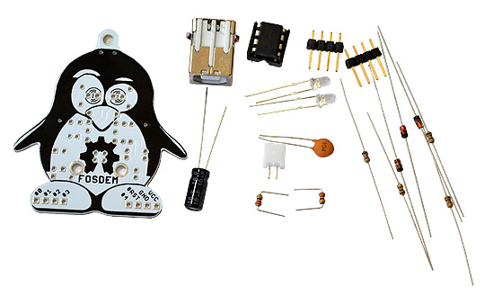
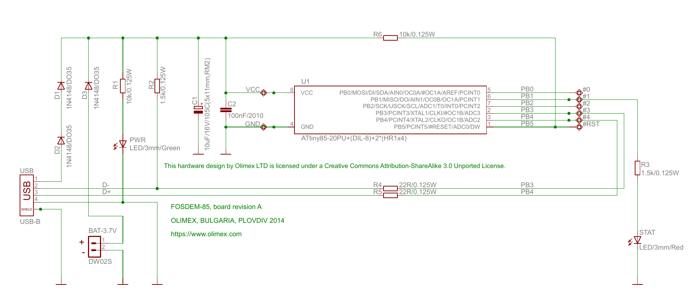
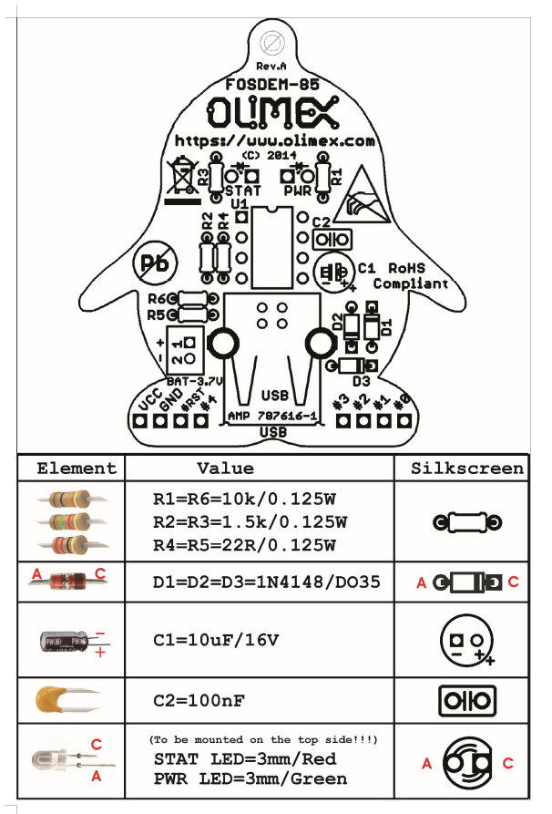
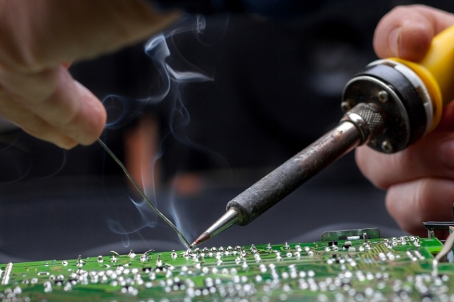
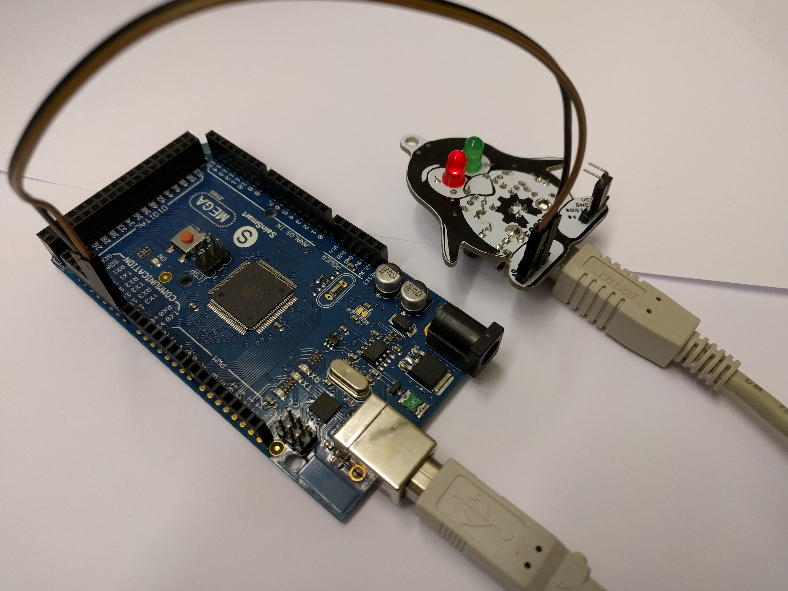

<!--

author:   Sebastian Zug & André Dietrich
email:    zug@ovgu.de   & andre.dietrich@ovgu.de
version:  0.0.1
language: de
narrator: Deutsch Female

-->

# GirlsDay 2019

**"Löten und Programmieren"**

Sebastian Zug, Technische Universität Bergakademie Freiberg

------------------------------

<!-- width="80%" -->

Herzlich Willkommen!

> Die interaktive Ansicht dieses Kurses ist unter folgendem [Link](https://liascript.github.io/course/?https://raw.githubusercontent.com/liaScript/ArduinoEinstieg/master/SolderingCourse.md#1) verfügbar.

## 0. Motivation

{{0-1}}
Programmieren und Löten ... Mikrocontroller ... Sensoren ... Wo braucht man das?

{{0-1}}
<!-- width="60%" -->

{{0-1}}
> _"Ein Auto ist ein Computer\[netzwerk\] mit vier Rädern"_ (Quelle gesucht)

{{1-2}}
Was wollen wir heute erreichen?

{{1-2}}
+ Zusammenbau einer Mikrocontrollerplatine
+ Erste Programmierversuche

{{1-2}}
<!-- width="60%" -->

## 1. Einführung

+ Was heißt das eigentlich "Eingebettetes System"?

{{1-2}}
> ... ein elektronischer Rechner ..., der in einen technischen Kontext
> eingebunden ist. Dabei übernimmt der (Kleinst-)Rechner entweder
> Überwachungs-, Steuerungs- oder Regelfunktionen ... weitestgehend unsichtbar
> für den Benutzer .. [^1].

+ Wie programmiere ich einen Mikrocontroller?

{{2-3}}
> Compiler wird eine Software genannt, die einen in einer Programmiersprache
> geschrieben Quellcode so übersetzt, dass sie von Maschinen verstanden
> werden können.

+ Was ist das Arduino Projekt?

{{3}}
> Arduino ist eine aus Soft- und Hardware bestehende
> Physical-Computing-Plattform. Beide Komponenten sind im Sinne von Open
> Source quelloffen. Die Hardware besteht aus einem einfachen E/A-Board mit
> einem Mikrocontroller und analogen und digitalen Ein- und Ausgängen.

{{3}}
  https://www.arduino.cc/

{{3}}
  <!-- width="70%" -->
  [^3]

{{3}}
[^1]: nach Wikipedia "Eingebettete Systeme"
[^2]: http://21stdigitalhome.blogspot.com/2016/03/cross-compiling-compile-c-programs-on.html
[^3]: aus entsprechendem Artikel "Spiegel Online" http://www.spiegel.de/netzwelt/gadgets/arduino-erklaert-das-kann-der-microcontroller-a-1105328.html


## 2. Erster Schritt - Löten

{{0-1}}
**Analyse des Schaltplanes**

{{0-1}}
<!-- width="100%" -->

{{1-2}}
**Analyse der Lötvorgabe**

{{1-2}}
<!-- width="60%" -->

{{2-4}}
**Vorbereitung des Lötprozesses**

{{2-4}}
> Achtung: Ein Lötkolben ist an sich ein nützliches Werkzeug ... wenn er mit der
> nötigen Vorsicht benutzt wird.

{{2-4}}
<!-- width="60%" --> [^1]

[^1]: Firma Reichelt, "Wie Sie sicher und perfekt löten", https://www.reichelt.de/magazin/ratgeber/wie-sie-sicher-und-perfekt-loeten/

{{3-4}}
Los gehts ...

## 3. Zweiter Schritt - Vorbereitung der Programmierung

**Aufbau eines Arduino-Programmes**

Arduino nutzt eine C/C++ Semantik für die Programmierung, die folgende
Grundelemente bedient

+ Alle Anweisungen enden mit einem `;`
+ Variabeln sind typbehaftet (`int`, `char`, `float`, etc.)
+ wichtige Schlüsselwörter sind `for`, `if`, `while`, etc.
+ Kommentare werden durch `//` eingeleitet

```c     A_BlinkLed.c
// the setup function runs once when you press reset or power the board
const int ledPin = 1;

void setup() {
  pinMode(ledPin, OUTPUT);
}

void loop() {
  digitalWrite(ledPin, HIGH);  // turn the LED on (HIGH is the voltage level)
  delay(1000);                 // wait for a second
  digitalWrite(ledPin, LOW);   // turn the LED off by making the voltage LOW
  delay(1000);                 // wait for a second
}
```

* Referenzübersicht Arduino

    + deutsch (unvollständig) https://www.arduino.cc/reference/de/

    + englisch https://www.arduino.cc/reference/en/


**Arduino IDE**

<!-- width="80%" -->

**Vorbereitung der DigiSpark AtTiny Unterstützung**

Installation der Treiber unter Windows ...

!?[alt-text](https://www.youtube.com/embed/MmDBvgrYGZs)<!--
style="height: 2000px; width="80%""
-->


oder anhand der Beschreibung unter

http://digistump.com/wiki/digispark/tutorials/connecting

**Realisierung einer seriellen Schnittstelle**

Der AtTiny verfügt über keine eigene UART Schnittstelle um Textfragmente mit dem
Programmierrechner auszutauschen. Zwar besteht die Möglichkeit eine solche
Kommunikation über den aufgelöteten USB Stecker (hier wird keine echte USB Verbindung aufgebaut)
zu emulieren, allerdings ist die Stabilität dieser Lösung immer vom angebundenen
Rechner abhängig.

Wir nutzen einfach einen weiteren Arduino Controller als Gateway und simulieren die
Serielle Konfiguration auf den Pins 0 und 2.

<!-- width="60%" -->

Dafür ist es zudem notwendig die zwei Dateien

`SoftwareSerial.cpp`
`SoftwareSerial.h`

in den eigenen Projektordner zu kopieren.

## 4. Dritter Schritt - Implementierung

Wichtige Grundeinstellungen für die Arduino IDE

+ Richtigen Port für den Programmiervorgang auswählen (Tools -> Port)
+ Richtigen Controller auswählen (Tools -> Board)
+ Richtige Baudrate für die Serielle Schnittstellen


### 4a. LED Beispiele

{{0-2}}
```c      Serial.ino
#include "SoftwareSerial.h"

SoftwareSerial mySerial(0,2);  //rx, tx
const int ledPin = 1;

void setup()
{
    mySerial.begin(19200);
    pinMode(ledPin, OUTPUT);
    mySerial.println("Glück auf!");
    digitalWrite(ledPin, HIGH);
}

void loop()
{}
```

{{1-3}}
> **Aufgabe:** Schreiben Sie einen Code, der die Zahlen von 0 bis 9 über die
> serielle Schnittstelle ausgibt.

{{2-3}}
```c      PrintNumbers.ino
// Loesung
void setup() {
  mySerial.begin(57600);
  for (int counter=0; counter < 10; counter++) {
    mySerial.print(counter);
  }
}

void loop() {
}
```

{{3-5}}
> **Aufgabe:** Erweitern Sie den Code, so dass wir die LED über 'A' an- und
> 'B' ausschalten können.

{{4-5}}
```c      ControlLed.ino
// Loesung
void loop() {
  if (mySerial.available() > 0) {
        incomingByte = mySerial.read();
        mySerial.write(incomingByte);
        if (incomingByte == 'A'){
          digitalWrite(ledPin, HIGH);
        }
        if (incomingByte == 'B'){
          digitalWrite(ledPin, LOW);
        }
  }
}
```

{{5-7}}
> **Aufgabe:** Mit `analogWrite(pin, wert);` können Sie variable Spannungen an
> unserer LED anlegen und damit unterschiedliche Helligkeiten generieren. Lassen Sie
> das Auge wie auf dem folgenden Bild langsam blinken!

{{5-7}}
<!-- width="30%" -->

{{6-7}}
```c      PWM.ino
// Loesung
const int ledPin = 1;
const int Delay_time_ms = 5;

void setup() {
  pinMode(Led, OUTPUT);    
  digitalWrite(ledPin, LOW);  // Set it in Low state
}

void loop() {
  for (int i=0; i<256; i++) {
    analogWrite(ledPin, i);  // PWM the LED from 0 to 255 (max)
    delay(Delay_time_ms);
  }
  for (int i=255; i>=0; i--) {
    analogWrite(ledPin, i);  // PWM the LED from 255 (max) to 0
    delay(Delay_time_ms);
  }
  delay(500);
}
```

### 4b. Sensor Beispiele

{{0-2}}
*Langweilig ... ! Das ist doch kein echtes eingebettetes System!*

{{0-2}}
> **Aufgabe:** Der Taster schaltet die LED ein und nach 3 Sekunden geht sie von
> selbst wieder aus.

{{0-2}}
Es wird ernst! Wir müssen den Taster elektrisch mit dem Board verbinden. Anweisungen unter ...
https://www.mangolabs.de/portfolio-item/micro-switches/

{{1-2}}
```c               ActivateLed.ino
// Loesung
void loop() {
  // read the state of the pushbutton value:
  buttonState = digitalRead(buttonPin);

  // check if the pushbutton is pressed. If it is, the buttonState is HIGH:
  if (buttonState == HIGH) {
    // turn LED on:
    digitalWrite(ledPin, HIGH);
    delay(3000);
    digitalWrite(ledPin, LOW);
  }
}
```

{{2-3}}
> **Aufgabe:** Unter den Beispielen finden Sie ein Programm Music.ino . Dieses
>greift auf einen Beeper zu, der an PIN 1 und GND angeschlossen ist. Erweitern
> Sie dieses Programm so, dass Sie mit dem Button die Tonsequenz starten.

{{3-4}}
Unter der Webseite https://www.mangolabs.de/portfolio-item/microphone-with-analog-digital-output/#getting-started
finden Sie die Beschaltung eines kleinen Mikrophones, mit dem die Schallamplitude
gemessen werden kann.

{{3-4}}
> **Aufgabe:** Geben Sie die Schallamplitude über die serielle Schnittstelle aus
> und lassen Sie unseren Pinguin in Abhängigkeit von der Lautstärke zwinkern.
