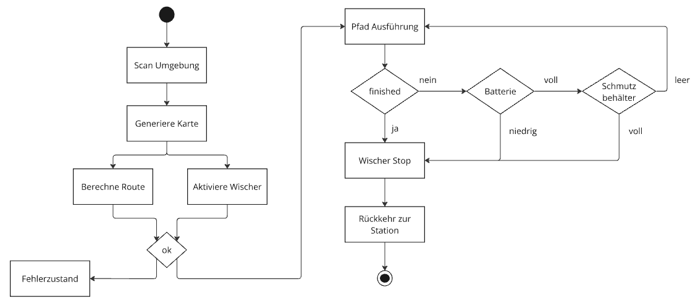

<!--

author:   Sebastian Zug & André Dietrich
email:    sebatian.zug@informatik.tu-freiberg.de & andre.dietrich@informatik.tu-freiberg.de
import:   https://github.com/LiaTemplates/AVR8js/main/README.md#10
version:  0.0.2
language: de
link:     style.css

-->

[](https://liascript.github.io/course/?https://raw.githubusercontent.com/liaScript/ArduinoEinstieg/master/StrukturierteRoboterEntwicklung.md#1)


# Ach, das ist doch schnell gemacht ...

<h2>
Systematische Entwicklung von Robotiksystemen
</h2>


<div style="width: 46%; float: left">

| Prof. Dr. Sebastian Zug                      |
| -------------------------------------------- |
| Technische Universität Bergakademie Freiberg |
|                                              |

</div>

<!-- style="width: 50%; float: right" -->


<h5>Werkstatt Zukunft: Robotik, Freiberg, 14.03.2025</h5>

-----------------

## Lernziel der heutigen Veranstaltung

<div style="width: 46%; float: left">

> 1. Warum brauchen wir einen systematische Entwicklungsfluss bei der Umsetzung von autonomen Systemen?

> 2. Welche Stufen hat ein solcher Prozess?


{{1-3}}
************************

Phase 1: Kleine Probleme werden groß - Wir starten vom Code her.

Phase 2: Große Probleme zerlegen - Wir starten aus der Vogelperspektive.

*********************

{{2-3}}
<!-- class="highlight" -->
> __Frage:__ Welches Problem hat dieser Roboter?

</div>

{{0-1}}
<!-- style="width: 50%; float: right" -->

{{1-3}}
<!-- style="width: 50%; float: right" -->


## Anwendungsfall: Staubsaugerroboter

> Wir haben die Aufgabe einen Wischroboter zu entwickeln. Die Mechanik und Elektrik steht bereits - nun ist die Software dran. 


## 1. Versuch 

Einer der Kollegen hat sich in seinem Büro eingeschlossen und präsentiert folgende Lösung: 

```python
from arduino_alvik import ArduinoAlvik
from time import sleep_ms

def init():
  alvik.left_led.set_color(0, 0, 1)
  while(not alvik.get_touch_ok()):
    sleep_ms(50);
  alvik.left_led.set_color(0, 1, 0)

######################################################

alvik = ArduinoAlvik()
alvik.begin()

# Keine Ahnung was das soll, machen alle so
init()

for i in range(3):
  # Pruefe auf Hindernisse
  L, CL, C, CR, R = alvik.get_distance()
  if C>50:  # cm
    # Gradeausfahrt
    alvik.drive(15, 0, 'cm/s', 'deg/s')
    sleep_ms(5000)
    # Kurvenfahrt / Drehung um 180 Grad
    if i%2 == 0:
      alvik.drive(5, 30, 'cm/s', 'deg/s') 
    else:
      alvik.drive(5, -30, 'cm/s', 'deg/s') 
    sleep_ms(6000) # Habe ich gestoppt, klappt gut

# Aus die Maus
alvik.left_led.set_color(0, 0, 1)
alvik.stop()
```

<!-- class="highlight" -->
> __Frage:__ Welche Mängel sehen Sie bei diesem Programm?


## 2. Versuch: Systematische Entwicklung

> Das [V-Modell](https://de.wikipedia.org/wiki/V-Modell) ist eine Methodik zur systematischen Entwicklung von Software. Es beschreibt den Entwicklungsprozess von der Anforderungsanalyse bis zur Wartung. 

<!--
style="width: 100%; max-width: 760px; display: block; margin-left: auto; margin-right: auto;"
-->
```ascii
                         Szenarien
Anforderungen        ................>              Abnahmetest
   \ ^                                              / ^
    v \                  Testfälle                 v /
    Grobentwurf      ................>        Systemtest
      \ ^                                       / ^
       v \               Testfälle             v /
      Feinentwurf    ................>     Integrationstest
         \ ^                                 / ^
          v \            Testfälle          v /
        Modulimpl.   ................>    Modultest
            \ \                           / /
             \ +-------------------------+ /
              +---------------------------+                                    .
```

### 2.1 Anforderungsanalyse

<!-- class="highlight" -->
> __Frage:__ Welche Funktionalitäten erwarten wir von unserem Roboter?

| Abstrakte Anforderung | Teilprobleme                   | Subprobleme |
| --------------------- | ------------------------------ | ----------- |
| + Schmutz aufnehmen   | Raumspezifische Reinigungsmodi |             |
| + autonome Bewegung   | ...                            |             |
| + Energiemanagement   | ...                            |             |

### 2.2 Grobentwurf

> Wie organisieren wir die Software für unseren Anwendungsfall sinnvoll und wie sehen die Schnittstellen zwischen den Komponenten aus?

Die nachfolgende Grafik zeigt die Gliederung der Software eines autonomen Roboters.


```ascii
                    Statusmeldungen 
     Nutzereingaben  ^                                       
                 |   |
Befehle          v   |
            +-----------------------+
            | Handlungsplanung      |  "$Strategie   $"
            +-----------------------+
                 |   ^     | | |        Folge von Aktionen     
                 v   |     v v v
            +-----------------------+
            | Ausführung            |  "$Taktik$    "           
            +-----------------------+
                     ^      | | |       Geplante Trajektorie,
Status               |      v v v       Verhalten
            +-----------------------+
            | Reaktive Überwachung  |  "$Ausführung$        "
            +-----------------------+
Sensordaten-    ^ ^ ^        | | |      Steuerbefehle an den 
erfassung       | | |        v v v      Aktuator 
            +----------+ +----------+
            | Sensoren | | Aktoren  |                               
            +----------+ +----------+
                  ^           |
                  |           v      
            .-----------------------.
            | Umgebung              |
            .-----------------------.                                                                                .
```

### 2.3 Feinentwurf

> Wie können die einzelnen Komponenten implementiert werden?



### 2.4 Modulimplementation

> Hier schließt sich der Bogen jetzt wieder zu unserem Einführungsbeispiel. Lassen Sie uns einzelne Aspekte wieder aufgreifen. 

```python
from arduino_alvik import ArduinoAlvik
from time import sleep_ms

def init():
  alvik.left_led.set_color(0, 0, 1)
  while(not alvik.get_touch_ok()):
    sleep_ms(50);
  alvik.left_led.set_color(0, 1, 0)

def drive_forward(distance, speed):
  ...

def turn(angle, radius, speed):
  ...

def trajectory_execution():
  ...
  if checkBatterie():
  ...
  if cleaner_is_full():
  ...

```

> Was jetzt folgen würden, wären umfangreiche Tests, Tests und nochmals Tests.  

## Zusammenfassung

<div style="width: 46%; float: left">

{{0-3}}
<!-- class="highlight" -->
> __Achtung:__ Womit haben wir uns heute überhaupt nicht beschäftigt? Die Hardware blieb weitgehend außen vor.


                        {{1-3}}
*********************************************************

> Erkenntnis 1: _Gib mir eine halbe Stunde und ich schreibe Dir den Code ..._ gehört der Vergangenheit an.

> Erkenntnis 2: Informatik ist mehr als nur "Programmieren".

> Erkenntnis 3: Systematische Entwicklung ist der Schlüssel zum Erfolg.

*********************************************************

</div>

{{2-3}}
<!-- style="width: 50%; float: right" -->