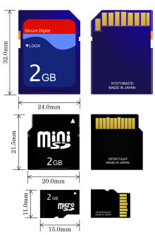
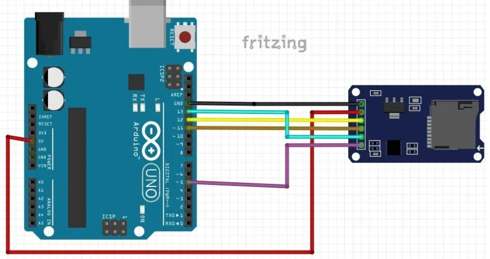
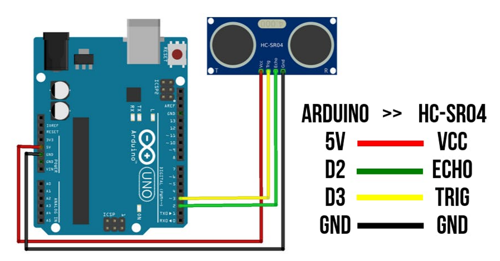
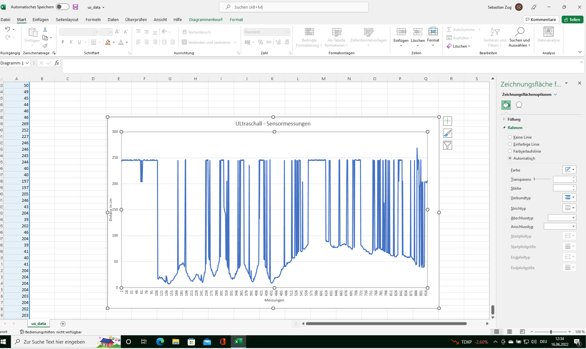

<!--

author:   Sebastian Zug & André Dietrich
email:    zug@ovgu.de   & andre.dietrich@ovgu.de
version:  0.0.3
language: de
narrator: Deutsch Female

link:     https://cdnjs.cloudflare.com/ajax/libs/animate.css/3.7.0/animate.min.css

import: https://raw.githubusercontent.com/LiaTemplates/Rextester/master/README.md
        https://raw.githubusercontent.com/LiaTemplates/WebDev/master/README.md
        https://github.com/LiaTemplates/AVR8js/main/README.md#10
        https://raw.githubusercontent.com/LiaTemplates/NetSwarm-Simulator/master/README.md
-->

[](https://liascript.github.io/course/?https://raw.githubusercontent.com/liaScript/ArduinoEinstieg/master/WritingToSDcard.md#1)


# Schreiben auf die SD Karte

**Robotik AG**

Prof. Dr. Sebastian Zug,
Technische Universität Bergakademie Freiberg

------------------------------

<!-- width="80%" -->

<h2>Herzlich Willkommen!</h2>

> Die interaktive Ansicht dieses Kurses ist unter folgendem [Link](https://liascript.github.io/course/?https://raw.githubusercontent.com/liaScript/ArduinoEinstieg/master/Course_00.md#1) verfügbar.

Der Quellcode der Materialien ist unter https://github.com/liaScript/ArduinoEinstieg/blob/master/WritingToSDcard.md zu finden.

## Einführung

Eine SD-Karte (_Secure Digital Memory Card_) ist ein digitales Speichermedium, das nach dem Prinzip der Flash-Speicherung arbeitet.

<!-- width="30%" -->

Was bekommt man da so drauf?

| Datentyp                    | Speichergröße |
| --------------------------- | ------------- |
| Buchstabe                   | 1 Byte        |
| Buchseite                   | 2 KB          |
| Skype-Anruf von 1 Minute    | 1 MB          |
| Bibel-Text                  | 5 MB          |
| Foto, MP3-Datei             | 3 bis 5 MB    |
| Musik streamen für 1 Stunde | 40 MB         |
| Facebook-Video von 1 Stunde | 60 MB         |
| HD-Video 1 Stunde           | 2 GB          |


### Aufgabe für heute

> __Wir wollen von der SD Karte Daten lesen __

<!--
style="width: 100%; max-width: 860px; display: block; margin-left: auto; margin-right: auto;"
-->
```ascii
     Wassertiefe
  Temperatur   |                            SD Karte
Position   |   |               ╔══════════════════════════════╗
       |   |   |               ║     Data.txt                 ║                     
       v   v   v               ║     +-------------------+    ║   
  +-------------+              ║     | Time, Measurement |\   ║    
  |             |              ║     | 23.232, 4564      +-+  ║     
  |  Arduino    |  Messdaten   ║     | 24.346, 5654        |  ║
  |             |  ----------> ║  +------------------+     |  ║
  |             |              ║  | 7, 12, 3         |\    |  ║  
  |             |  Fahrbefehle ║  | 13, 23, 5        +-+   |  ║    
  |             |  <---------- ║  | 12, 22, 4 # Fertig |---+  ║
  +-------------+              ║  | ...                |      ║      
         |                     ║  +--------------------+      ║                 
         v                     ║   SteeringCommands.txt       ║             
      Motoren                  ╚══════════════════════════════╝

```


[^Wikipedia_SD]: Author jdx at https://commons.wikimedia.org/wiki/File:SD_Cards.svg

### Grundlagen - Stringverarbeitung mit dem Arduino

Die zugehörigen Methoden der String-Klasse finden sich in der Dokumentation unter [String](https://www.arduino.cc/reference/de/language/variables/data-types/stringobject/)

                                      {{0-1}}
********************************************************************************

<div>
  <span id="simulation-time"></span>
</div>
```cpp       StringAuswertung.cpp
void setup() {
  Serial.begin(9600);
  String HelloWorld = "Hello World";
  Serial.println(HelloWorld);
}

void loop() {
}
```
@AVR8js.sketch

********************************************************************************

                                    {{1-2}}
********************************************************************************

String - Zahlen
-----------------------

> __Aufgabe:__ Passe den Code so an, dass bei einer negativen Geschwindigkeit die Led des Boards leuchtet. Die Richtung
>
> - `links` kleiner 0,
> - `rechts` größer 0,
> - `geradeaus` gleich 0
>
> soll über die Serielle Schnittstelle ausgegeben werden.

<div>
  <wokwi-led color="red" pin="13" port="B" label="13"></wokwi-led>
  <span id="simulation-time"></span>
</div>
```cpp       StringAuswertung.cpp
const int ledPin = 13;

void setup() {
  Serial.begin(9600);
  Serial.println("Zerlege das Befehlswort:");
  pinMode(ledPin, OUTPUT);

  //String SteeringCommand = "7, 12, 4";
  String SteeringCommand = "-5, 12, 5";
  Serial.println(SteeringCommand);
  int Comma_position = SteeringCommand.indexOf(",");
  String speed = SteeringCommand.substring(0, Comma_position);
  Serial.println(speed);

  //digitalWrite(ledPin, HIGH);  
  //Serial.println("Fahre nach links");
  //Serial.println("Fahre nach rechts");
}

void loop() {
}
```
@AVR8js.sketch

********************************************************************************

                        {{2-3}}
********************************************************************************

String - Vergleich
-----------------------

Nehmen wir an, dass wir unsere Befehle für das Boot erweitern und fügen Kommentare ein. Diese sind aber nur manchmal dabei!

> __Aufgabe:__Gib die Kommentare über die Serielle Schnittstelle aus. Schneide zuvor die Lehrzeichen ab. Wenn kein Kommentar enthalten ist, sollte der Ausdruck `no comment` erscheinen.__

<div>
  <span id="simulation-time"></span>
</div>
```cpp       StringAuswertung.cpp
const int ledPin = 13;

void setup() {
  Serial.begin(9600);
  Serial.println("Extrahiere den Kommentar:");
  pinMode(ledPin, OUTPUT);

  String SteeringCommand = "7 , 12, 2 #Das Boot ist jetzt am Steeg";
  //String SteeringCommand = "50, 0, 5 #  Jetzt ist die Seemitte erreicht   ";
  //String SteeringCommand = "50, -20, 5";
  Serial.println(SteeringCommand);

}

void loop() {
}
```
@AVR8js.sketch

********************************************************************************

## SD Karte am Arduino



| Bezeichner am Reader | Arduino Pin |
| -------------------- | ----------- |
| `GND`                | GND         |
| `VCC`                | 5V          |
| `MISO`               | 12          |
| `MOSI`               | 11          |
| `SCK`                | 13          |
| `CS`                 | 5           |

[^Funduino]: https://funduino.de/nr-28-das-sd-karten-modul

## Anwendung I - Lesen aus einer Datei

> __Aufgabe:__ Lies die Botschaft aus, die ich in der Datei `test.txt` für Dich hinterlassen habe!

```cpp     ReadTextFile.ino
#include <SPI.h>
#include <SD.h>  

void setup() {
  Serial.begin(9600);
  Serial.print("Initializing SD card...");

  if (!SD.begin(5)) {                              
    Serial.println("Initialisierung fehlgeschlagen!");    // Fehlermeldung
    return;
  }
  Serial.println("Initialisierung abgeschlossen");       

  myFile = SD.open("test.txt");

  // Hier gehört Ihr Code für das Einlesen von der SD Karte her

  Serial.println("Fertig!");                    
}

void loop()    // Die Loop bleibt leer.
{
}
```

> __Aufgabe:__ Geben Sie diese Zeichenweise aus, so dass der Text langsam auf dem Bildschirm erscheint!

> __Aufgabe:__ Lesen Sie den Text zeilenweise ein und stellen Sie fest, wo Sie das Wort `Bergakademie` im Text finden.

## Anwendung II - Schreiben von Daten

> __Aufgabe:__Das folgende Beispiel schreibt die Werte von 0 - 100 in eine Datei und gitb diese dann wieder aus. Erweitern Sie es, so dass Sie die Messdaten des Ultraschallsensors in die Datei schreiben.

```cpp
#include <SPI.h>
#include <SD.h>

File Textdatei;

void setup() {
  Serial.begin(9600);

  if (!SD.begin(5)) {
    Serial.println("Initialisierung fehlgeschlagen!");
    return;
  }

  // Schreiben
  SD.remove("data.txt");
  Textdatei = SD.open("data.txt", FILE_WRITE);
  if (Textdatei)
  {
    for (int i = 0; i < 100; i++)
    {
      Textdatei.print(i);
      Textdatei.print(",");
      if (i % 10 == 0) Textdatei.println("");   // Zeilenumbruch in 10er Schritten
    }
    Textdatei.close();
  }
  else
  {
    Serial.println("Textdatei konnte nicht ausgelesen werden");
  }

  // Lesen
  Textdatei = SD.open("data.txt");
  if (Textdatei)
  {
    int count = 0;
    while (Textdatei.available())
    {
      String text = Textdatei.readStringUntil('\n');
      Serial.println(text);
    }
    Textdatei.close();
  }
  else
  {
    Serial.println("Textdatei konnte nicht geoeffnet werden");
  }
}

void loop() {}
```

Zur Erinnung hier noch mal der Code für den Ultraschallsensor:


```cpp
// ---------------------------------------------------------------- //
// Arduino Ultrasoninc Sensor HC-SR04
// Re-writed by Arbi Abdul Jabbaar
// Using Arduino IDE 1.8.7
// Using HC-SR04 Module
// Tested on 17 September 2019
// ---------------------------------------------------------------- //

#define echoPin 2
#define trigPin 3

// defines variables
long duration;
int distance;

void setup() {
  pinMode(trigPin, OUTPUT);
  pinMode(echoPin, INPUT);  
  Serial.begin(9600);      
}

void loop() {
  digitalWrite(trigPin, LOW);
  delayMicroseconds(2);
  digitalWrite(trigPin, HIGH);
  delayMicroseconds(10);
  digitalWrite(trigPin, LOW);
  duration = pulseIn(echoPin, HIGH);
  distance = duration * 0.034 / 2;
  Serial.println(distance);
}
```



## Verarbeiten der Daten am Rechner

Das Dateiformat CSV steht für englisch _Comma-separated Values_  und beschreibt den Aufbau einer Textdatei zur Speicherung oder zum Austausch einfach strukturierter Daten. Die Dateinamenserweiterung lautet .csv.


